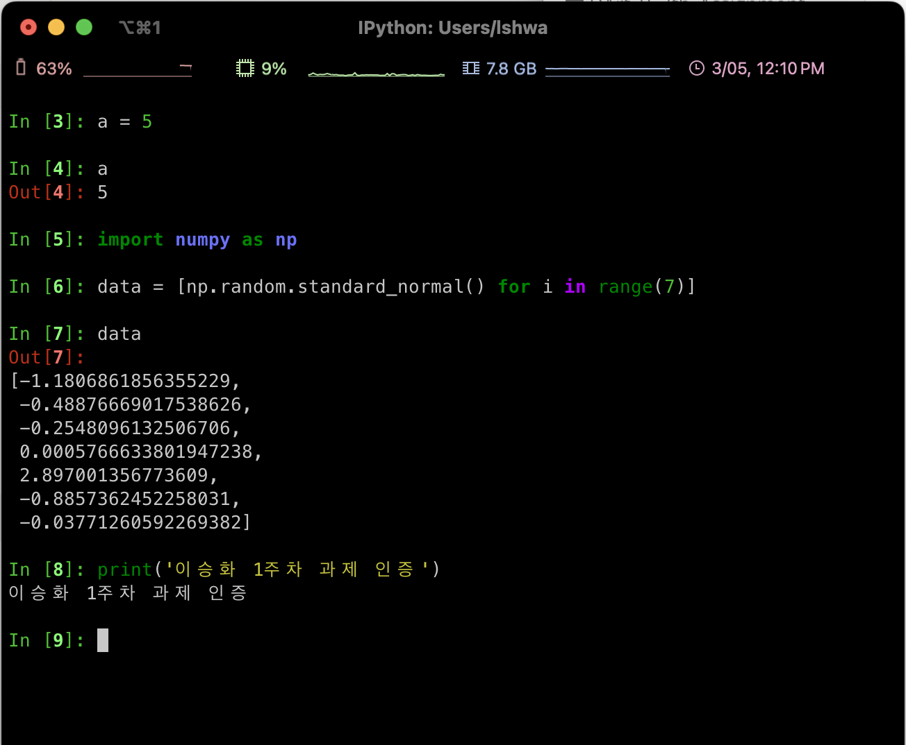
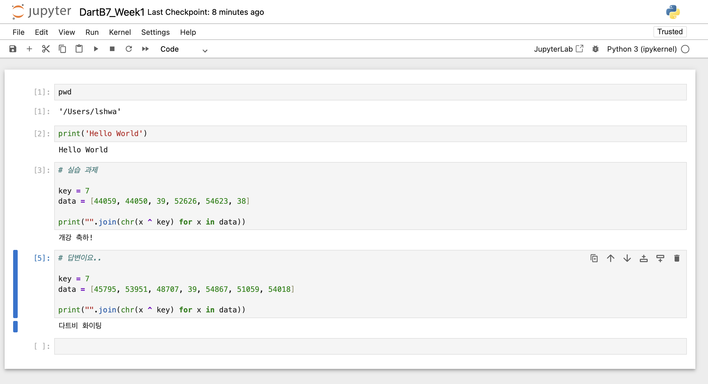

# Python 1주차 정규 과제 

📌Python 정규과제는 매주 정해진 분량의 『*파이썬 라이브러리를 활용한 데이터 분석*』 을 읽고 학습하는 것입니다. 이번주는 아래의 **Python_1st_TIL**에 나열된 분량을 읽고 공부하시면 됩니다.

아래의 문제를 풀어보며 학습 내용을 점검하세요. 문제를 해결하는 과정에서 개념을 스스로 정리하고, 필요한 경우 참고 자료를 통해 보완하는 것이 좋습니다.

**교재 실습 예제 파일은 07_Python_Template 레포지토리의 notebooks 폴더에 업로드되어 있습니다.**

**👀(수행 인증샷은 필수입니다.)** 

## Python_1st_TIL

### 1장 시작하기 전에
#### 1. 다루는 내용
#### 2. 데이터 분석에 파이썬을 사용하는 이유
#### 3. 필수 파이썬 라이브러리
#### 4. 설치 및 설정
#### 5. 커뮤니티와 콘퍼런스
#### 6. 이 책을 살펴보는 방법
### 2장 파이썬 기초, IPython과 주피터 노트북 
#### 1. 파이썬 인터프리터 
#### 2. IPython 기초 
#### 3. 파이썬 기초
#### 4. 마치며


## Study Schedule

| 주차  | 공부 범위 | 완료 여부 |
| ----- | --------- | --------- |
| 1주차 | p.25~82   | ✅         |
| 2주차 | p.83~129  | 🍽️         |
| 3주차 | p.131~179 | 🍽️         |
| 4주차 | p.181~246 | 🍽️         |
| 5주차 | p.247~309 | 🍽️         |
| 6주차 | p.310~379 | 🍽️         |
| 7주차 | p.381~465 | 🍽️         |


<br>

<!-- 여기까진 그대로 둬 주세요-->

---

# 1️⃣ 학습 내용 정리

> 필수 파이썬 라이브러리 정리

**넘파이 (Numpy)**

- 빠르고 효율적 다차원 배열 객체 `ndarray`
- 배열 원소를 다루거나 배열 간의 수학 계산을 수행하는 함수 
  - 디스크에서 배열 기반의 데이터를 읽고 쓰는 도구 


**판다스 (Pandas)**

- 넘파이의 고성능과 배열 연산 아이디어를 RDB의 데이터 처리 기능에 결합 
- 축의 이름에 따라 데이터를 정렬할 수 있는 자료구조
- 통합된 시계열 기능
  - 시계열, 비시계열 데이터를 함께 다룰 수 있는 자료구조


**맷플롯립 (Matplotlib)**

- 그래프나 2차원 데이터의 시각화 생성 


**사이파이 (SciPy)**

- 과학 계산 영역의 여러 문제를 다룸 

~~~python
import scipy as sp 

sc.integrate # 수치적분 루틴과 미분방정식 풀이
sc.linalg 	# 선형대수 루틴과 매트릭스 분해
sc.optimize	# 함수 최적화기와 방정식의 근
sc.signal 	# 시그널 프로세싱 함수
sc.sparse	# 희소 행렬과 희소 선형 시스템 풀이
sc.special 	# 감마 함수
sc.stats	# 표준 연속, 이산 확률 분포 등 다양한 통계 테스트 
~~~


**사이킷 런(Scikit-learn)**

- ML 도구
  - **분류, 회귀, 클러스터링, 차원 축소, 모델 선택, 전처리** 등이 있음. 
- **statsmodels**
  - **회귀 모델** : 선형 회귀, 일반화 선형 모델, 로버스트 선형 모델, 선형 혼합 효과 모델
  - **분산 분석** 
  - **시계열 분석** : AR, ARMA, ARIMA, VAR 및 기타 모델
  - **비모수 기법** : 커널 밀도 추정, 커널 회귀


<br>

## 1. 설치 및 설정  

```
아나콘다(Anaconda) 또는 미니콘다(Miniconda)를 설치한 후, 필수 패키지를 설치하고 설치 완료 화면을 캡처하여 제출해주세요.
```
<!-- 이 부분을 지우고 실행 화면을 제출해주세요. -->
<!--  Python 실행 및 가상환경 관리가 가능한 환경(예: venv 등)이 이미 구축되어 있다면 해당 환경을 사용하셔도 괜찮습니다. 
이 경우 해당 환경의 시작 화면을 캡쳐해주세요.-->


<br>

<br>

<br>
<br>

## 2. 파이썬 인터프리터 

```
간단한 hello_world.py 파일을 생성한 후, Anaconda Prompt(또는 Miniconda Prompt)를 실행하세요.
(해당 파일에는 print('Hello World!')라고 입력해주세요.)
프롬프트에서 ipython을 입력하여 IPython 환경을 실행한 뒤, %run hello_world.py 명령어로 파일을 실행하시기 바랍니다.
실행 결과가 나타난 화면을 캡처하여 제출해주세요.
```

<!-- 이 부분을 지우고 실행 화면을 제출해주세요. -->


<br>
## 3. IPython 기초  

### IPython 셀 실행하기 
```
IPython을 실행한 후, 아래 코드를 한 줄씩 입력하여 실행해보세요. 각 명령어 실행 결과를 확인하고, 실행 화면을 캡처하여 제출해주세요.
```
```python
a = 5
a

import numpy as np
data = [np.random.standard_normal() for i in range(7)]
data
```

<!-- 이 부분을 지우고 실행 화면을 제출해주세요. -->



### 주피터 노트북 실행하기 

```
주피터 노트북을 실행한 후, 새로운 노트북을 생성하세요.
코드 셀에 print("Hello, World!")를 입력하고 실행한 뒤, 출력 결과가 나타난 화면을 캡처하여 제출해주세요.
```

<!-- 이 부분을 지우고 실행 화면을 제출해주세요. -->


<br>
## 파이썬 기초  

<!-- 이 부분을 지우고 파이썬 기초에 대해 새롭게 배우게 된 내용을 정리해주세요. -->

> **컴파일러와 인터프리터의 차이에 대해서 설명하세요**

➀ **컴파일러**

- PL를 Runtime 이전에 기계어로 해석하는 작업 방식. 런타임 이전에 Assembly 언어로 변환하기에 구동 시간이 오래 걸리지만, 구동 후에는 매우 빠르게 작동. ( C, C++)

- OS 및 빌드 환경에 종속적임.

- 구동 시 코드와 함께 시스템으로부터 메모리를 할당받으며 할당받은 메모리를 사용.

 

➁ **인터프리터**

- 런타임 이후에 Row 단위로 해석하며 프로그램을 구동시킴.

- PL을 기계어로 바꾸지 않고 중간 단계를 거친 뒤, 런타임에서 즉시 해석하기 때문에 실제 실행시간은 느림.

- 단 런타임에 실시간 디버깅 및 코드 수정이 가능.

- 메모리는 필요할 때 할당하여 사용.


> **덕 타이핑**

- 객체의 자료형에는 관심이 없고, 그 객체가 어떤 메서드나 행동을 지원하느지만 알고 싶은 경우
- `__iter__`을 사용함. 


> **바이트와 유니코드**

- `encode` 메서드를 사용해서 유니코드 문자열을 UTF-8 바이트 표현으로 반환이 가능

~~~python
val_utf8 = val.encode("utf-8")
val_utf8
# 출력 : b'espa\xc3\xb1ol'

type(val_utf8)
# 출력 : bytes
~~~


---

# 2️⃣ 실습 과제

**주피터 노트북에서 아래의 코드 셀을 실행하고, 출력 결과를 캡처하여 제출하세요.**

```python
key = 7
data = [44059, 44050, 39, 52626, 54623, 38]

print("".join(chr(x ^ key) for x in data))
```

<!-- 이 부분을 지우고 인증 사진을 제출해주세요.-->


### 🎉 수고하셨습니다.