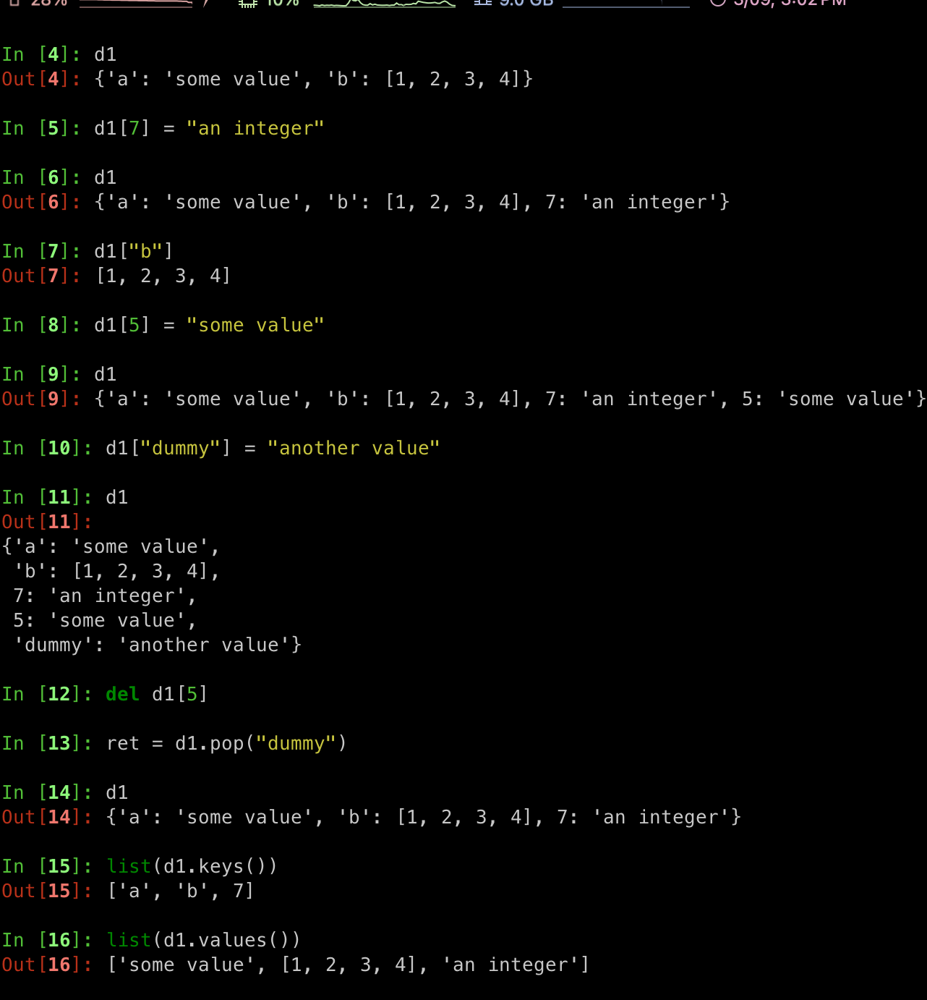
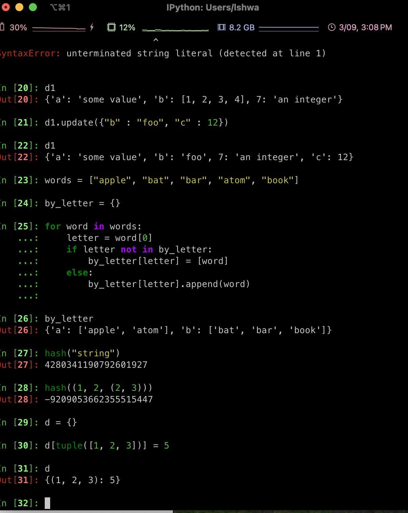
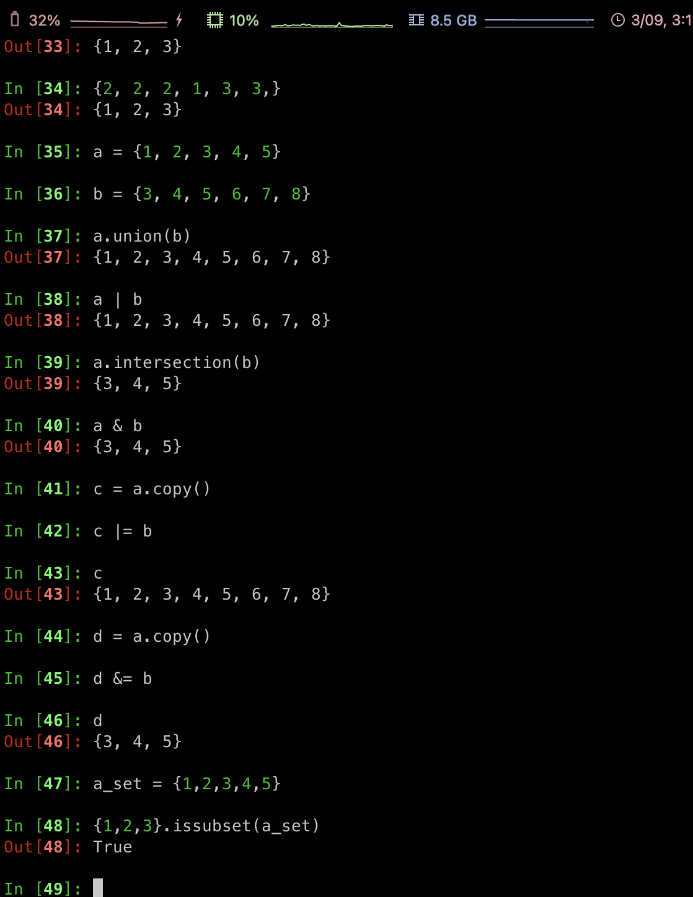
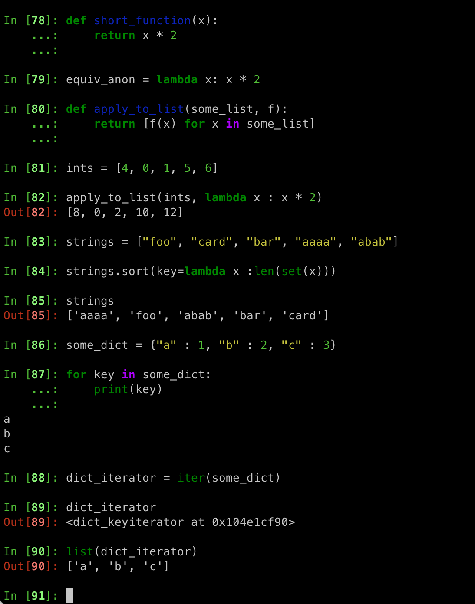
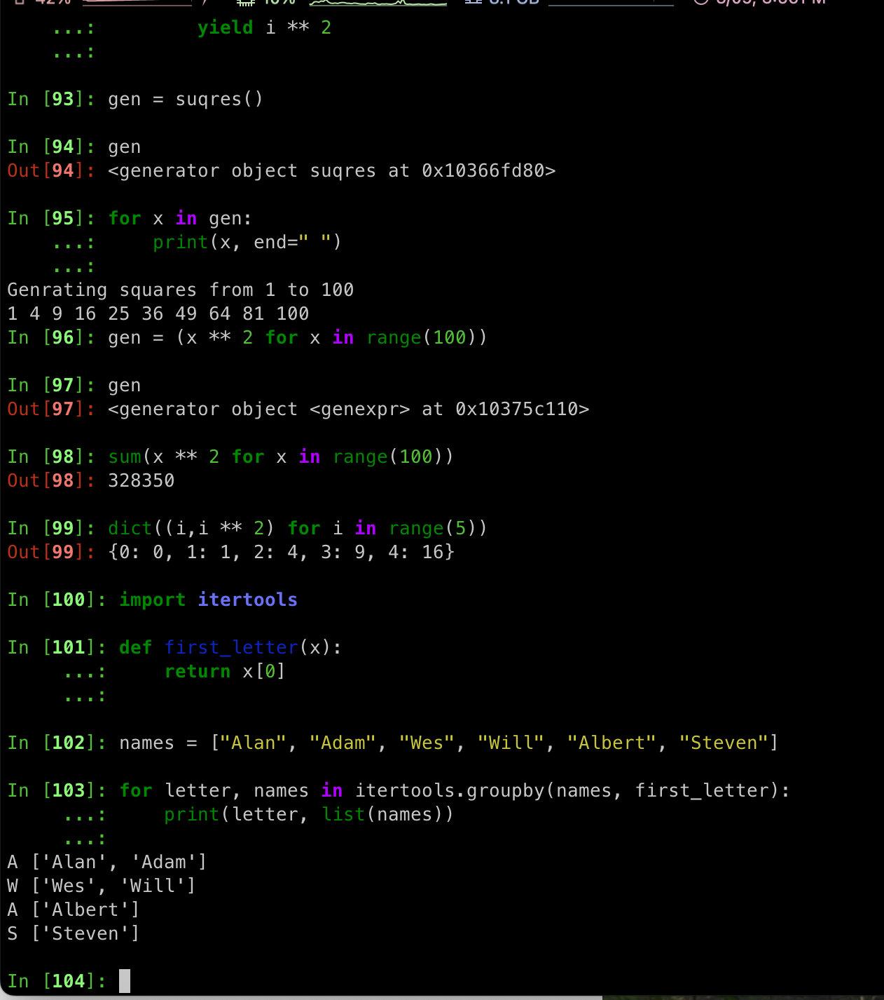
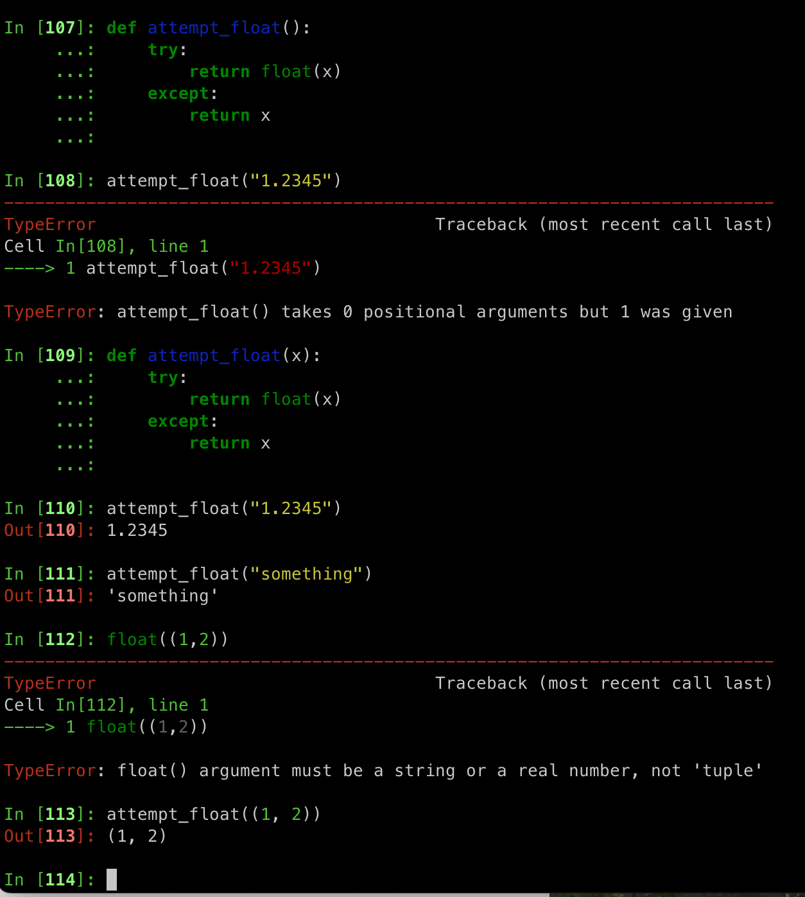
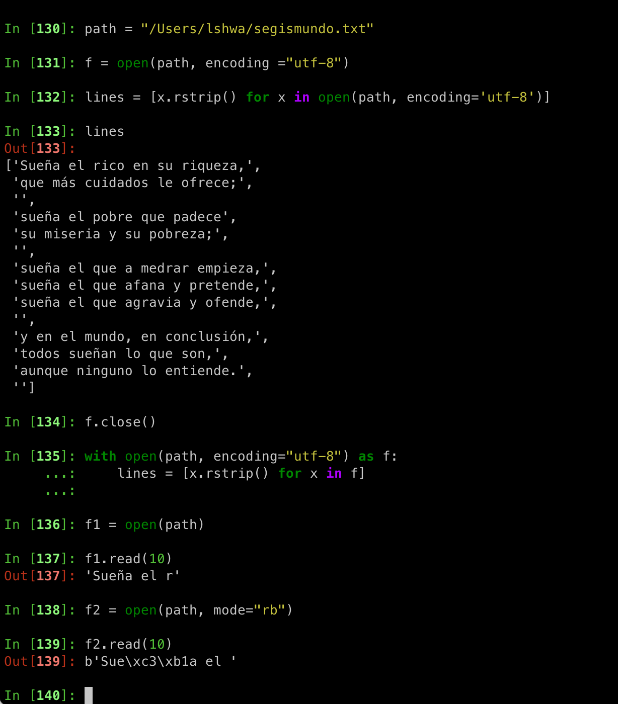
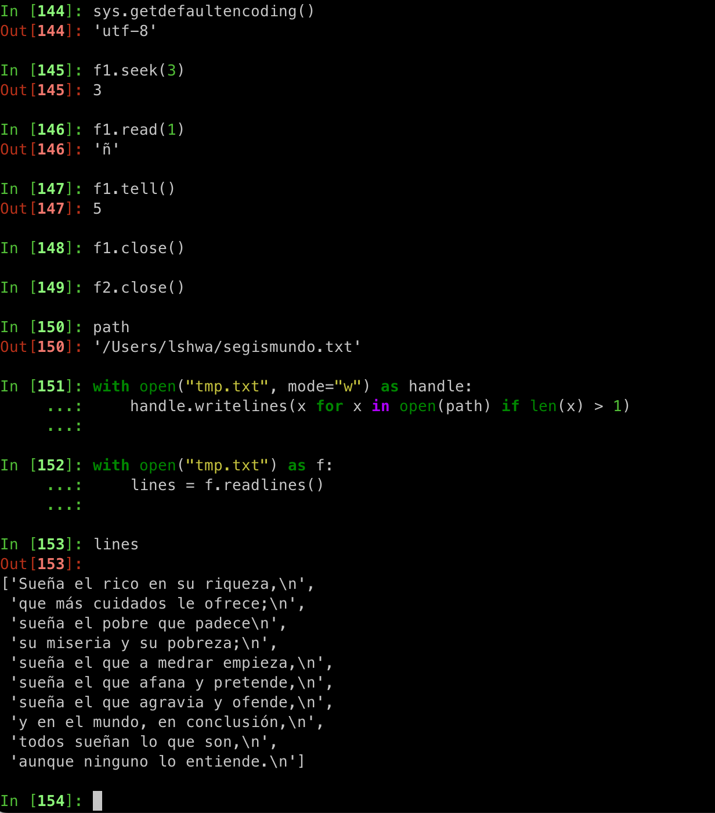
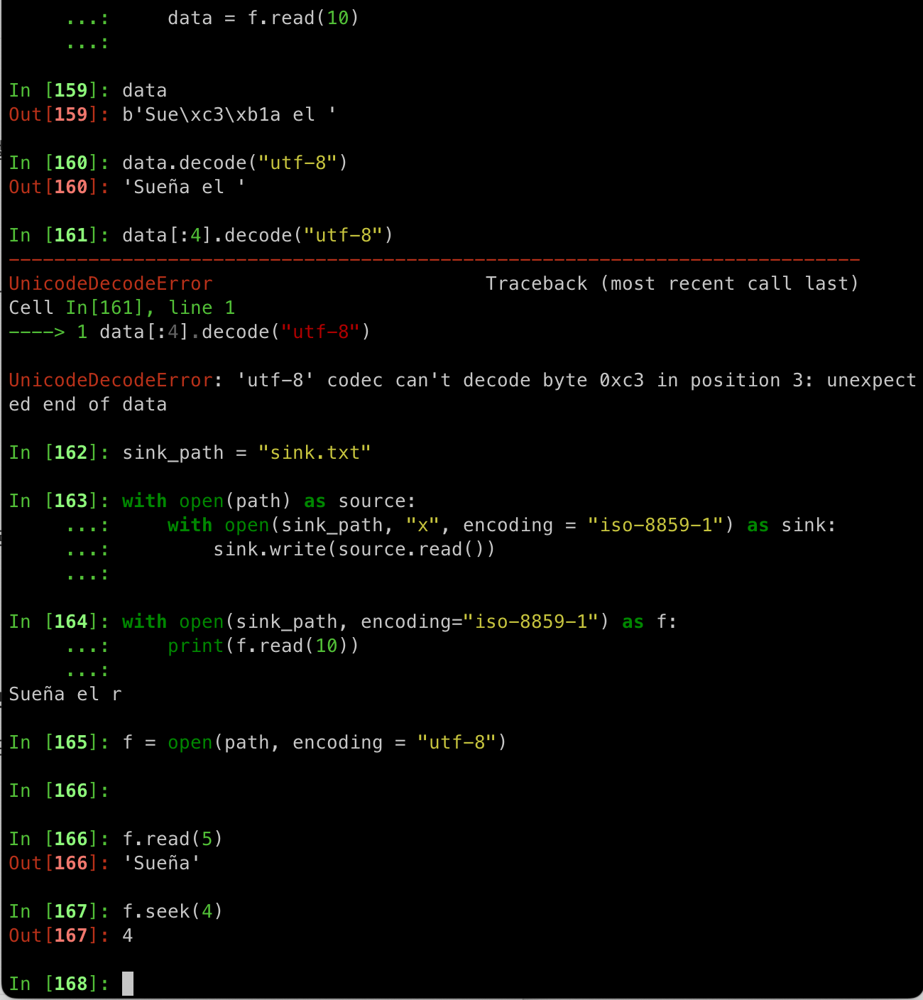

# Python 2주차 정규 과제 

📌Python 정규과제는 매주 정해진 분량의 『*파이썬 라이브러리를 활용한 데이터 분석*』 을 읽고 학습하는 것입니다. 이번주는 아래의 **Python_2nd_TIL**에 나열된 분량을 읽고 공부하시면 됩니다.

아래의 문제를 풀어보며 학습 내용을 점검하세요. 문제를 해결하는 과정에서 개념을 스스로 정리하고, 필요한 경우 참고 자료를 통해 보완하는 것이 좋습니다.

**교재 실습 예제 파일은 07_Python_Template 레포지토리의 notebooks 폴더에 업로드되어 있습니다.**

**👀(수행 인증샷은 필수입니다.)** 

## Python_2nd_TIL

### 3장 내장 자료구조, 함수, 파일
#### 1. 자료구조와 순차 자료형
#### 2. 함수
#### 3. 파일과 운영체제
#### 4. 마치며


## Study Schedule

| 주차  | 공부 범위 | 완료 여부 |
| ----- | --------- | --------- |
| 1주차 | p.25~82   | ✅         |
| 2주차 | p.83~129  | ✅         |
| 3주차 | p.131~179 | 🍽️         |
| 4주차 | p.181~246 | 🍽️         |
| 5주차 | p.247~309 | 🍽️         |
| 6주차 | p.310~379 | 🍽️         |
| 7주차 | p.381~465 | 🍽️         |


<br>

<!-- 여기까진 그대로 둬 주세요-->

---

# 1️⃣ 학습 내용 정리

## 1. 자료구조와 순차 자료형 & 실습 인증

### 개념정리

<!-- 이 부분을 지우고 새롭게 배우게 된 내용을 정리해주세요. -->

### 튜플 (Tuple)

**한 번 할당되면 변경할 수 없는 고정 길이를 갖는 파이썬의 순차 자료형**

- 생성 방법 : 쉼표로 구분되는 일련의 값을 괄호로 감싸는 것 
  - 괄호 생략이 가능하다. 
  - 모든 순차 자료형, Iterator는 **tuple 메서드**를 통해 튜플로 변환이 가능
  - **nested 한 자료형**도 가능
- **특징**
  - 저장된 객체 자체는 변경이 가능하지만 한 번 생성되면 슬롯에 저장된 객체를 변경하는 것은 불가능
  - `+` 연산자를 사용해 튜플 이어 붙이기가 가능
    - 정수를 곱해서 여러 개의 튜플 복사본을 늘리기도 가능
  - 튜플 같은 표현의 변수에 튜플 대입 시 등호 오른쪽에 있는 변수에서 **값을 분리**가 가능
  - `*rest` : 함수의 시그니처에서 길이를 알 수 없는 긴 인수를 담기 위한 방법으로 사용
    - 필요 없는 값을 무시하기 위해서도 사용 (불필요함을 나타내기 위해 `_` 도 사용)
  - **튜플 메서드** : `count` 주어진 값과 같은 값의 개수를 반환하는 count 메서드


<!-- 튜플 인증 사진 1, 2 -->


### 리스트 (List)

**튜플과 다르게 크기나 내용을 변경할 수 있는 자료구조**

- 생성 방법 : **대괄호**나 **list** 함수를 사용해서 생성
- **리스트 특징**
  - **원소 추가 및 삭제** 
    - `append` 메서드 : 리스트의 끝에 새로운 값을 추가
    - `insert` 메서드 : 리스트의 특정 위치에 값 추가 가능
    - `pop` 메서드 : 특정 위치의 값을 반환하고 해당 값을 리스트에서 삭제
    - `remove` 메서드 : 원소 삭제 (리스트의 제일 앞부분에 위치한 값부터 진행)
  - `in`, `not in` : 해당 값이 리스트에 있는지 / 없는지를 검사 
  - `+` 연산자를 사용하여 두 개의 리스트 합치기가 가능 
  - `extend` 메서드 : 여러 개의 값을 추가하기도 가능
  - **정렬** : `sort` 메서드를 사용해 리스트 생성하지 않고 그대로 리스트 정렬이 가능
    - 정렬 기준으로 사용할 값을 반환하여 문자열 길이와 같은 순서대로 정렬이 가능
  - **슬라이싱** : [] 대괄호 안에 `start : stop`을 지정해서 원하는 크기 만큼 자르기 가능
    - 슬라이싱 결과의 개수는 `stop - start` 
    - 시작값이나 끝 값 생략 : 맨 처음 or 맨 끝까지 슬라이싱 
    - 음수 색인은 순차 자료형의 끝에서부터의 위치를 나타냄


<!-- 리스트 인증 사진 1, 2 -->


### 딕셔너리 (Dict)

**키-값(Key-Value) 쌍을 저장하며 키와 값은 모두 파이썬 객체인 자료구조**

**키는 값과 연관되어 특정 키가 주어지면 값을 편리하게 검색, 삽입, 수정 또는 삭제가 가능**

- 생성 방법 : 중괄호를 {} 사용해 콜론으로 구분된 키와 값을 둘러싸면 딕셔너리 생성
- **특징**
  - **딕셔너리의 값을 삭제** : `del` , `pop` 
  - `keys`, `values` : 각각 키와 값이 담긴 이터레이터 반환
  - `items` : 키와 값의 쌍을 갖는 튜플로 이를 사용하기 가능
  - `update` : 하나의 딕셔너리를 다른 딕셔너리와 합치기 가능
    - 값을 그 자리에서 바꾸기 때문에 이미 존재하는 키에 대해 update를 호출 할 때 이전 값이 사라진다. 
  - `get` : 해당 키가 존재하지 않을 경우 None 반환, `pop` 예외를 발생
    - `setdefault` : 여러 단어를 시작 글자에 따라 딕셔너리에 리스트로 저장
    - `defaultdict` : 자료형 혹은 딕셔너리의 각 슬롯에 담긴 기본값을 생성하는 함수를 넘겨 딕셔너리를 생성
  - **유효한 딕셔너리 키** : hash 함수를 사용하여 검사 가능


<!-- 딕셔너리 인증사진 1, 2 -->





### 집합 (Set)

**고유한 원소만 담는 정렬되지 않은 자료형**

- 생성 방법 : `set` 함수를 이용 또는 중괄호를 사용하여 생성

- **특징**

  - **합집합, 교집합, 차집합, 대칭차집합** 같은 산술 집합 연산을 제공

    - `union` 메서드나 `|` 연산자로 합집합 구함.
    - `intersection` 메서드나 `&` 연산자로 교집합을 구함. 

    ~~~python
    # Python (set) 연산
    a.add(x)
    a.clear()
    a.remove()
    a.pop()
    a.intersection_update(b)
    a.difference(b)
    a.difference_update(b)
    a.symmetric_difference(b)
    a.symmetric_difference_update(b)
    a.issubset(b)
    a.issuperset(b)
    a.isdisjoint(b)
    ~~~

  - 모든 논리 집합 연산 : 연산 결과를 좌항에 대입하는 함수도 따로 제공


<!-- 집합 이미지1 -->



> **내장 순차 자료형 함수**

- **enumerate** : 순차 자료형에서 현재 아이템의 색인을 함께 추적할 때 흔히 사용

  - `(i, value)` 튜플을 반환하는 함수가 있다. 
  - 사용 방법

  ~~~Python
  for index, value in enumerate(collection):
    # 여기서 value 변수를 사용 가능
  ~~~


- **sorted** : 정렬된 새로운 순차 자료형 반환

- **zip** : 여러 개의 리스트나 튜플 또는 다른 순차 자료형을 서로 짝지어서 튜플 리스트를 생성
  - 여러 개의 순차 자료형을 받을 수 있고, 반환되는 리스트의 길이는 넘겨받은 순차 자료형 중 가장 짧은 길이를 가짐
  - `enumerate`와 함께 자주 사용
- **reversed** : 순차 자료형을 역순으로 순화
- **map** : 중첩된 리스트 or 리스트 출력 시 사용


<!-- 내장 순차 자료 함수 이미지 --> 


## 2. 함수

### 개념정리 & 실습 인증

**코드를 재사용하거나 조직화하기 위한 가장 중요한 수단**

- 같은 일을 반복하거나 비슷한 코드가 한 번 이상 실행될 거라고 예상된다면 재사용이 가능한 함수를 작성하는 것이 더 좋음. 
- 생성 방법 : `def` 예약어로 정의, 선택적으로 `return` 예약어를 사용하는 코드 블록 포함
- **특징**
  - 함수 블록이 끝날 때까지 return이 없으면 자동으로 `None `이 반환
  - 여러 개의 위치 / 키워드 인수를 받을 수 있음. 
  - 함수도 객체 : 공백 문자나 구두점 제거, 대소문자 맞추는 작업을 **내장 문자열 메서드, 정규 표현식 기반 표준 라이브러리 `re` ** 사용하여 쉽게 해결이 가능
  - **익명(람다) 함수** : 데이터를 변형하는 함수에서 인수로 함수를 받아야 하는 경우가 매우 잦아서 람다 함수가 특히 편리
    - 실제 함수를 선언, 지역 변수에 람다 함수를 대입하는 것보다 코드가 적고 더 간결해짐 
  - **이터레이터 프로토콜** : 순회 가능한 객체 
    - 제너레이터 생성 시 함수에서는 return을 대신해서 `yield` 예약어 사용
    - 제너레이터 생성 : 제너레이터 표현식 사용하기
    - 표준 라이브러리 `itertools` : 일반적인 데이터 알고리듬을 위해 여러 제너레이터 제공

- **오류와 예외 처리**
  - 입력 타입이 맞지 않으면 **TypeError** 라는 오류를 둔다. 
    - ValueError만 무시하고 싶다 : **except** 뒤에 처리할 예외의 종류를 적어줌.
  - `finally` : 해당 블록코드의 성공/실패 여부와 관계없이 실행시키고 싶은 코드를 넣어두는 곳


#### 네임스페이스, 스코프, 지역 함수 

**네임스페이스 (NameSpace) : 변수의 스코프**

> 변수가 호출 될 때 그 변수가 어디 블록까지 유효한지를 설명해주는 개념

- 함수의 범위 밖에서 변수에 값을 대입하기 위해 : `global`, `nonlocal` 예약어를 사용해야함. 
  - 일반적으로 전역 변수는 시스템의 상태를 저장하는데 사용하기에 객체 지향 프로그래밍에 어긋나는 기술


<!-- 함수 이미지 넣어두는 곳 1, 2, 3 -->








## 3. 파일과 운영체제

### 개념정리 & 실습 인증 

- `open` : 내장함수로, 파일을 읽고 쓰기 위해서 파일의 상대 경로나 절대 경로를 넘겨줘야 한다. 
  - 기본적으로 파일 읽기 전용 모드인 `r` 로 열린다. 
    - `w` : 새롭게 파일이 생성, 새로운 내용으로 덮어 쓰게 된다. 
  - 작업이 끝났을 때 명시적으로 닫아줘야 한다. `close` 메서드 사용
  - `with`을 사용하여 더 쉽게 끄기도 가능

- `read, seek, tell` 메서드 : 파일 읽을 때 주로 사용
  - `read` : 해당 파일에서 특정 개수 만큼의 문자를 반환, 읽은 바이트 만큼 파일 핸들의 위치를 옮긴다. 
  - `tell` : 현재 위치를 알려준다. 
  - `seek` : 파일 핸들의 위치를 해당 파일에서 지정한 바이트 위치로 옮긴다. 


**바이트와 유니코드**

- 읽기/쓰기 등 파이썬 파일은 파이썬 문자열을 다루기 위한 **텍스트 모드**를 기본으로 함.
  - 텍스트 인코딩에 따라 읽어온 바이트를 str객체로 직접 디코딩도 가능하지만 온전한 유니코드 문자로 인코딩 될 경우만 가능 


<!-- 파일 이미지 넣어두는 곳 -->







# 2️⃣ 실습 과제

각 문제에 대한 실행 결과가 확인되도록 코드를 작성하고 실행한 뒤, **모든 문제의 실행 화면을 캡처하여 제출하시기 바랍니다.**

**1. 다음 형식으로 학생 정보를 저장하세요.**
```python
students = [
    {"name": "규서", "score": 85},
    {"name": "예운", "score": 72},
    {"name": "민서", "score": 90}
]
```

**2. 문제**
```
1. 전체 평균 점수를 구하는 함수 작성 및 결과 출력
  - students 리스트를 입력받아 평균 점수를 반환하는 get_average 함수를 작성하세요.
  - 함수를 호출하여 계산된 평균 점수를 print()를 이용해 화면에 출력하세요.

2. 80점 이상 우수 학생 추출 및 리스트 출력
  - 리스트 표기법을 사용하여 점수가 80점 이상인 학생의 이름만 담긴 새로운 리스트를 만드세요.
  - 생성된 우수 학생 명단 리스트를 print()를 이용해 화면에 출력하세요.
```

<!-- 이 부분을 지우고 인증 사진을 제출해주세요.-->


### 🎉 수고하셨습니다.