# Python 5주차 정규 과제 

📌Python 정규과제는 매주 정해진 분량의 『*파이썬 라이브러리를 활용한 데이터 분석*』 을 읽고 학습하는 것입니다. 이번주는 아래의 **Python_5th_TIL**에 나열된 분량을 읽고 공부하시면 됩니다.

아래의 문제를 풀어보며 학습 내용을 점검하세요. 문제를 해결하는 과정에서 개념을 스스로 정리하고, 필요한 경우 참고 자료를 통해 보완하는 것이 좋습니다.

**교재 실습 예제 파일은 07_Python_Template 레포지토리의 notebooks 폴더에 업로드되어 있습니다.**

**아나콘다 환경에서는 많은 패키지가 기본적으로 포함되어 있어 별도의 설치 없이 사용할 수 있지만, 환경에 따라 conda install이나 pip install이 필요할 수 있습니다.**

**👀(수행 인증샷은 필수입니다.)** 

## Python_5th_TIL

### 6장 데이터 로딩과 저장, 파일 형식
#### 1. 텍스트 파일에서 데이터를 읽고 쓰는 법
#### 2. 이진 데이터 형식
#### 3. 웹 API와 함께 사용하기
#### 4. 데이터베이스와 함께 사용하기
#### 5. 마치며
### 7장 데이터 정제 및 준비
#### 1. 누락된 데이터 처리하기
#### 2. 데이터 변형 


## Study Schedule

| 주차  | 공부 범위 | 완료 여부 |
| ----- | --------- | --------- |
| 1주차 | p.25~82   | ✅         |
| 2주차 | p.83~129  | ✅         |
| 3주차 | p.131~179 | ✅         |
| 4주차 | p.181~246 | ✅         |
| 5주차 | p.247~309 | ✅         |
| 6주차 | p.310~379 | 🍽️         |
| 7주차 | p.381~465 | 🍽️         |


<br>

<!-- 여기까진 그대로 둬 주세요-->

---

# 1️⃣ 학습 내용 정리

## 1. 텍스트 파일에서 데이터를 읽고 쓰는 법

### 개념정리

판다스의 텍스트 및 이진 데이터 읽기 함수들 종류

- `read_csv` 에서 csv 를 대신하여
  - fwf, clipboardsd, excel, hdf, html, json, feather, orc, parquet, pickle, sas, spss, sql, sql_table, stata, xml 도 가능

**텍스트 데이터를 DataFrame으로 읽어오는 함수**

- **색인** : 반환하는 DataFrame에서 하나 이상의 열을 색인으로 지정, 파일이나 사용자로부터 열 이름을 받거나 아무것도 받지 않을 수 있다.
- **자료형 추론과 데이터 변환** : 사용자 정의 값 변환과 비어 있는 값을 위한 사용자 리스트 포함
- **날짜 및 시간 분석** : 여러 열에 걸쳐 있는 날짜와 시간 정보를 하나의 열에 조합해서 결과에 반영
- **반복** : 여러 개의 파일에 걸쳐있는 자료를 반복적으로 읽음
- **정제되지 않은 데이터 처리** : 행이나 꼬리말, 주석 건너뛰기 또는 천 단위마다 쉼표로 구분된 숫자 같은 사소한 요소를 처리


함수 중에는 데이터 형식에 열의 자료형이 포함되어 있지 않아 타입 추론을 수행하는 함수도 존재

- 특정 열을 숫자, 정수, 불리언 또는 문자열로 지정하지 않아도 된다는 의미


고정된 구분자 ㅇ벗이 공백이나 다른 패턴으로 필드를 구분해 놓은 경우

- 정규표현식을 사용하여 처리 가능 


기본적으로 판다스는 `NA, NULL`처럼 흔히 통용되는 문자로 결측치를 나타냄

- `na_values` : 문자열 집합을 받아서 누락된 값을 처리

- `keep_default_na` : NA 값 표현 목록을 비활성화

- 열마다 다른 NA 문자를 딕셔너리 값으로 넘겨서 처리도 가능 


**텍스트 파일 조금씩 읽어오기**

- 매우 큰 파일을 처리할 때 인수를 제대로 설정했는지 알아보기 위해 파일의 일부분만 읽어보거나 여러 파일 중 몇개의 파일만 읽어서 확인이 가능
- `nrows` : 파일 전체 말고 처음 몇 행만 읽으려고 할 때 쓰는 옵션
- `chunksize` : 파일을 여러 조각으로 나누어서 읽고 싶을 때 행 개수 설정 옵션


**데이터를 텍스트 형식으로 기록하기**

- 데이터를 구분자로 구분한 형식으로 내보내기도 가능


**다른 구분자 형식 다루기**

- 디스크에 표 형태로 저장된 대부분의 파일 형식을 불러오기가 가능
- `csv.reader` 함수에 열려진 파일 객체를 넘기면 끝
- 다양한 구분자, 문자열 둘러싸기, 개형 문자를 `csv.Dialect`로 상속받아 새로운 클래스 정의해서 해결이 가능


**JSON 데이터**

- 웹 브라우저와 다른 애플리케이션이 HTTP 요청으로 데이터를 보낼 때 널리 사용하는 표준 파일 형식 중 하나
- 더 유연한 방식
- 객체의 키는 반드시문자열
- 문자열을 파이썬 형태로 변환하기 위해서는 `json.loads`를 사용
  - `json.dumps` : 파이썬 객체를 JSON 형태로 변환


**XML과 HTML : 웹 스크래핑**

- XML : 계층적 구조와 메타 데이터를 포함하는 중첩된 데이터 구조를 지원하는 또 다른 유명한 데이터 형식
  - `pandas.read_xml` 함수를 통해 처리 가능


### 실습 인증

<!-- 이미지 1-n -->
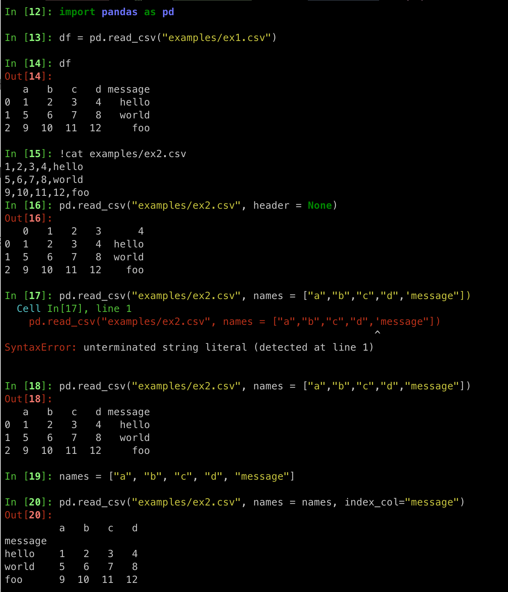

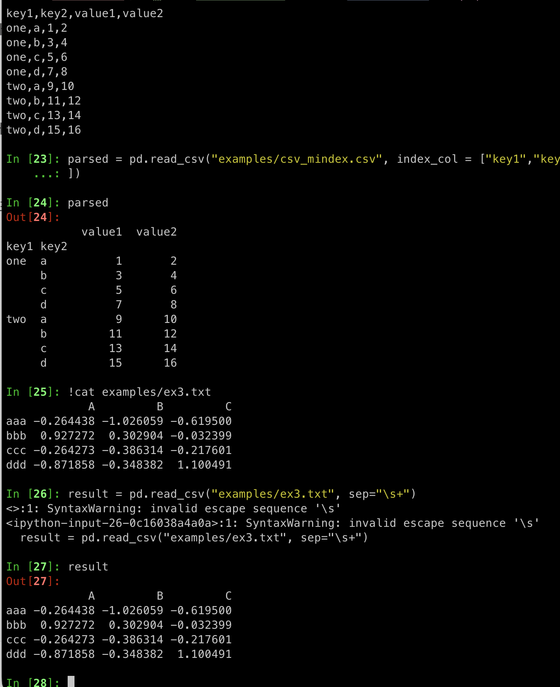

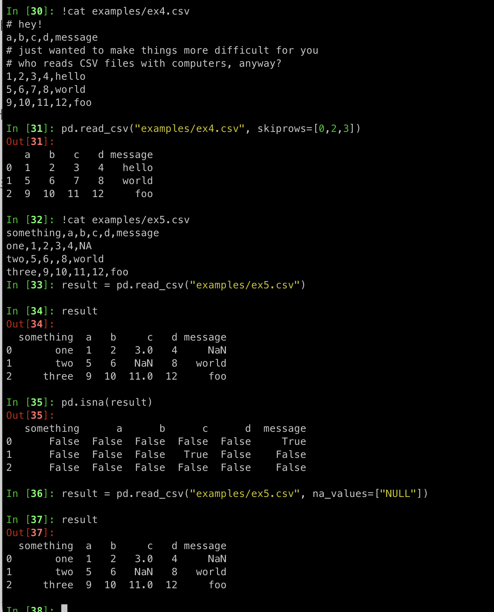

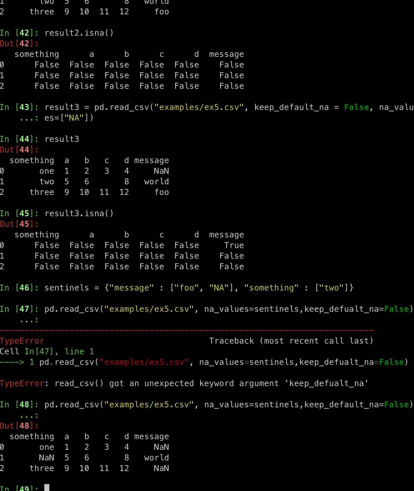

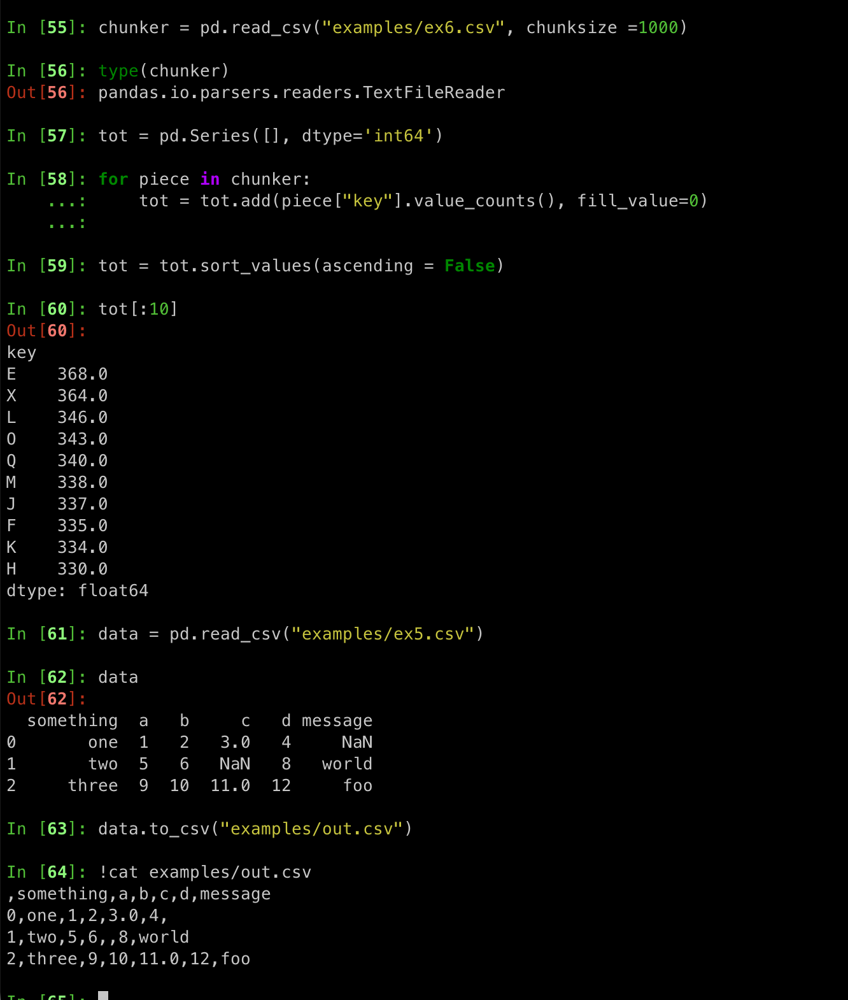
---


## 2. 이진 데이터 형식

### 개념정리

데이터를 이진 형식으로 저장하는 간단한 방법

- 파이썬의 내장 `pickle` 모듈 활용하기
  - pickle을 통해 저장된 객체 : 파이썬 내장 모듈로 불러오거나 pandas.read_pickle 함수를 이용해서 불러오기가 가능


**마이크로소프트 엑셀 파일 읽기**

- `pandas.read_excel` 함수를 통해 표 형식 데이터를 불러오기가 가능
- Xls, xlsx 파일 경로를 전달해 인스턴스를 만들어야 함. 
- `to_excel` : 파일 경로를 넘겨주기 가능


**HDF5 형식 사용하기**

- HDF5 : 대량의 과학 계산용 배열 데이터를 저장하기 위한 파일 포맷 
  - 다양한 언어에서의 인터페이스 제공
  - `PyTables` 패키지를 통해 사용 가능
  - 파이썬 딕셔너리와 유사한 API 형식으로 사용이 가능
- 대부분의 데이터 분석 문제는 CPU보다 IO 성능에 의존적
- HDF5는 데이터 베이스가 아니라 데이터를 자주 여러번 읽을 때에 최적화되어있다.
  - 동시에 데이터를 추가하면 원자성 확보 X


### 실습 인증

<!-- 이미지 2-n -->
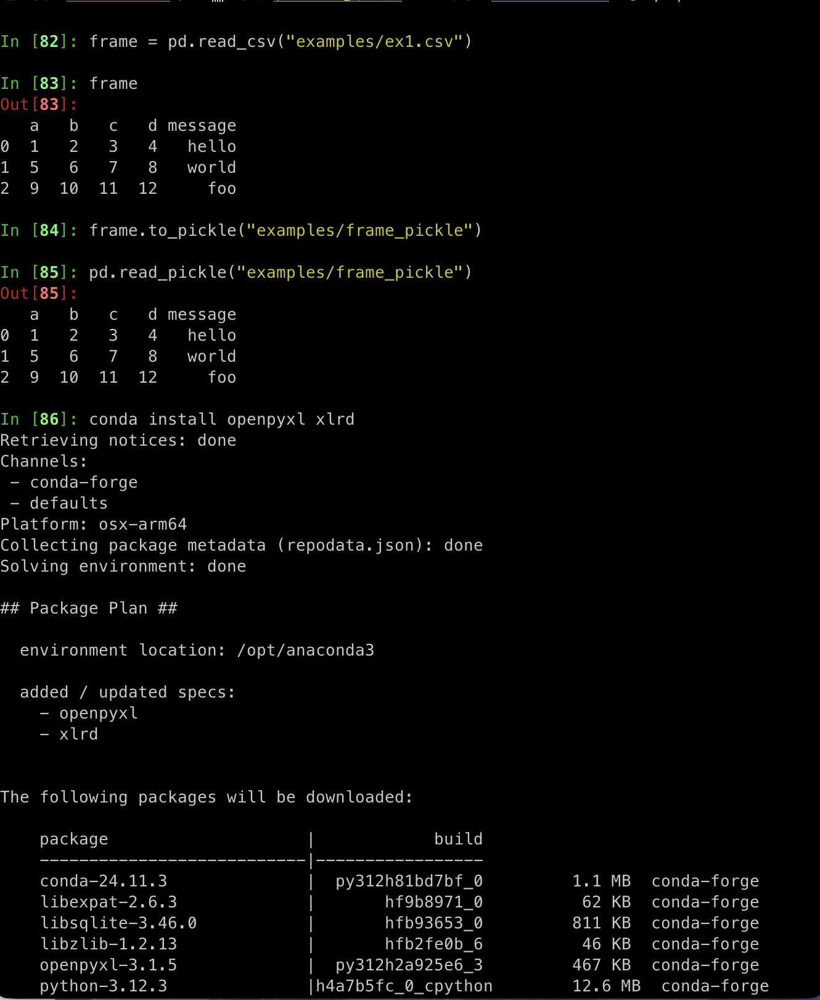

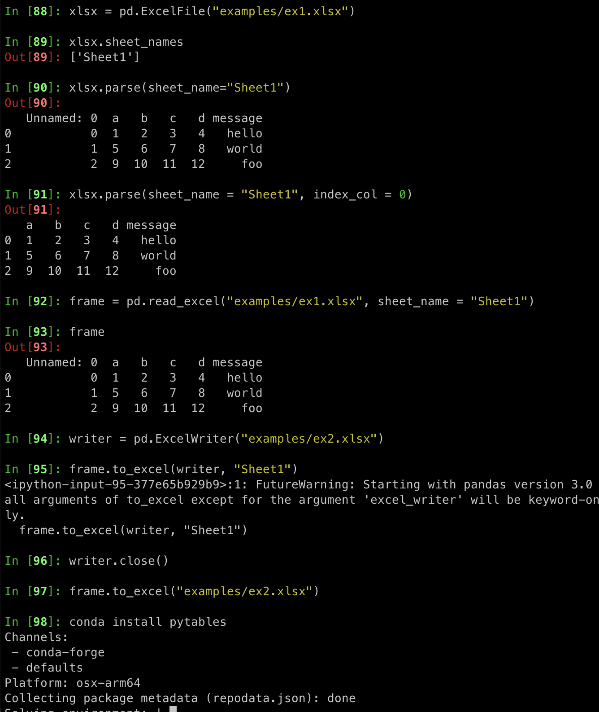

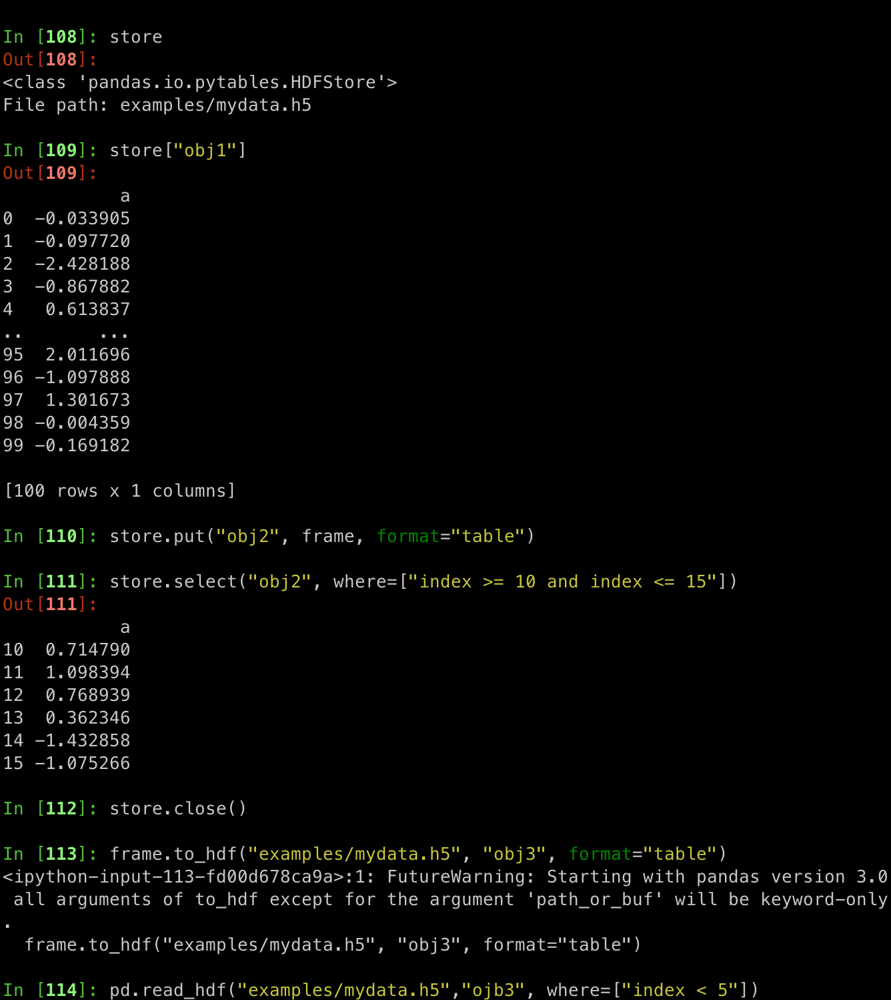

---


## 3. 웹 API와 함께 사용하기

### 개념정리

`requests` 패키지 

- 데이터 피드나 JSON이나 여타 다른 형식으로 얻을 수 있는 공개 API를 제공하는 웹사이트
- `GET HTTP` 요청을 하기가 가능 
- `raise_for_status` : HTTP 오류를 확인하기가 가능
  - 변환되는 결과는 실시간 결과


### 실습 인증

<!-- 이미지 3-n -->
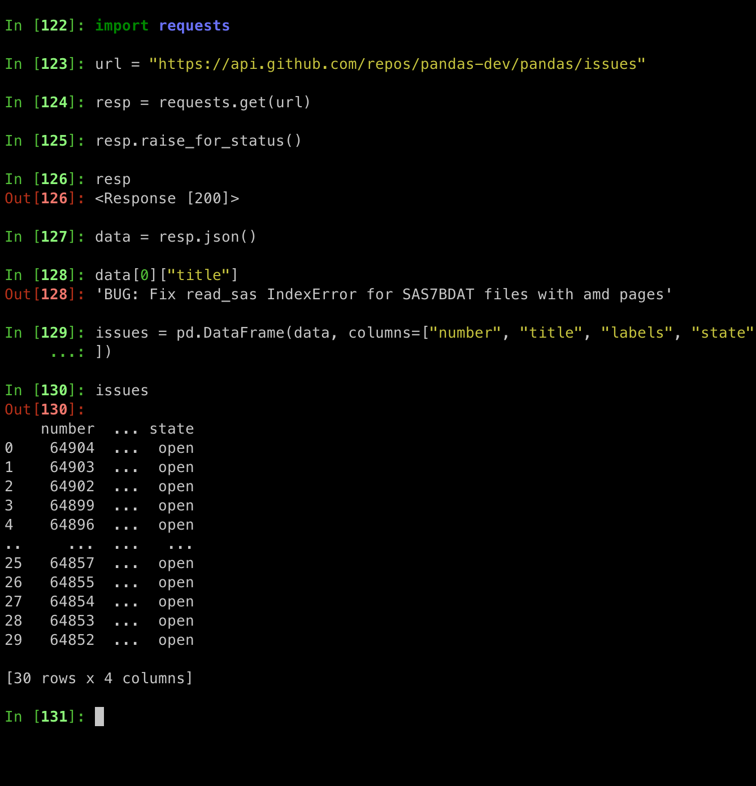


---


## 4. 데이터베이스와 함께 사용하기

### 개념정리

대부분의 데이터가 텍스트 파일이나 엑셀 파일로 저장되기보다 SQL 기반의 관계형 데이터베이스를 많이 사용

- 애플리케이션에서 필요한 성능이나 데이터 무결성, 확장성에 맞춰서 선택


**파이썬의 SQL 드라이버**

- 테이블에서 select 쿼리를 수행하면 튜플 리스트 반환
- `cursor` 의 description 속성에 있는 열 이름을 지정해야 함. 


**SQLAlchemy 프로젝트** : SQL 데이터베이스 간의 일반적인 차이점을 추상화해 제공

- 판다스는 `read_sql` 함수를 통해 일반적인 연결을 이용해 쉽게 데이터를 읽도록 지원


### 실습 인증

<!-- 이미지 4-n -->
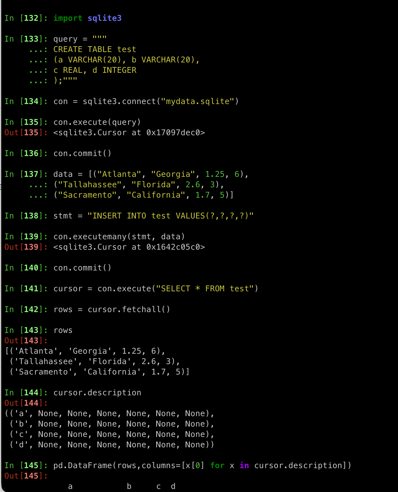


---


## 5. 누락된 데이터 처리하기

### 개념정리

데이터에서 누락된 데이터는 흔하게 발생

- 판다스에서는 이를 편하게 처리가 가능
  - 감싯값이라고 부르며 누락된값임을 등장하기 위해 나타남
- `isna` : 값이 null인 경우 True를 가지는 불리안 메서드
  - R 프로그래밍에서 결측치를 **NA** 로 취급하는 개념을 차용
  - 데이터가 존재하지 않거나, 존재하더라도 검출되지 않음을 의미 
- **NA 처리 메서드**
  - `dropna, fillna, isna, notna


**누락된 데이터 골라내기** : `dropna` 사용하기

- `how = "all"` 옵션을 넘기면 모든 값이 NA인 행만 제거
- 열을 제거는 `axis = columns`를 사용
- 결측치가 특정 개수보다 적은행만 보고 싶을 때는 `thresh` 인수에 원하는 값 설정하기


**결측치 채우기** : `fillna` 메서드 사용하기

- 메서드에 채워놓고 싶은 값을 넣으면 끝
- 평균값이나 중간값으로 넣을 수도 있다.


### 실습 인증

<!-- 이미지 5-n -->
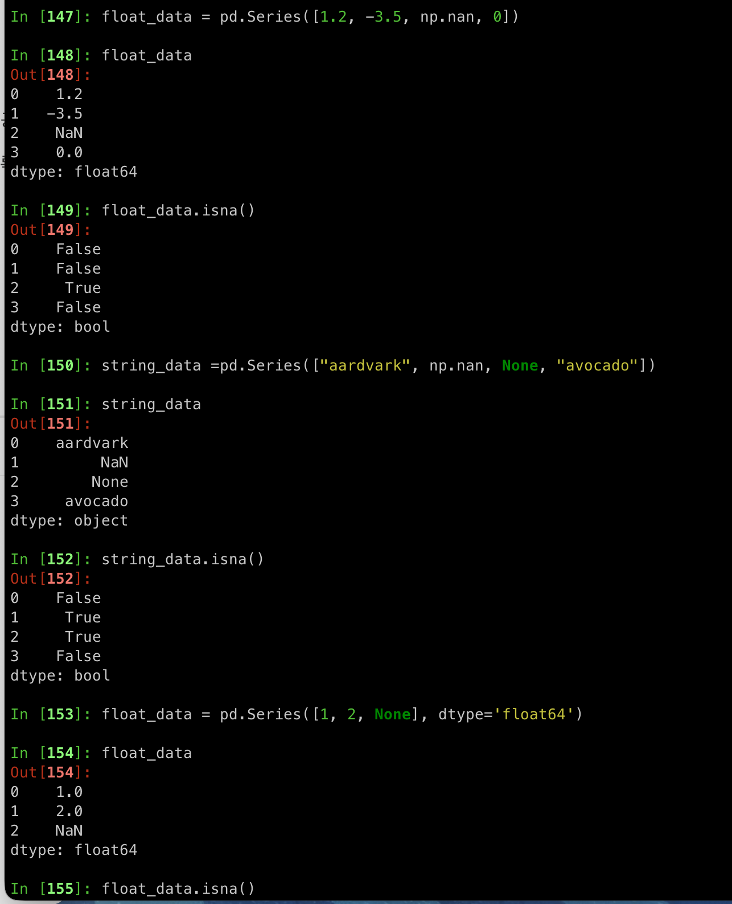

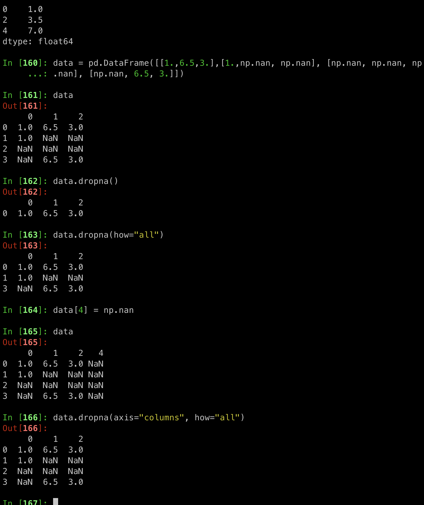

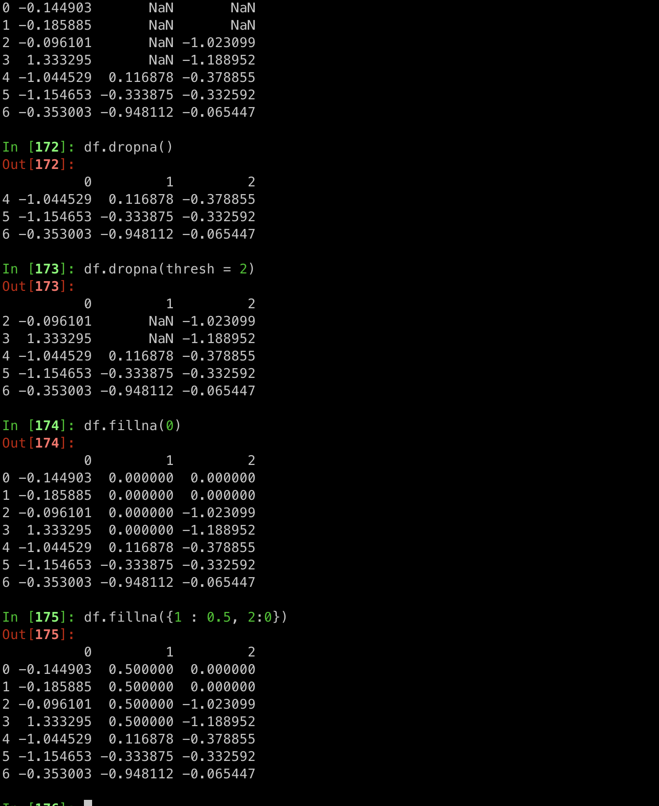

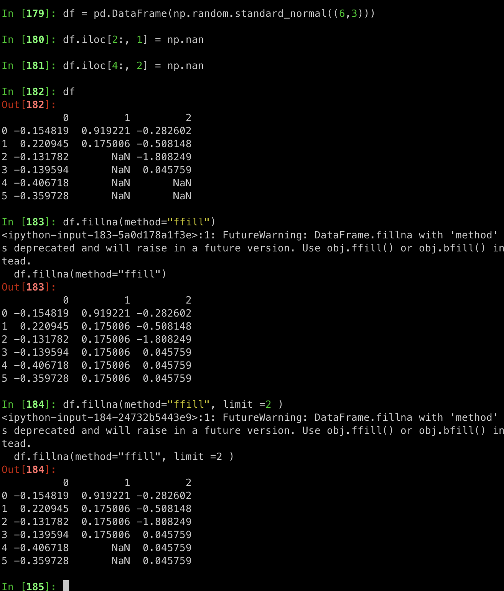

---


## 6. 데이터 변형 

### 개념정리

**중복 제거하기**

- `duplicated` 메서드 : 각 행이 중복인지 아닌지를 알려주는 객체 반환
- `drop_dupliates` : duplicated 배열이 False이 DataFrame을 필터링하여 반환


**함수나 매핑을 이용해서 데이터 변형하기**

- DataFrame의 열이나 Series, 배열 내의 값을 기반으로 변형
- `map` 메서드를 통해 데이터의 요소별 변형과 다듬는 작업을 할 수 있다.


**값 치환하기**

- `replace` : 해당 값을 판다스에서 인식할 수 있는 NA 값으로 치환해서 생성 가능
  - 여러 개의 값을 한 번에 치환하기 가능
  - 새로지정할 값의 리스트 전달도 가능


**축 색인 이름 바꾸기**

- Series 값처럼 축 이름도 함수나 새롭게 바꿀 값을 이용해서 변형할 수 있음.
- 축 색인에도 `map` 메서드가 존재
  - 원래 객체를 변경하지 않고 새로운 객체 생성하기 위해 `rename` 메서드 사용


**이산화**

- 종종 개별로 분할하거나 분석을 위해 그룹으로 나누기도 함
- `Categorical` : 판다스 객체
  - 개별 그룹의 상한과 하한값을 담은 특수한 간격값으로 구분


### 실습 인증

<!-- 이미지 6-n -->
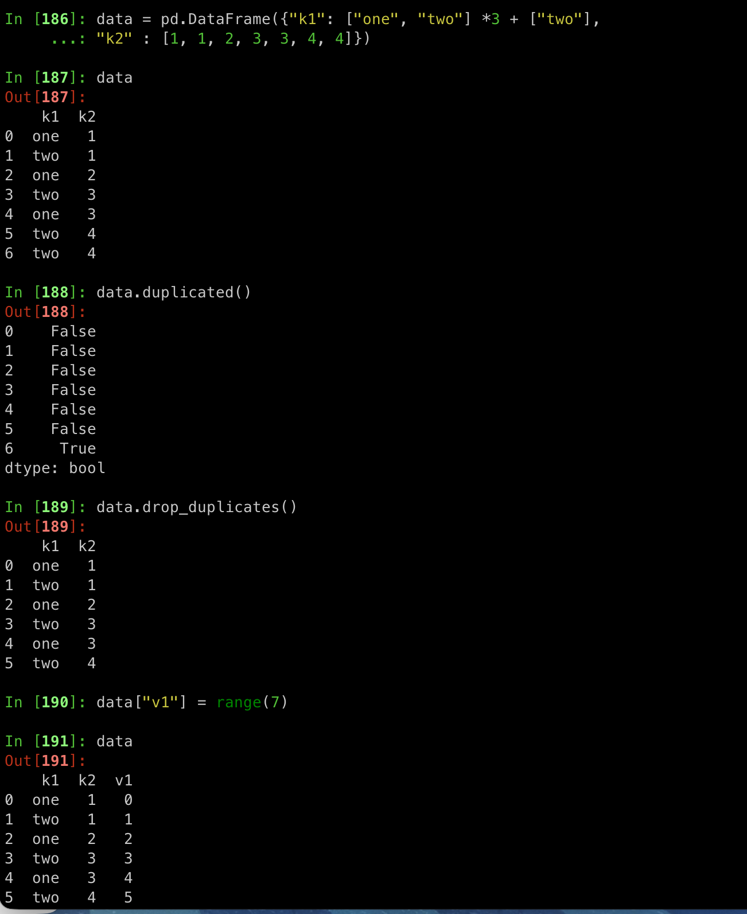

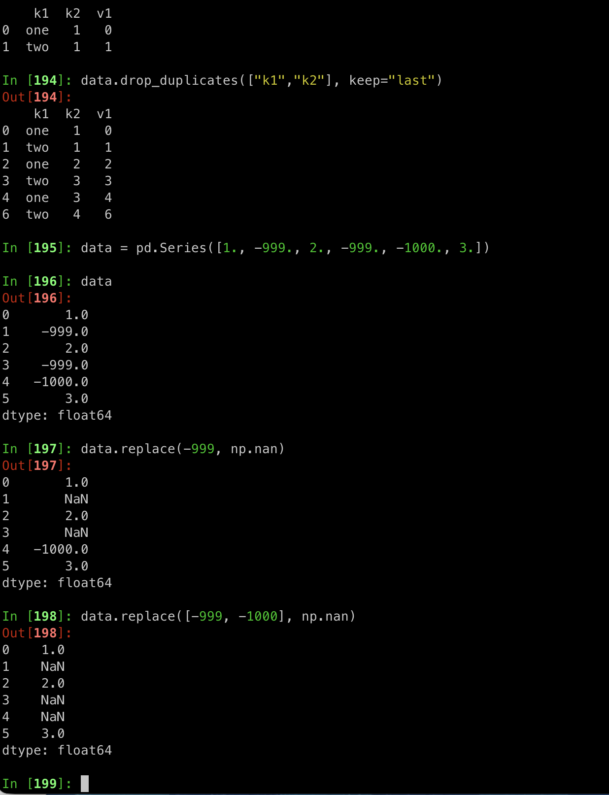

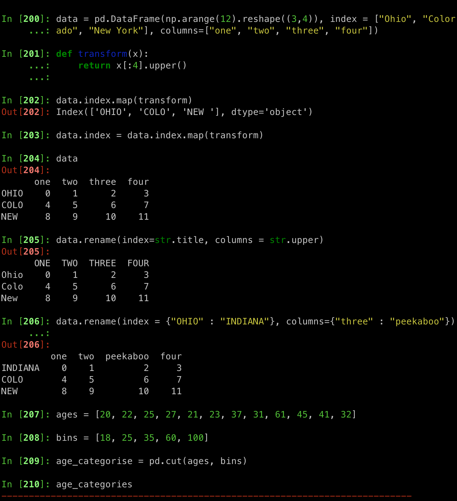
---

# 2️⃣ 실습 과제

각 문제에 대한 실행 결과가 확인되도록 코드를 작성하고 실행한 뒤, **모든 문제의 실행 화면을 캡처하여 제출하시기 바랍니다.**

**1. 아래 코드를 실행하여 텍스트와 데이터를 선언합니다.**
```python
import pandas as pd
import json
import requests

# 1. 테스트용 CSV 내용 (메모리 내 시뮬레이션용)
csv_data = "id,name,score,note\n1,Kim,85,NA\n2,Lee,NULL,Good\n3,Park,90,None"
with open("test_data.csv", "w") as f:
    f.write(csv_data)

# 2. 테스트용 JSON 문자열
json_obj = """
{
    "company": "DataService",
    "employees": [
        {"name": "Alice", "age": 30, "dept": "IT"},
        {"name": "Bob", "age": 25, "dept": "HR"}
    ]
}
"""
```

**2. 문제**
```
1. CSV 파일 읽기 및 결측치 지정
  - 문제 설명: 제공받은 test_data.csv 파일을 읽어오기(단, 데이터의 특성에 맞게 옵션 설정)
  - read_csv()를 사용하여 파일을 읽으세요.
  - 이때 NA, NULL, None이라는 문자열을 모두 **결측치(NaN)**로 인식하도록 na_values 옵션을 설정하세요.
  - print()를 이용해 읽어온 DataFrame을 출력하세요.

2. JSON 데이터 변환 및 특정 데이터 추출
  - 문제 설명: 문자열 형태의 JSON 데이터를 파싱하여 직원 명단만 추출
  - json.loads()를 사용하여 json_obj 문자열을 파이썬 객체로 변환하세요.
  - 변환된 객체에서 employees 리스트만 추출하여 DataFrame으로 만드세요.
  - print()를 이용해 생성된 직원 명단 DataFrame을 출력하세요.

3. 웹 API 데이터 가져오기
  - 문제 설명: 판다스 깃허브 저장소의 이슈(Issues) 데이터를 가져와 상위 항목 확인
  - requests.get()을 사용하여 https://api.github.com/repos/pandas-dev/pandas/issues URL의 데이터를 가져오세요.
  - 응답받은 JSON 데이터를 DataFrame으로 변환하세요.
  - print()를 이용해 데이터의 상단 5행(head)을 출력하세요.
```

<!-- 이 부분을 지우고 인증 사진을 제출해주세요.-->
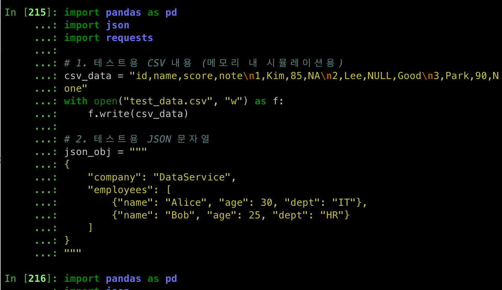

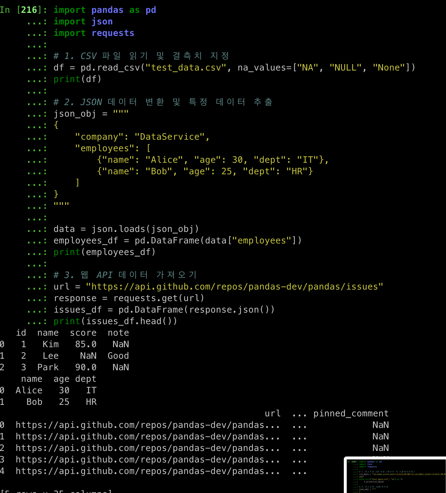

### 🎉 수고하셨습니다.