# SQL_MASTER 2주차 정규과제

📌SQL MASTER 정규과제는 매주 정해진 분량의 『*데이터 분석을 위한 SQL 레시피*』 를 읽고 학습하는 것입니다. 이번 주는 아래의 **SQL_MASTER_2nd_TIL**에 나열된 분량을 읽고 공부하시면 됩니다.

아래 실습을 수행하며 학습 내용을 직접 적용해보세요. 단순히 결과를 재현하는 것이 아니라, SQL을 직접 작성하는 과정에서 개념을 스스로 정리하는 것이 중요합니다.

필요한 경우 교재와 추가 자료를 참고하여 이해를 보완하시기 바랍니다.

## SQL_MASTER_2nd_TIL

### 3장 데이터 가공믈 위한 SQL
#### 1. 하나의 값 조작하기
#### 2. 여러 개의 값에 대한 조작
#### 3. 하나의 테이블에 대한 조작
#### 4. 여러 개의 테이블 조작하기


## Study Schedule

| 주차  | 공부 범위 | 완료 여부 |
| ----- | --------- | --------- |
| 1주차 | p.20~50   | ✅         |
| 2주차 | p.52~136  | ✅         |
| 3주차 | p.138~184 | 🍽️         |
| 4주차 | p.186~232 | 🍽️         |
| 5주차 | p.233~321 | 🍽️         |
| 6주차 | p.324~406 | 🍽️         |
| 7주차 | p.408~464 | 🍽️         |

<br>

<!-- 여기까진 그대로 둬 주세요-->


# 실습

## 0. 실습 규칙

1. 샘플 데이터 생성 코드는 **07_SQL_MASTER_Template/src** 경로에 장별로 정리되어 있습니다.
2. 아래 목차에 맞춰 해당 코드를 실행하여 샘플 데이터를 생성한 후, 각 장에서 요구하는 쿼리를 직접 작성해보시기 바랍니다.
3. 작성한 쿼리의 **실행 결과 화면도 함께 제출**해 주세요.
4. 단순히 교재의 예시 코드를 그대로 작성하는 것이 아니라, **제시된 로직을 충분히 이해한 뒤 교재를 보지 않고 스스로 쿼리를 구성**해보는 것을 권장합니다.
5. 교재 예시는 PostgreSQL, Hive, BigQuery 등 다양한 DBMS 기준으로 제시되어 있기 때문에, **MySQL이 아닌 다른 SQL 환경을 사용하여 실습을 진행해도 무방합니다.**
6. 다만, 사용 중인 DBMS에 맞는 문법으로 적절히 변환하여 작성하시기 바랍니다.


## 1. 하나의 값 조작하기 

**데이터를 가공해야 하는 이유**

- 다룰 데이터가 데이터 분석 용도로 상정되지 않은 경우 
- 연산할 때 비교 가능한 상태로 만들고 오류를 회피하기 위한 경우
  - 로그, 업무 데이터를 함께 다룰 때, 각 데이터 형식이 일치하지 않는데 모두 활용해 집계하면 연산 결과에 `NULL`이 나올 수 있다. 이러한 오류 발생을 대비해서 필요하다. 


### 1-1 코드 값을 레이블로 변경하기

로그 or 업무 데이터로 저장된 코드 값을 그대로 집계에 사용하면 리포트의 가독성이 낮아진다. 

- 집계 시 미리 코드 값을 레이블로 변경하는 방법 
- 코드 값을 레이블로 변경하는 것 : 특정 조건을 기반으로 값을 결정 `CASE` 식 사용
  - `CASE WHEN <조건식> THEN <조건을 만족할 때의 값>` 마지막 `END` 
  - 조건식에 해당되는 경우가 없을 시, `ELSE <값>` 으로 디폴트 값을 별도로 지정 가능


```sql
SELECT user_id, 
	CASE 
		WHEN register_device = 1 THEN '데스크톱'
		WHEN register_device = 2 THEN '스마트폰'
		WHEN register_device = 3 THEN '애플리케이션'
		ELSE ''
	END AS device_name
FROM mst_users;
```

<!-- 1-1 이미지 -->


### 1-2 URL에서 요소 추출하기

- 분석 현장에서 최소한의 요건으로 **레퍼러와 페이지 URL을 저장해두는 경우가 다수**
- 이후에 저장한 URL을 기준으로 요소들을 추출
  - Hive, BigQuery 에서는 URL을 다루는 함수가 존재
  - 구현되지 않은 미들웨어에서는 정규 표현식으로 호스트 이름의 패턴을 추출해야 함. 


```sql
SELECT stamp, substring(referrer from 'https?://[^/]*)') AS referrer_host
FROM access_log;
```

<!-- 이 부분을 지우고 실행 결과 화면을 제출해주세요. -->

**My_SQL 기준 풀이**

- `substring` 이 아닌 `REGEXP_SUBSTR()` 정규 표현식 사용

<!-- 이미지 1-2 -->


### 1-3 문자열을 배열로 분해하기

빅데이터에서 가장 많이 사용하는 자료형은 문자열

- 문자열 자료형은 **세부적으로 분해해서 사용해야 하는 경우가 다수**
- 아래 쿼리는 접근 로그 샘플 기반으로 페이지 계층을 나눠본 쿼리


```sql
SELECT stamp, url,
	split_part(substring(url from '//[^/]+([^?#]+)'),'/', 2) AS path1,
  split_part(substring(url from '//[^/]+([^?#]+)'),'/', 3) AS path2
FROM access_log;
```

**MySQL 풀이 기준**

- 쿼리 설명 : url에서 **도메인 뒤의 path 부분만 추출하기**
  - `?query, #fragment` 부분을 제거 
  - 정규 표현식 기반으로 `https://example.com` 부분을 제거
  - `?id = 10, #top` 같은 것도 제거 

<!-- 이미지 1-3 -->


### 1-4 날짜와 타임스탬프 다루기

**현재 날짜와 타임스탬프 추출하기**

- 주로 로그데이터에서 자주 날짜 또는 타임 스탬프 등의 시간 정보 사용
- **PostgreSQL** : `CURRENT_TIMESTAMP`의 리턴값으로 타임스탬프 자료형이 존재
  - 이 외에는 타임존 없는 타임스탬프를 리턴
- **BigQuery** : UTC 시간을 리턴, 한국 시각과 다르기에 주의해야 함.


```sql
SELECT CURRENT_DATE AS dt, CURRENT_TIMESTAMP AS stamp 
	CURRENT_DATE AS dt, GETDATE() AS stamp;
```

**MySQL 풀이 기준**

- MySQL 에서는 `CURDATE()` -> `NOW()`

<!-- 이미지 1-4 -->


**지정한 값의 날짜/시각 데이터 추출하기**

- 현재 시각이 아니라 문자열로 지정한 날짜와 시각을 기반으로 날짜 자료형과 타임스탬프 자료형의 데이터를 만드는 경우
- `CAST` 함수를 사용

~~~sql
SELECT CAST('2016-01-30' AS date) AS dt, 
	CAST('2016-01-30 12:00:00' AS timestamp) AS stamp;
~~~

**MySQL 풀이 기준**

- `DATETIME` 을 사용하여 MySQL에서의 문자열 캐스팅을 진행

<!-- 이미지 1-4-1-->


**날짜/시각에서 특정 필드 추출하기**

- 타임스탬프 자료형의 데이터에서 년과 월 등의 필드 값 추출을 위해서는 `EXTRACT` 함수를 사용

~~~sql
SELECT stamp, 
	EXTRACT(YEAR FROM stamp) AS year,
	EXTRACT(MONTH FROM stamp) AS month,
	EXTRACT(DAY FROM stamp) AS day,
	EXTRACT(HOUR FROM stamp) AS hour
FROM (SELECT CAST('2016-01-30 12:00:00' AS timestamp) AS stamp) AS t;
~~~

~~~sql
-- substring 함수를 사용해 문자열을 추출하는 쿼리
SELECT stamp,
	substring(stamp, 1, 4) AS year,
	substring(stamp, 6, 2) AS month,
	substring(stamp, 9, 2) AS day,
	substring(stamp, 12, 2) AS hour,
	substring(stamp, 1, 7) AS year_month
FROM (SELECT CAST('2016-01-30 12:00:00' AS text) AS stamp) AS t;
~~~


**MySQL 풀이 기준**

- MySQL에서도 물론 EXTRACT 를 사용할 수는 있다.
  - 하지만, `YEAR(), MONTH()`를 사용하는 것이 더 편함. 

<!-- 이미지 1-4-2 -->


### 1-5 결손 값을 디폴트 값으로 대치하기

- 문자열 또는 숫자 중간에 NULL이 있을 때 사칙 연산을 하면 **NULL** 발생
  - 따라서 데이터가 우리가 원하는 형태가 아닐 때 가공해야 함.

```sql
SELECT purchase_id, amount, coupon, amount - coupon AS discount_amount1,
	amount - COALESCE(coupon, 0) AS discount_amount2
FROM purchase_log_with_coupon;
```

<!-- 이미지 1-5 -->


## 2. 여러 개의 값에 대한 조작 

**새로운 지표 정의**

- 비율에 대한 계산 정의하기
  - ex) CTR(클릭 비율 : Click Through Rate), CVR(컨버전 비율 : Conversion Rate)


### 2-1 문자열을 연결하기

리포트 작성 시 용도에 맞게 여러 개의 데이터를 연결하여 쉬운 형식으로 만드는 경우에 사용 

- 대부분의 미들웨어에서 `CONCAT` 함수를 사용해서 원하는 만큼의 문자열 연결이 가능
  - Redshift에서는 `||` 연산자를 사용

```sql
SELECT user_id, CONCAT(pref_name, city_name) AS pref_city
FROM mst_user_location;
```

MySQL은 `CONCAT` 명령어를 그대로 사용해도 문제가 없기에 그대로 붙여서 해결했다. 

<!-- 이미지 2-1 -->
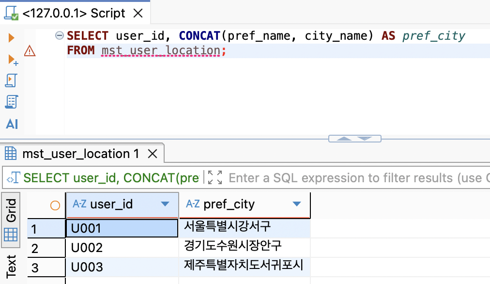


### 2-2 여러 개의 값을 비교하기

하나의 레코드에 포함된 여러 개의 값을 비교하는 방법 

**분기별 매출 증강 판정하기**

- 컬럼의 크고 작음을 비교하기 위해 `CASE` 식을 사용 
  - 조건에 맞게 지정 (매출의 대소 비교로 +/-로 확인하고, 증감 판정)

```sql
SELECT year, q1, q2, 
	CASE 
		WHEN q1 < q2 THEN '+'
		WHEN q1 = q2 THEN ' '
	ELSE '-'
	END AS judge_q1_q2, q2 - q1 AS diff_q2_q1,
	SIGN(q2 - q1) AS sign_q2_q1
FROM quarterly_sales
ORDER BY year;
```

<!-- 2-2 이미지 -->
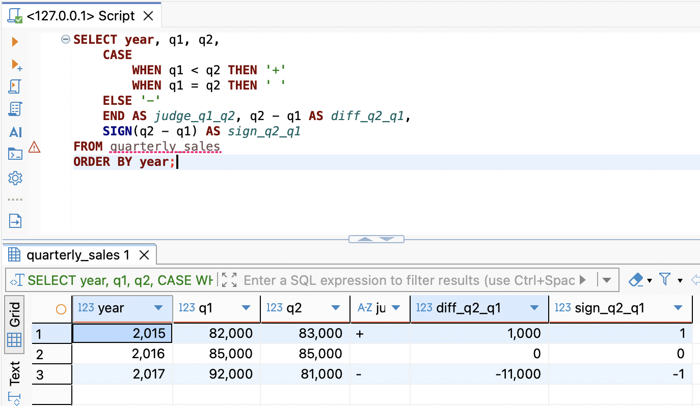


**연간 최대 / 최소 4분기 매출 찾기**

- 2개의 컬럼을 대소 비교하는 방법 소개 
  - 컬럼 값에서 최대 또는 최소를 찾을 때는 `greatest`, `least` 함수 사용 

~~~sql
SELECT year, greatest(q1, q2, q3, q4) AS greatest_sales,
	least(q1, q2, q3, q4) AS least_sales
FROM quarterly_sales
ORDER BY year;
~~~

<!-- 이미지 2-2-1 -->
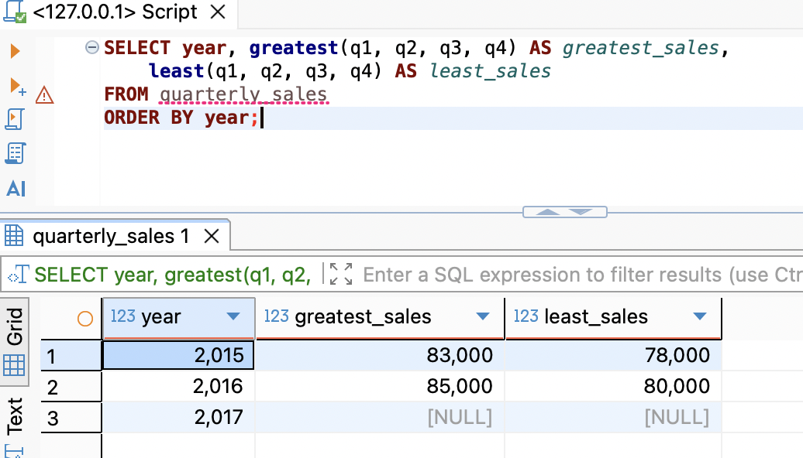


**연간 평균 4분기 매출 계산하기**

- 매출 평균 계산하기

~~~sql
SELECT 
    year,
    (COALESCE(q1,0) + COALESCE(q2,0) + COALESCE(q3,0) + COALESCE(q4,0)) / 4 AS average
FROM quarterly_sales
ORDER BY year;
~~~

<!-- 이미지 2-2-2 -->
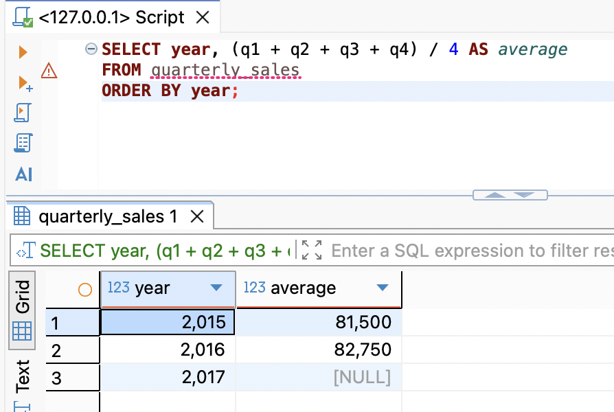


- 방금 구한 매출 평균에서 `COALESCE` 함수 사용해서 적절하게 변환하기

~~~sql
SELECT year, (COALESCE(q1, 0) + COALESCE(q2, 0) + COALESCE (q3, 0) + COALESCE(q4, 0)) / AS average
FROM quarterly_sales
ORDER BY year;
~~~

<!-- 이미지 2-2-3 -->
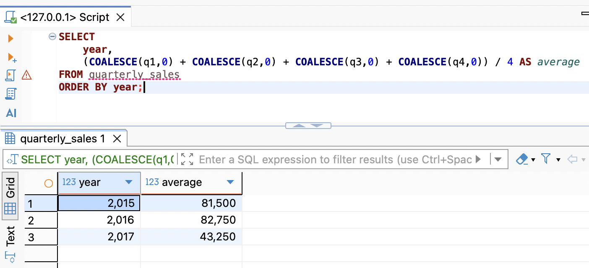


- NULL 아닌 컬럼만을 사용해서 평균값을 구하기

~~~sql
SELECT 
    year,
    (COALESCE(q1,0) + COALESCE(q2,0) + COALESCE(q3,0) + COALESCE(q4,0)) /
    (SIGN(COALESCE(q1,0)) + SIGN(COALESCE(q2,0)) + SIGN(COALESCE(q3,0)) + SIGN(COALESCE(q4,0))) AS average
FROM quarterly_sales
ORDER BY year;
~~~

<!-- 이미지 2-2-4 -->

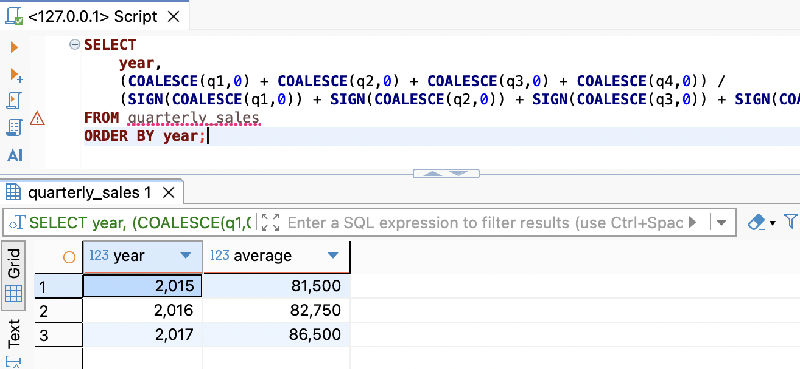


### 2-3 2개의 값 비율 계산하기

하나의 레코드에 포함된 값을 조합해서 비율을 계산하는 방법

- 메일의 광고 노출 수와 클릭 수를 집계 


**정수 자료형의 데이터 나누기**

- 광고의 **CTR(Click Through Rate)** 계산하기
- 퍼센트로 나타내기 위해 결과에 100 곱하기 
  - 100.0으로 곱하면 자료형 변환이 자동으로 캐스팅 됨

```sql
SELECT dt, ad_id, clicks / impressions AS ctr,
	100.0 * clicks / impressions AS ctr_as_percent
FROM advertising_stats
WHERE dt = '2017-04-01'
ORDER BY dt, ad_id;
```

<!-- 2-3 이미지 -->

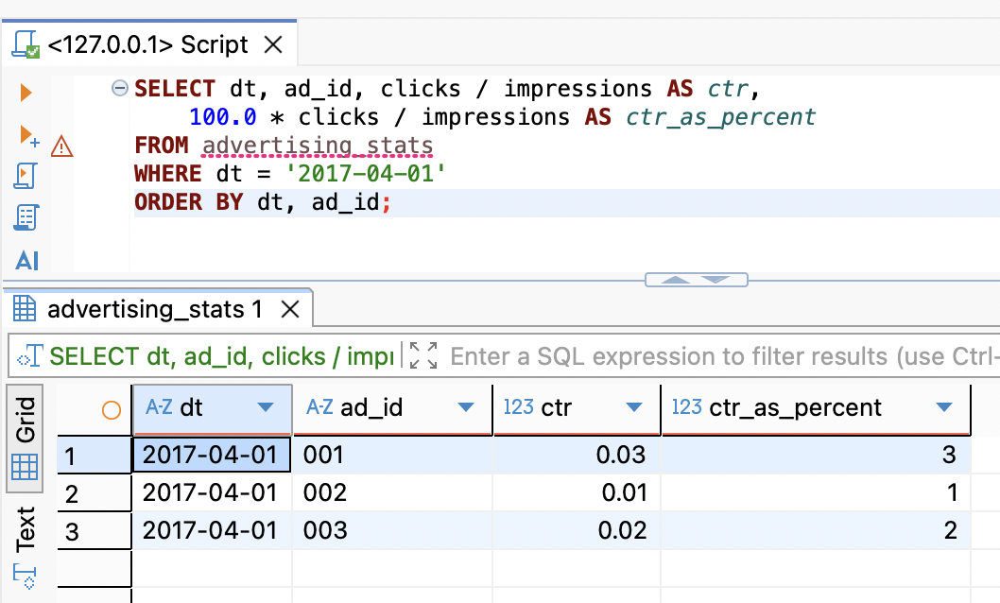

**0으로 나누는 것 피하기**

- CASE 식을 사용해서 impressions가 0인지 확인하기 
  - 0보다 큰 경우에만 CTR 계산, 이외의 경우는 NULL 출력 

~~~sql
SELECT dt, ad_id, 
	CASE WHEN impressions > 0 THEN 100.0 * clicks / impressions
	END AS ctr_as_percent_by_case,
	100 * clicks / NULLIF(impressions, 0) AS ctr_as_percent_by_null
FROM advertising_stats
ORDER BY dt, ad_id;
~~~

<!-- 2-3-1 이미지 -->
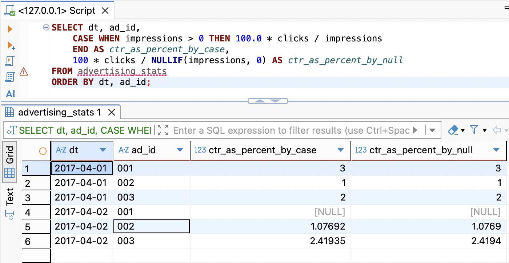


### 2-4 두 값의 거리 계산하기

서로 값이 어느정도 떨어져있는지 **거리 계산하기**


**숫자 데이터의 절댓값, 제곱 평균 제곱근 (RMS) 계산하기**

- 절댓값을 사용하기, 제곱 평균 제곱근 사용하기 
  - `ABS` 함수 사용하기, 제곱 할 때 `POWER` 사용, 제곱근에서는 `SQRT` 하기 

```sql
SELECT 
    ABS(x1 - x2) AS abs,
    SQRT(POWER(x1 - x2, 2)) AS rms
FROM location_id;
```

<!-- 2-4 이미지 -->
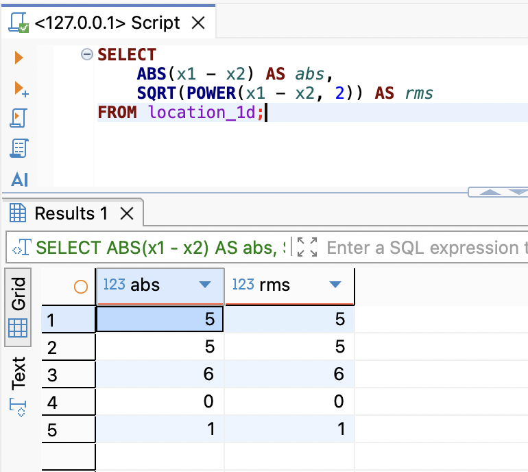


**xy 평면 위에 있는 두 점의 유클리드 거리 계산하기**

- PostgreSQL에서는 **POINT 자료형**이 존재하여 거리 연산자 <-> 사용하면 된다.

~~~sql
SELECT 
    SQRT(POWER(x1 - x2, 2) + POWER(y1 - y2, 2)) AS dist
FROM location_2d;
~~~

<!-- 2-4-1 이미지 -->
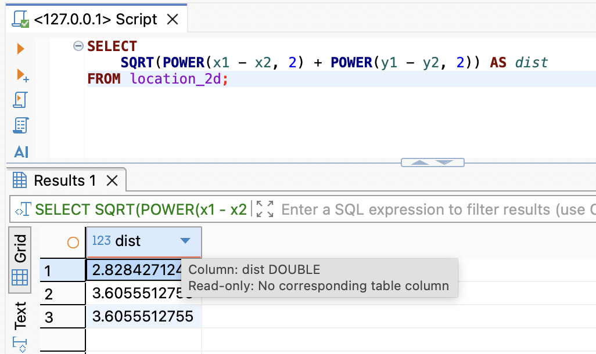


### 2-5 날짜/시간을 계산하기

- 두 날짜 데이터의 차이를 구하기 
  - 회원 등록 시간 1시간 후와 30분 전의 시간 등을 계산하는 쿼리

```sql
SELECT user_id, register_stamp::timestap AS register_stamp,
	register_stamp::timestamp + '1 hour'::interval AS after_1_hour,
	register_stmap::timestamp - '30 minutes'::interval AS before_30_minutes,
	register_stamp::date AS register_date,
	(register_stamp::date + '1 day'::interval)::date AS after_1_day,
	(register_stamp::date = '1 month'::interval)::date AS before_1_month
FROM mst_users_with_dates;
```

<!-- 2-5 이미지 -->
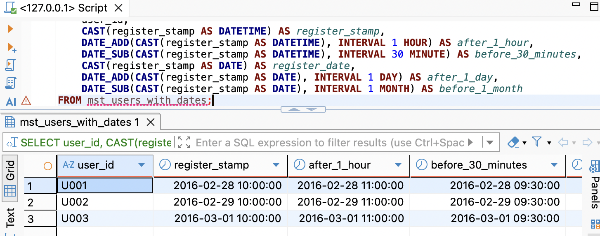


**날짜 데이터들의 차이 계산하기**

~~~sql
SELECT
    user_id,
    CURRENT_DATE AS today,
    DATE(register_stamp) AS register_date,
    DATEDIFF(CURRENT_DATE, DATE(register_stamp)) AS diff_days
FROM mst_users_with_dates;
~~~

<!-- 2-5-1 이미지 -->
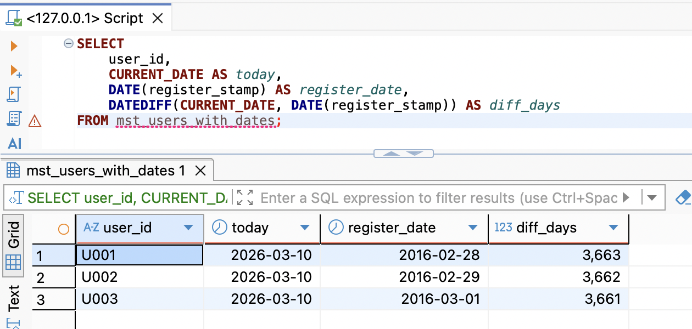


**사용자의 생년월일로 나이 계산하기**

- 나이를 계산하는 전용 함수가 구현되어 있는 것은 PostgreSQL만 있다. 

~~~sql
SELECT user_id, CURRENT_DATE AS today, 
	register_stamp::date AS register_date,
	birth_date::date AS birth_date,
	EXTRACT(YEAR FROM age(birth_date::date)) AS current_age,
	EXTRACT(YEAR FROM age(register_stamp::date, birth_date::date)) AS register_age
FROM mst_users_with_dates;
~~~

<!-- 2-5-2 이미지 -->
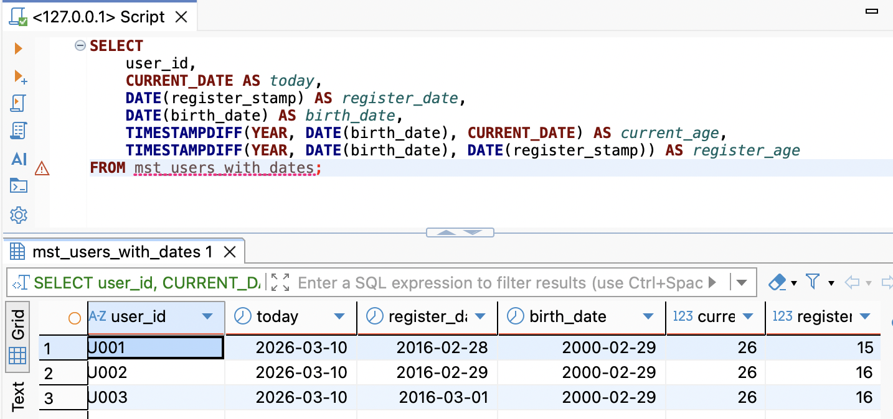


- 연 부분 차이를 계산하는 쿼리

~~~sql
SELECT user_id, CURRENT_DATE AS today, 
	register_stamp::date AS register_date,
	birth_date::date AS birth_date,
	datediff(year,birth_date::date, CURRENT_DATE),
	datediff(year, birth_date::date, register_stamp::date)

FROM mst_users_with_dates;
~~~

<!-- 2-5-3 이미지 -->

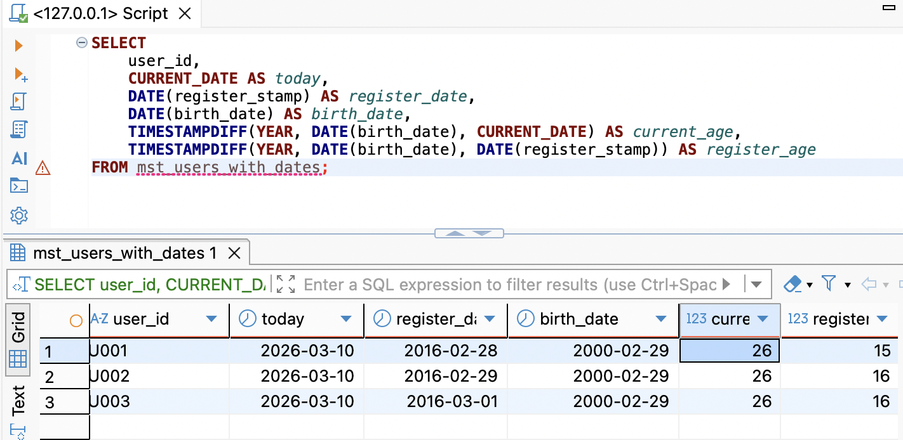

- 날짜를 정수로 표현해서 나이를 계산하는 함수

~~~sql
SELECT floor((20160228 - 20000229) / 10000) AS age;
~~~

<!-- 2-5-4 이미지 -->
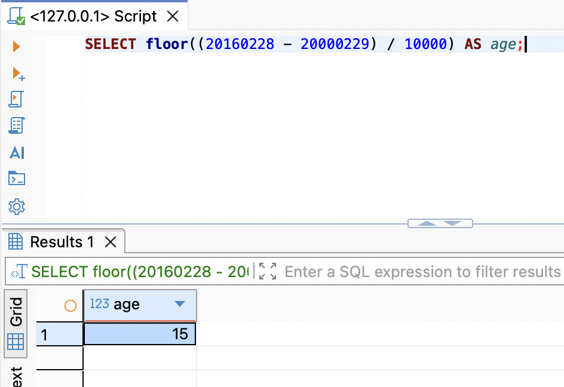


- 등록 시점과 현재 시점의 나이를 문자열로 계산하는 쿼리

~~~sql
SELECT
    user_id,
    SUBSTRING(register_stamp, 1, 10) AS register_date,
    birth_date,
    FLOOR(
        (
            CAST(REPLACE(SUBSTRING(register_stamp, 1, 10), '-', '') AS SIGNED)
            - CAST(REPLACE(birth_date, '-', '') AS SIGNED)
        ) / 10000
    ) AS register_age,
    FLOOR(
        (
            CAST(REPLACE(CAST(CURRENT_DATE AS CHAR), '-', '') AS SIGNED)
            - CAST(REPLACE(birth_date, '-', '') AS SIGNED)
        ) / 10000
    ) AS current_age
FROM mst_users_with_dates;
~~~

<!-- 2-5-5 이미지 -->
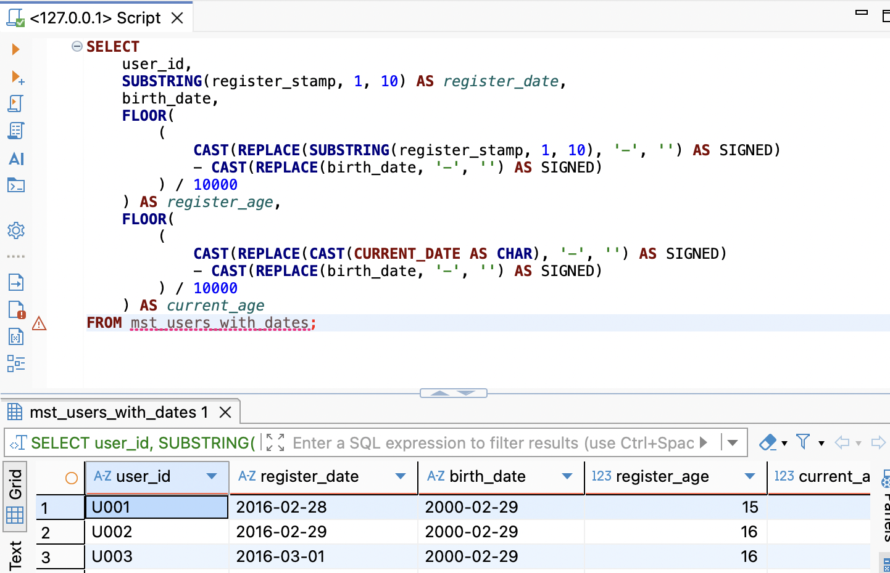


### 2-6 IP 주소 다루기

**IP 주소 자료형 활용하기**

- PostgreSQL 에서는 **inet** 자료형이 구현되어 있다. 
- `address/y` 형식의 네트워크 범위에 IP주소의 포함여부 판정이 가능
  - `<<또는>>` 연산자의 사용

```sql
SELECT 
	CAST('127.0.0.1' AS inet) < CAST('127.0.0.2' AS inet) AS lt,
	CAST('127.0.0.1' AS inet) > CAST('192.168.0.1' AS inet) AS gt;
```

<!-- 2-6 이미지 -->
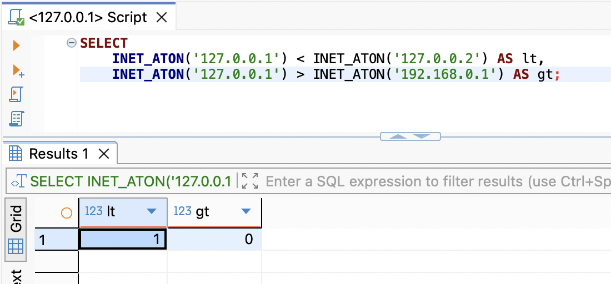


**정수 또는 문자열로 IP 주소 다루기**

- IP 주소를 정수 자료형으로 변환하기 

~~~sql
SELECT 
    ip,
    CAST(SUBSTRING_INDEX(ip, '.', 1) AS SIGNED) AS ip_part1,
    CAST(SUBSTRING_INDEX(SUBSTRING_INDEX(ip, '.', 2), '.', -1) AS SIGNED) AS ip_part2,
    CAST(SUBSTRING_INDEX(SUBSTRING_INDEX(ip, '.', 3), '.', -1) AS SIGNED) AS ip_part3,
    CAST(SUBSTRING_INDEX(ip, '.', -1) AS SIGNED) AS ip_part4
FROM (SELECT '192.168.0.1' AS ip) AS t;
~~~

<!-- 2-6-1 이미지 -->
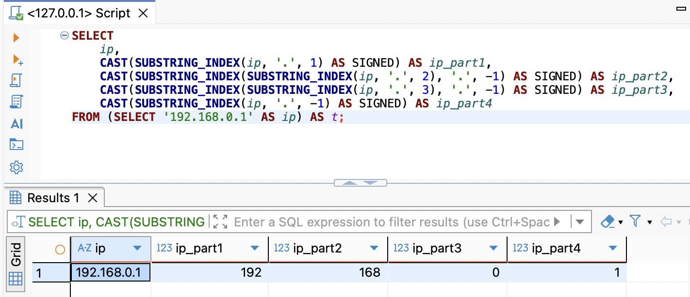


- IP 주소를 정수 자료형 표기로 변환하기

~~~sql
SELECT ip, CAST(split_part(ip, '.', 1) AS integer) * 2^24 + CAST(split_part(ip, '.', 2) AS integer) * 2^16 + CAST(split_part(ip, '.', 3) AS integer) * 2^8 + CAST(split_part(ip, '.', 4) AS integer) * 2^0
AS ip_integer
FROM (SELECT '192.168.0.1' AS ip) AS t;
~~~

<!-- 2-6-2 이미지 -->
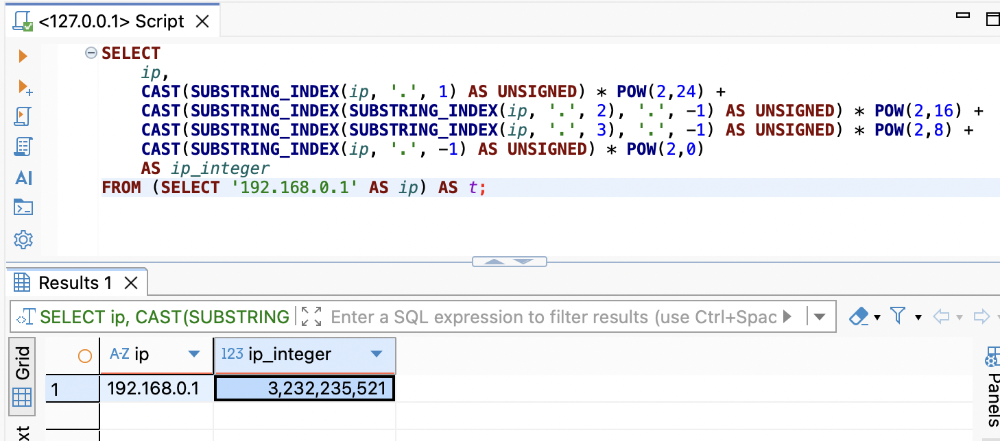


**IP 주소를 0으로 메우기**

- 각 10진수 부분을 3자리 숫자가 되게 앞 부분을 0으로 메워서 문자열로 만들기 

~~~sql
SELECT 
    ip,
    CONCAT(
        LPAD(SUBSTRING_INDEX(ip, '.', 1), 3, '0'),
        LPAD(SUBSTRING_INDEX(SUBSTRING_INDEX(ip, '.', 2), '.', -1), 3, '0'),
        LPAD(SUBSTRING_INDEX(SUBSTRING_INDEX(ip, '.', 3), '.', -1), 3, '0'),
        LPAD(SUBSTRING_INDEX(ip, '.', -1), 3, '0')
    ) AS ip_padding
FROM (SELECT '192.168.0.1' AS ip) AS t;
~~~

<!-- 2-6-3 이미지 -->
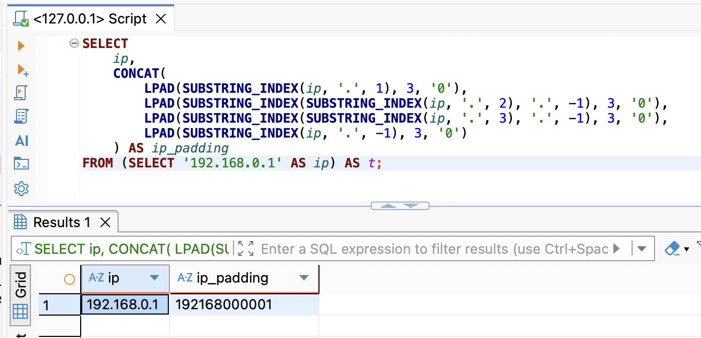


## 03. 하나의 테이블에 대한 조작 

**데이터를 집합으로 다루는 방법**

- 대량의 데이터를 집계, 지표를 사용해 데이터의 전체 특징을 파악
- 집약 함수의 사용 : 합계, 평균, 최대, 최소 계산하는 함수부터 통계 처리 사용

### 3-1 그룹의 특징 잡기

**집약 함수** : 여러 레코드를 기반으로 하나의 값을 리턴하는 함수 

- COUNT, SUM 함수 등이 존재

**테이블 전체의 특징량 계산하기**

- 집약함수를 사용해서 테이블 전체의 특징량을 계산하는 쿼리

```sql
SELECT 
	COUNT(*) AS total_count,
	COUNT(DISTINCT user_id) AS user_count,
	COUNT(DISTINCT product_id) AS product_count,
	SUM(score) AS sum,
	AVG(score) AS avg,
	MAX(score) AS max,
	MIN(score) AS min
FROM review;
```

<!-- 3-1 이미지 -->
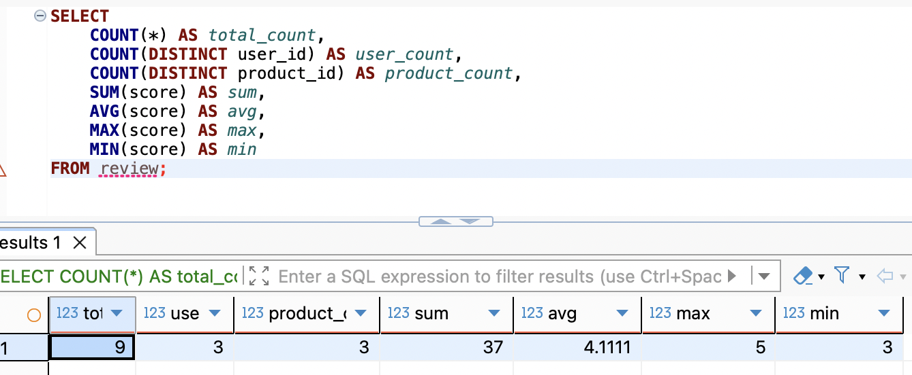


**그루핑한 데이터의 특정량 계산하기**

- 데이터를 더 작게 분할하기 위해 `GROUP BY`를 사용한 쿼리
  - GROUP BY 구문에 지정한 컬럼 또는 집약 함수만 SELECT 구문의 컬럼으로 지정이 가능

~~~sql
SELECT
	user_id,
	COUNT(*) AS total_count,
	COUNT(DISTINCT user_id) AS user_count,
	COUNT(DISTINCT product_id) AS product_count,
	SUM(score) AS sum,
	AVG(score) AS avg,
	MAX(score) AS max,
	MIN(score) AS min
FROM review
GROUP BY user_id;
~~~

<!-- 3-1-2 이미지 -->
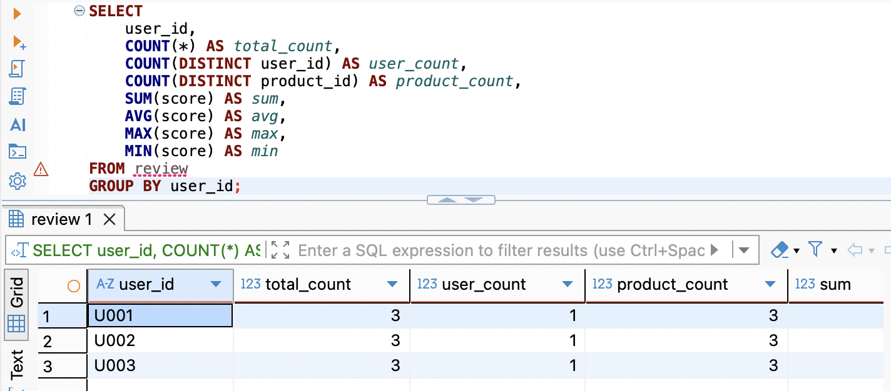


**집약 함수를 적용한 값과 집약 전의 값을 동시에 다루기**

- 윈도 함수를 사용해 집약 함수의 결과와 원래 값을 동시에 다루는 쿼리
  - OVER 구문에 매개변수를 지정하지 않으면 테이블 전체에 집약 함수 적용한 값 리턴

~~~sql
SELECT 
	user_id, product_id, score, 
	AVG(score) OVER() AS avg_score,
	AVG(score) OVER(PARTITION BY user_id) AS user_avg_score,
	score - AVG(score) OVER(PARTITION BY user_id) AS user_avg_score_diff
FROM review;
~~~

<!-- 3-1-3 이미지 -->
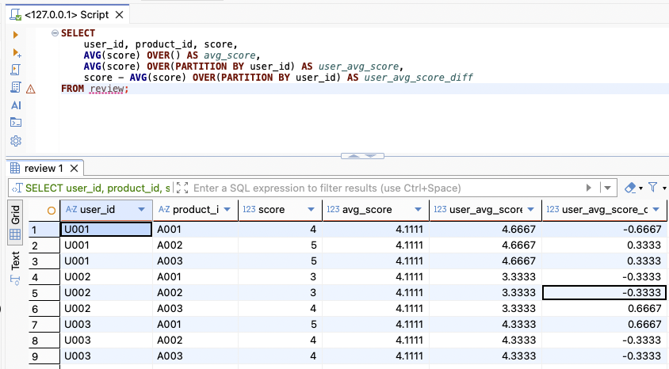


### 3-2 그룹 내부의 순서

윈도우 함수를 활용해서 데이터를 가공하기

**ORDER BY 구문으로 순서 정의하기**

- 윈도 내부에서 특정 값을 참조하기 위해 해당 값의 위치를 명확하게 지정 
- 윈도 함수에서 **ORDER BY 구문으로 테이블 내부의 순서 다루기**
  - `LAG, LEAD` 함수 : 현재 행을 기준으로 앞의 행 또는 뒤의 행의 값을 추출하는 함수
    - 두 번째 매개변수로 앞뒤 n번째 값을 추출 가능

```sql
SELECT 
    product_id,
    score,
    ROW_NUMBER() OVER (ORDER BY score DESC) AS row_num,
    RANK() OVER (ORDER BY score DESC) AS rank_num,
    DENSE_RANK() OVER (ORDER BY score DESC) AS dense_rank_num,
    LAG(product_id) OVER (ORDER BY score DESC) AS lag1,
    LAG(product_id, 2) OVER (ORDER BY score DESC) AS lag2,
    LEAD(product_id) OVER (ORDER BY score DESC) AS lead1,
    LEAD(product_id, 2) OVER (ORDER BY score DESC) AS lead2
FROM popular_products
ORDER BY row_num;
```

<!-- 3-2 이미지 -->
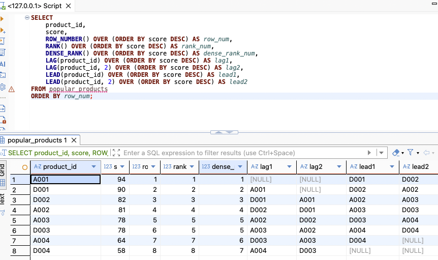


**ORDER BY 구문과 집약 함수 조합하기**

- ORDER BY 구문에 집약 함수 조합으로 집약 함수의 적용 범위를 우선하게 지정이 가능 
- ORDER BY 구문과 집약 함수를 조합해서 계산하는 쿼리

~~~sql
SELECT
	product_id,
	score,
	ROW_NUMBER() OVER(ORDER BY score) AS row,
	SUM(score) OVER(ORDER BY UNBOUNDED PRECEDING AND CURRENT ROW) AS cum_score,
	AVG(score) OVER(ORDER BY score DESC ROWS BETWEEN 1 PRECEDING AND 1 FOLLOWING) AS local_avg, 
	FIRST_VALUE(product_id) OVER(ORDER BY score DESC ROWS BETWEEN UNBOUNDED PRECEDING AND UNBOUNDED FOLLOWING) AS first_value,
	LAST_VALUE(prodcut_id) OVER(ORDER BY score DESC ROWS BETWEEN UNBOUNDED  PRECEDING AND UNBOUNDED FOLLOWING) AS last_value,
FROM popular_products
ORDER BY row;
~~~

<!-- 3-2-1 이미지 -->

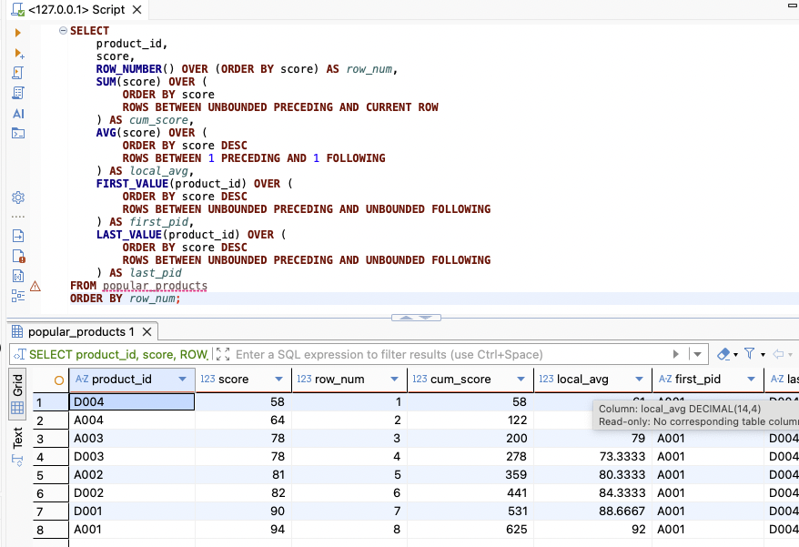

**윈도 프레임 지정에 대해서**

- 프레임 지정 : 현재 레코드 위치를 기반으로 상대적인 윈도를 정의하는 구문

~~~sql
SELECT
    category,
    product_id,
    score,
    ROW_NUMBER() OVER (PARTITION BY category ORDER BY score DESC) AS row_num,
    RANK() OVER (PARTITION BY category ORDER BY score DESC) AS rank_num,
    DENSE_RANK() OVER (PARTITION BY category ORDER BY score DESC) AS dense_rank
FROM popular_products
ORDER BY category, row_num;
~~~

<!-- 3-2-2 이미지 -->
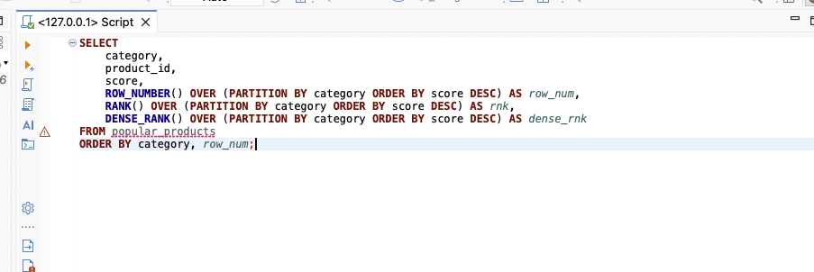


### 3-3 세로 기반 데이터를 가로 기반으로 변환하기

행을 열로 변환하는 방법

- 행으로 지정된 지표 값을 열로 변환하는 쿼리

```sql
SELECT 
	dt, 
	MAX(CASE WHEN indicator = 'impressions' THEN val END) AS impressions,
	MAX(CASE WHEN indicator = 'sessions' THEN val END) AS sessions,
	MAX(CASE WHEN indicator = 'users' THEN val END) AS users
FROM daily_kpi
GROUP BY dt
ORDER BY dt;
```

<!-- 3-3 이미지 -->

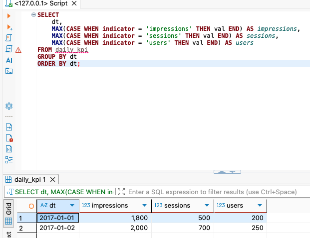

**행을 쉼표로 구분한 문자열로 집약하기**

- 미리 열의 수를 정할 수 없는 경우 데이터를 쉼표 등으로 구분한 문자열로 변환하기 
- PostgreSQL에서는 **string_agg**, Redshift에서는 **listagg 함수** 사용

~~~sql
SELECT 
	purchase_id,
	string_agg(product_id, ',') AS product_ids,
	SUM(price) AS amount
FROM purchase_detail_log
GROUP BY purchase_id
ORDER BY purchase_id;
~~~

<!-- 3-3-1 이미지 -->
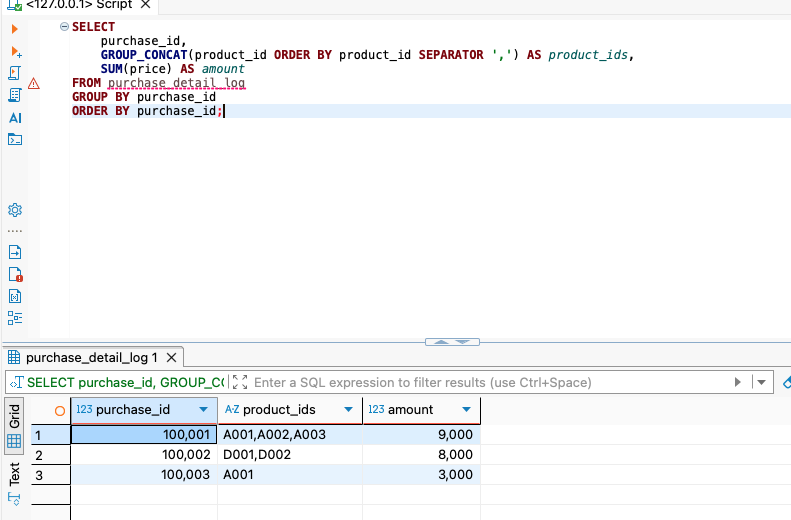


### 3-4 가로 기반 데이터를 세로 기반으로 변환하기

위와 다르게 가로 기반 데이터를 새로 기반으로 변환하는 방법이다.

**열로 표현된 값을 행으로 변환하기**

- 행으로 전개할 데이터 수가 고정이라면, 일련 번호를 가진 피벗 테이블을 만들고 `CROSS JOIN` 을 진행

```sql
SELECT 
	q.year,
	CASE 
		WHEN p.idx = 1 THEN 'q1'
		WHEN p.idx = 2 THEN 'q2'
		WHEN p.idx = 3 THEN 'q3'
		WHEN p.idx = 4 THEN 'q4'
	END AS quarter,
	CASE 
		WHEN p.idx = 1 THEN q.q1
		WHEN p.idx = 2 THEN q.q2
		WHEN p.idx = 3 THEN q.q3
		WHEN p.idx = 4 THEN q.q4
	END AS sales
FROM quarterly_sales AS q
CROSS JOIN
	(	SELECT 1 AS idx
  UNION ALL SELECT 2 AS idx
  UNION ALL SELECT 3 AS idx
  UNION ALL SELECT 4 AS idx
   )AS p;
```

<!-- 3-4 이미지 -->
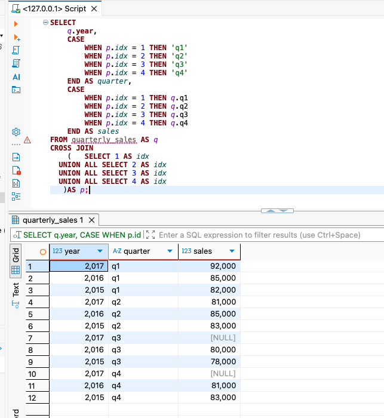


**임의의 길이를 가진 배열을 행으로 전개하기**

- Unnest, exploding 함수가 존재
- 테이블 함수를 사용해서 배열을 행으로 전개하는 쿼리

~~~sql
SELECT unnest(ARRAy['A001','A002','A003']) AS product_id;
~~~

<!-- 3-4-1 이미지 -->
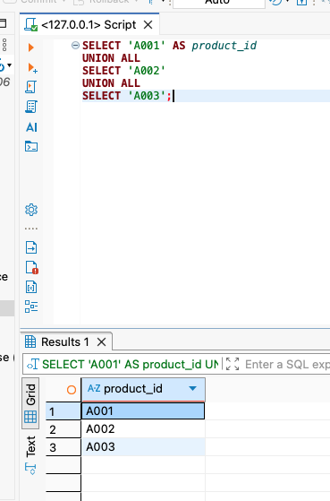


## 04. 여러 개의 테이블 조작하기

### 4-1 여러 개의 테이블을 세로로 결합하기

- 비슷한 구조를 가진 테이블의 데이터를 일괄 처리하고 싶은 경우, `UNION ALL` 구문을 활용

```sql
SELECT 'app1' AS app_name, user_id, name, email FROM app1_mst_users
UNION ALL
SELECT 'app2' AS app_name, user_id, name, NULL AS email FROM app2_mst_users;
```

<!-- 4-1 이미지 -->
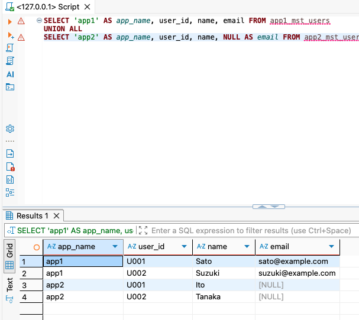

### 4-2 여러 개의 테이블을 가로로 정렬하기

가장 일반적인 방법 - `JOIN`을 사용하기 

- 여러 개의 테이블을 결합해서 가로로 정렬하는 쿼리

```sql
SELECT 
	m.category_id,
	m.name,
	s.sales,
	r.product_id AS sale_product
FROM mst_categories AS m
JOIN category_sales AS s
	ON m.category_id = s.category_id
JOIN product_sale_ranking AS r
	ON m.category_id = r.category_id;
```

<!-- 4-2 이미지 -->


### 4-3 조건 플래그를 0과 1로 표현하기

- 마스터 테이블의 속성 조건으로 0 또는 1이라는 플래그로 표현하기

```sql
SELECT 
	m.user_id,
	m.car_number,
	COUNT(p.user_id) AS purchase_count,
	CASE WHEN m.card_number IS NOT NULL THEN 1 ELSE 0 END AS has_card,
	SIGN(COUNT(p.user_id)) AS has_purchased
FROM mst_users_with_card_number AS m
LEFT JOIN 
	purchase_log AS p
		ON m.user_id = p.user_id
GROUP BY m.user_id, m.card_number;
```

<!-- 4-3 이미지 -->

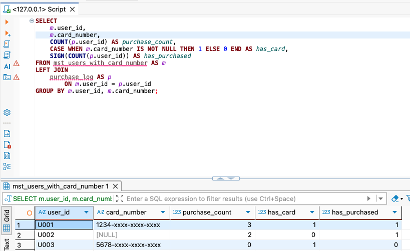

### 4-4 계산한 테이블에 이름 붙여 재사용하기

CTE 공통 테이블 식을 사용하여 가독성 높이기

- 카테고리별 순위를 추가한 테이블에 이름 붙이기 

```sql
WITH product_sale_ranking AS (
    SELECT 
        category_name,
        product_id,
        sales,
        ROW_NUMBER() OVER (
            PARTITION BY category_name 
            ORDER BY sales DESC
        ) AS `rank`
    FROM product_sales
)
SELECT *
FROM product_sale_ranking;
```

<!--  4-4 이미지 -->

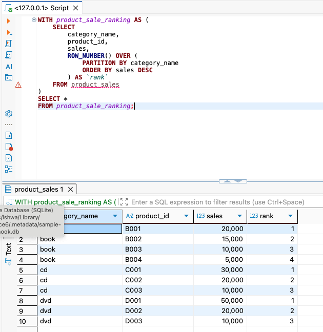

- 카테고리들의 순위에서 유니크한 순위 목록을 계산하는 쿼리

~~~sql
WITH product_sale_ranking AS (
      SELECT 
        category_name,
        product_id,
        sales,
        ROW_NUMBER() OVER (
            PARTITION BY category_name 
            ORDER BY sales DESC
        ) AS `rank`
    FROM product_sales
), mst_rank AS(
	SELECT DISTINCT rank
	FROM product_sale_ranking)
SELECT * 
FROM mst_rank;
~~~

<!-- 4-4-1 이미지 -->

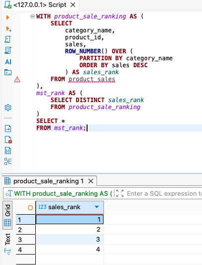

### 4-5 유사 테이블 만들기

**임의의 레코드를 가진 유사 테이블 만들기**

- 디바이스 ID와 이름의 마스터 테이블을 만드는 쿼리

```sql
WITH mst_devices AS (
    SELECT 1 AS device_id, 'PC' AS device_name
    UNION ALL SELECT 2 AS device_id, 'SP' AS device_name
    UNION ALL SELECT 3 AS device_id, '애플리케이션' AS device_name
)
SELECT *
FROM mst_devices;
```

<!-- 4-5 이미지 -->
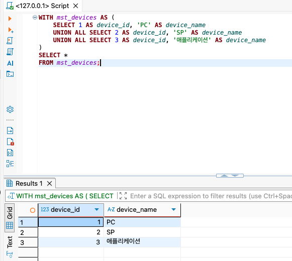


**VALUES 구문을 사용한 유사 테이블 만들기**

- `VALUES` 구문을 사용해 동적으로 테이블을 만드는 쿼리

~~~sql
WITH mst_devices AS (
    SELECT 1 AS device_id, 'PC' AS device_name
    UNION ALL
    SELECT 2, 'SP'
    UNION ALL
    SELECT 3, '애플리케이션'
)
SELECT *
FROM mst_devices;
~~~

<!-- 4-5-1 이미지 -->
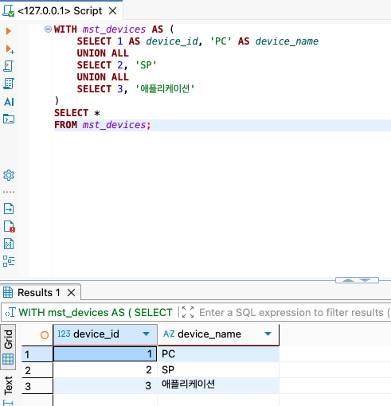


**순번을 사용해 테이블 작성하기**

~~~sql
WITH RECURSIVE series AS (
    SELECT 1 AS idx
    UNION ALL
    SELECT idx + 1
    FROM series
    WHERE idx < 5
)
SELECT *
FROM series;
~~~

<!-- 4-5-2 이미지 -->

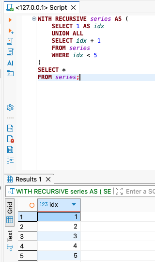

### 🎉 수고하셨습니다.