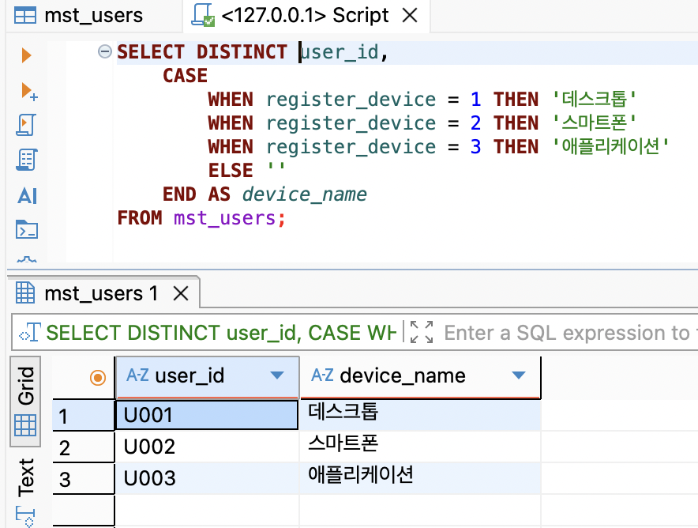
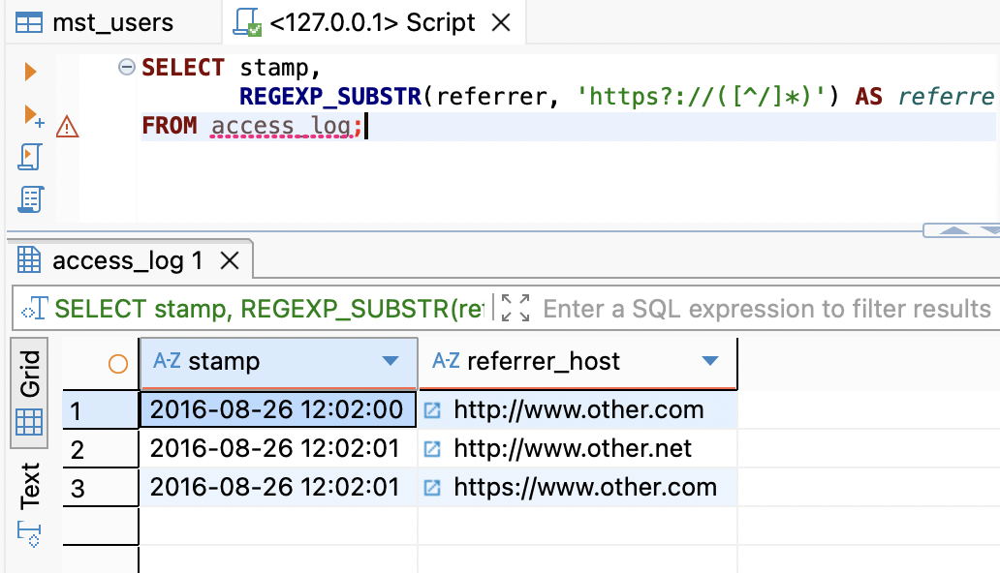
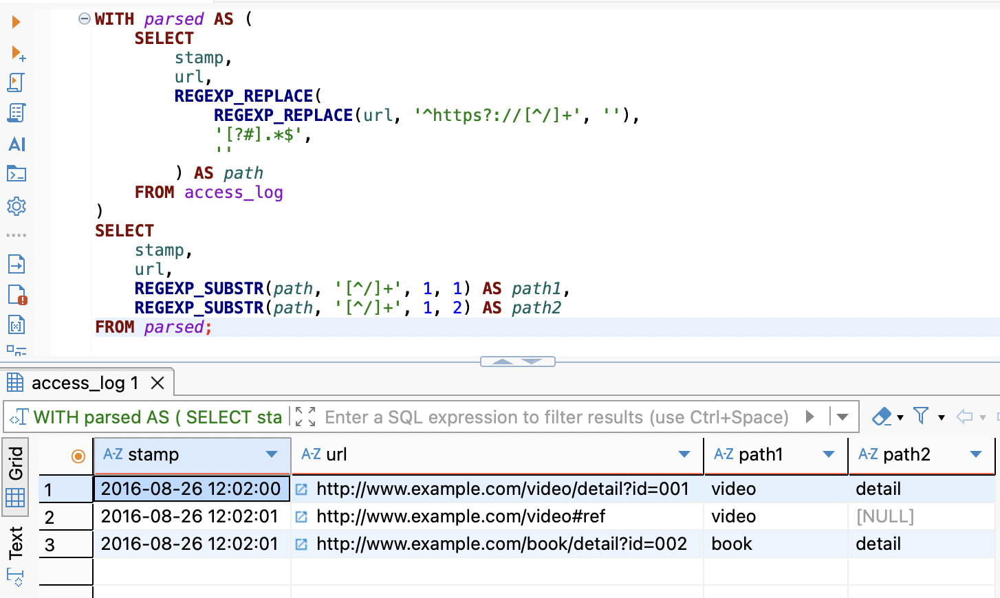
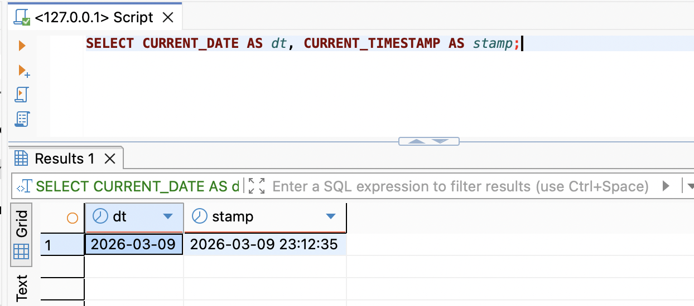
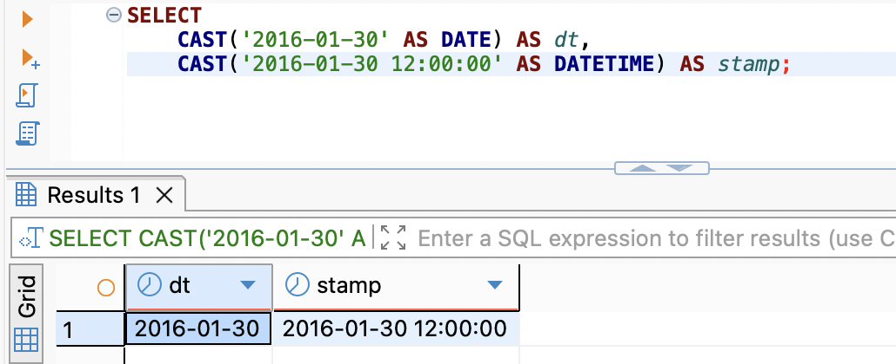
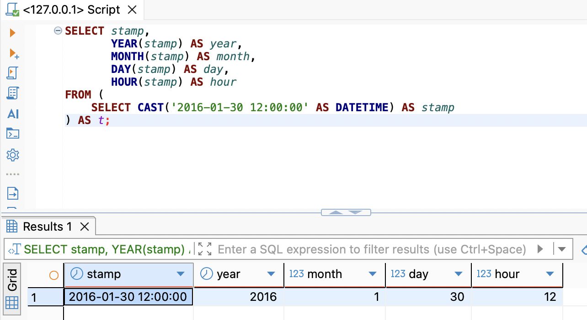
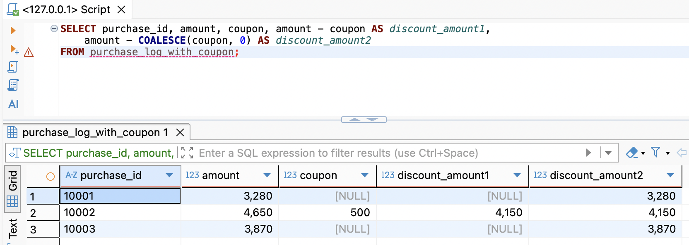

# SQL_MASTER 2주차 정규과제

📌SQL MASTER 정규과제는 매주 정해진 분량의 『*데이터 분석을 위한 SQL 레시피*』 를 읽고 학습하는 것입니다. 이번 주는 아래의 **SQL_MASTER_2nd_TIL**에 나열된 분량을 읽고 공부하시면 됩니다.

아래 실습을 수행하며 학습 내용을 직접 적용해보세요. 단순히 결과를 재현하는 것이 아니라, SQL을 직접 작성하는 과정에서 개념을 스스로 정리하는 것이 중요합니다.

필요한 경우 교재와 추가 자료를 참고하여 이해를 보완하시기 바랍니다.

## SQL_MASTER_2nd_TIL

### 3장 데이터 가공믈 위한 SQL
#### 1. 하나의 값 조작하기
#### 2. 여러 개의 값에 대한 조작
#### 3. 하나의 테이블에 대한 조작
#### 4. 여러 개의 테이블 조작하기


## Study Schedule

| 주차  | 공부 범위 | 완료 여부 |
| ----- | --------- | --------- |
| 1주차 | p.20~50   | ✅         |
| 2주차 | p.52~136  | ✅         |
| 3주차 | p.138~184 | 🍽️         |
| 4주차 | p.186~232 | 🍽️         |
| 5주차 | p.233~321 | 🍽️         |
| 6주차 | p.324~406 | 🍽️         |
| 7주차 | p.408~464 | 🍽️         |

<br>

<!-- 여기까진 그대로 둬 주세요-->


# 실습

## 0. 실습 규칙

1. 샘플 데이터 생성 코드는 **07_SQL_MASTER_Template/src** 경로에 장별로 정리되어 있습니다.
2. 아래 목차에 맞춰 해당 코드를 실행하여 샘플 데이터를 생성한 후, 각 장에서 요구하는 쿼리를 직접 작성해보시기 바랍니다.
3. 작성한 쿼리의 **실행 결과 화면도 함께 제출**해 주세요.
4. 단순히 교재의 예시 코드를 그대로 작성하는 것이 아니라, **제시된 로직을 충분히 이해한 뒤 교재를 보지 않고 스스로 쿼리를 구성**해보는 것을 권장합니다.
5. 교재 예시는 PostgreSQL, Hive, BigQuery 등 다양한 DBMS 기준으로 제시되어 있기 때문에, **MySQL이 아닌 다른 SQL 환경을 사용하여 실습을 진행해도 무방합니다.**
6. 다만, 사용 중인 DBMS에 맞는 문법으로 적절히 변환하여 작성하시기 바랍니다.


## 1. 하나의 값 조작하기 

**데이터를 가공해야 하는 이유**

- 다룰 데이터가 데이터 분석 용도로 상정되지 않은 경우 
- 연산할 때 비교 가능한 상태로 만들고 오류를 회피하기 위한 경우
  - 로그, 업무 데이터를 함께 다룰 때, 각 데이터 형식이 일치하지 않는데 모두 활용해 집계하면 연산 결과에 `NULL`이 나올 수 있다. 이러한 오류 발생을 대비해서 필요하다. 


### 1-1 코드 값을 레이블로 변경하기

로그 or 업무 데이터로 저장된 코드 값을 그대로 집계에 사용하면 리포트의 가독성이 낮아진다. 

- 집계 시 미리 코드 값을 레이블로 변경하는 방법 
- 코드 값을 레이블로 변경하는 것 : 특정 조건을 기반으로 값을 결정 `CASE` 식 사용
  - `CASE WHEN <조건식> THEN <조건을 만족할 때의 값>` 마지막 `END` 
  - 조건식에 해당되는 경우가 없을 시, `ELSE <값>` 으로 디폴트 값을 별도로 지정 가능


```sql
SELECT user_id, 
	CASE 
		WHEN register_device = 1 THEN '데스크톱'
		WHEN register_device = 2 THEN '스마트폰'
		WHEN register_device = 3 THEN '애플리케이션'
		ELSE ''
	END AS device_name
FROM mst_users;
```

<!-- 1-1 이미지 -->



### 1-2 URL에서 요소 추출하기

- 분석 현장에서 최소한의 요건으로 **레퍼러와 페이지 URL을 저장해두는 경우가 다수**
- 이후에 저장한 URL을 기준으로 요소들을 추출
  - Hive, BigQuery 에서는 URL을 다루는 함수가 존재
  - 구현되지 않은 미들웨어에서는 정규 표현식으로 호스트 이름의 패턴을 추출해야 함. 


```sql
SELECT stamp, substring(referrer from 'https?://[^/]*)') AS referrer_host
FROM access_log;
```

<!-- 이 부분을 지우고 실행 결과 화면을 제출해주세요. -->

**My_SQL 기준 풀이**

- `substring` 이 아닌 `REGEXP_SUBSTR()` 정규 표현식 사용

<!-- 이미지 1-2 -->



### 1-3 문자열을 배열로 분해하기

빅데이터에서 가장 많이 사용하는 자료형은 문자열

- 문자열 자료형은 **세부적으로 분해해서 사용해야 하는 경우가 다수**
- 아래 쿼리는 접근 로그 샘플 기반으로 페이지 계층을 나눠본 쿼리


```sql
SELECT stamp, url,
	split_part(substring(url from '//[^/]+([^?#]+)'),'/', 2) AS path1,
  split_part(substring(url from '//[^/]+([^?#]+)'),'/', 3) AS path2
FROM access_log;
```

**MySQL 풀이 기준**

- 쿼리 설명 : url에서 **도메인 뒤의 path 부분만 추출하기**
  - `?query, #fragment` 부분을 제거 
  - 정규 표현식 기반으로 `https://example.com` 부분을 제거
  - `?id = 10, #top` 같은 것도 제거 

<!-- 이미지 1-3 -->



### 1-4 날짜와 타임스탬프 다루기

**현재 날짜와 타임스탬프 추출하기**

- 주로 로그데이터에서 자주 날짜 또는 타임 스탬프 등의 시간 정보 사용
- **PostgreSQL** : `CURRENT_TIMESTAMP`의 리턴값으로 타임스탬프 자료형이 존재
  - 이 외에는 타임존 없는 타임스탬프를 리턴
- **BigQuery** : UTC 시간을 리턴, 한국 시각과 다르기에 주의해야 함.


```sql
SELECT CURRENT_DATE AS dt, CURRENT_TIMESTAMP AS stamp 
	CURRENT_DATE AS dt, GETDATE() AS stamp;
```

**MySQL 풀이 기준**

- MySQL 에서는 `CURDATE()` -> `NOW()`

<!-- 이미지 1-4 -->



**지정한 값의 날짜/시각 데이터 추출하기**

- 현재 시각이 아니라 문자열로 지정한 날짜와 시각을 기반으로 날짜 자료형과 타임스탬프 자료형의 데이터를 만드는 경우
- `CAST` 함수를 사용

~~~sql
SELECT CAST('2016-01-30' AS date) AS dt, 
	CAST('2016-01-30 12:00:00' AS timestamp) AS stamp;
~~~

**MySQL 풀이 기준**

- `DATETIME` 을 사용하여 MySQL에서의 문자열 캐스팅을 진행

<!-- 이미지 1-4-1-->



**날짜/시각에서 특정 필드 추출하기**

- 타임스탬프 자료형의 데이터에서 년과 월 등의 필드 값 추출을 위해서는 `EXTRACT` 함수를 사용

~~~sql
SELECT stamp, 
	EXTRACT(YEAR FROM stamp) AS year,
	EXTRACT(MONTH FROM stamp) AS month,
	EXTRACT(DAY FROM stamp) AS day,
	EXTRACT(HOUR FROM stamp) AS hour
FROM (SELECT CAST('2016-01-30 12:00:00' AS timestamp) AS stamp) AS t;
~~~

~~~sql
-- substring 함수를 사용해 문자열을 추출하는 쿼리
SELECT stamp,
	substring(stamp, 1, 4) AS year,
	substring(stamp, 6, 2) AS month,
	substring(stamp, 9, 2) AS day,
	substring(stamp, 12, 2) AS hour,
	substring(stamp, 1, 7) AS year_month
FROM (SELECT CAST('2016-01-30 12:00:00' AS text) AS stamp) AS t;
~~~


**MySQL 풀이 기준**

- MySQL에서도 물론 EXTRACT 를 사용할 수는 있다.
  - 하지만, `YEAR(), MONTH()`를 사용하는 것이 더 편함. 

<!-- 이미지 1-4-2 -->



### 1-5 결손 값을 디폴트 값으로 대치하기

- 문자열 또는 숫자 중간에 NULL이 있을 때 사칙 연산을 하면 **NULL** 발생
  - 따라서 데이터가 우리가 원하는 형태가 아닐 때 가공해야 함.

```sql
SELECT purchase_id, amount, coupon, amount - coupon AS discount_amount1,
	amount - COALESCE(coupon, 0) AS discount_amount2
FROM purchase_log_with_coupon;
```

<!-- 이미지 1-5 -->



## 2. 여러 개의 값에 대한 조작 

### 2-1 문자열을 연결하기

<!-- 이 부분을 지우고 새롭게 배운 내용을 자유롭게 정리해주세요. -->

```sql
여기에 코드를 적어주세요.
```

<!-- 이 부분을 지우고 실행 결과 화면을 제출해주세요. -->

### 2-2 여러 개의 값을 비교하기

<!-- 이 부분을 지우고 새롭게 배운 내용을 자유롭게 정리해주세요. -->

```sql
여기에 코드를 적어주세요.
```

<!-- 이 부분을 지우고 실행 결과 화면을 제출해주세요. -->

### 2-3 2개의 값 비율 계산하기

<!-- 이 부분을 지우고 새롭게 배운 내용을 자유롭게 정리해주세요. -->

```sql
여기에 코드를 적어주세요.
```

<!-- 이 부분을 지우고 실행 결과 화면을 제출해주세요. -->

### 2-4 두 값의 거리 계산하기

<!-- 이 부분을 지우고 새롭게 배운 내용을 자유롭게 정리해주세요. -->

```sql
여기에 코드를 적어주세요.
```

<!-- 이 부분을 지우고 실행 결과 화면을 제출해주세요. -->

### 2-5 날짜/시간을 계산하기

<!-- 이 부분을 지우고 새롭게 배운 내용을 자유롭게 정리해주세요. -->

```sql
여기에 코드를 적어주세요.
```

<!-- 이 부분을 지우고 실행 결과 화면을 제출해주세요. -->

### 2-6 IP 주소 다루기

<!-- 이 부분을 지우고 새롭게 배운 내용을 자유롭게 정리해주세요. -->

```sql
여기에 코드를 적어주세요.
```

<!-- 이 부분을 지우고 실행 결과 화면을 제출해주세요. -->

## 03. 하나의 테이블에 대한 조작 

### 3-1 그룹의 특징 잡기

<!-- 이 부분을 지우고 새롭게 배운 내용을 자유롭게 정리해주세요. -->

```sql
여기에 코드를 적어주세요.
```

<!-- 이 부분을 지우고 실행 결과 화면을 제출해주세요. -->

### 3-2 그룹 내부의 순서

<!-- 이 부분을 지우고 새롭게 배운 내용을 자유롭게 정리해주세요. -->

```sql
여기에 코드를 적어주세요.
```

<!-- 이 부분을 지우고 실행 결과 화면을 제출해주세요. -->

### 3-3 세로 기반 데이터를 가로 기반으로 변환하기

<!-- 이 부분을 지우고 새롭게 배운 내용을 자유롭게 정리해주세요. -->

```sql
여기에 코드를 적어주세요.
```

<!-- 이 부분을 지우고 실행 결과 화면을 제출해주세요. -->

### 3-4 가로 기반 데이터를 세로 기반으로 변환하기

<!-- 이 부분을 지우고 새롭게 배운 내용을 자유롭게 정리해주세요. -->

```sql
여기에 코드를 적어주세요.
```

<!-- 이 부분을 지우고 실행 결과 화면을 제출해주세요. -->


## 04. 여러 개의 테이블 조작하기

### 4-1 여러 개의 테이블을 세로로 결합하기

<!-- 이 부분을 지우고 새롭게 배운 내용을 자유롭게 정리해주세요. -->

```sql
여기에 코드를 적어주세요.
```

<!-- 이 부분을 지우고 실행 결과 화면을 제출해주세요. -->

### 4-2 여러 개의 테이블을 가로로 정렬하기

<!-- 이 부분을 지우고 새롭게 배운 내용을 자유롭게 정리해주세요. -->

```sql
여기에 코드를 적어주세요.
```

<!-- 이 부분을 지우고 실행 결과 화면을 제출해주세요. -->

### 4-3 조건 플래그를 0과 1로 표현하기

<!-- 이 부분을 지우고 새롭게 배운 내용을 자유롭게 정리해주세요. -->

```sql
여기에 코드를 적어주세요.
```

<!-- 이 부분을 지우고 실행 결과 화면을 제출해주세요. -->

### 4-4 계산한 테이블에 이름 붙여 재사용하기

<!-- 이 부분을 지우고 새롭게 배운 내용을 자유롭게 정리해주세요. -->

```sql
여기에 코드를 적어주세요.
```

<!-- 이 부분을 지우고 실행 결과 화면을 제출해주세요. -->

### 4-5 유사 테이블 만들기

<!-- 이 부분을 지우고 새롭게 배운 내용을 자유롭게 정리해주세요. -->

```sql
여기에 코드를 적어주세요.
```

<!-- 이 부분을 지우고 실행 결과 화면을 제출해주세요. -->


### 🎉 수고하셨습니다.