# SQL_MASTER 3주차 정규과제

📌SQL MASTER 정규과제는 매주 정해진 분량의 『*데이터 분석을 위한 SQL 레시피*』 를 읽고 학습하는 것입니다. 이번 주는 아래의 **SQL_MASTER_3rd_TIL**에 나열된 분량을 읽고 공부하시면 됩니다.

아래 실습을 수행하며 학습 내용을 직접 적용해보세요. 단순히 결과를 재현하는 것이 아니라, SQL을 직접 작성하는 과정에서 개념을 스스로 정리하는 것이 중요합니다.

필요한 경우 교재와 추가 자료를 참고하여 이해를 보완하시기 바랍니다.

## SQL_MASTER_3rd_TIL

### 4장 매출을 파악하기 위한 데이터 추출
#### 1. 시계열 기반으로 데이터 집계하기
#### 2. 다면적인 축을 사용해 데이터 집계하기 


## Study Schedule

| 주차  | 공부 범위 | 완료 여부 |
| ----- | --------- | --------- |
| 1주차 | p.20~50   | ✅         |
| 2주차 | p.52~136  | ✅         |
| 3주차 | p.138~184 | ✅         |
| 4주차 | p.186~232 | 🍽️         |
| 5주차 | p.233~321 | 🍽️         |
| 6주차 | p.324~406 | 🍽️         |
| 7주차 | p.408~464 | 🍽️         |

<br>

<!-- 여기까진 그대로 둬 주세요-->

# 실습

## 0. 실습 규칙

1. 샘플 데이터 생성 코드는 **07_SQL_MASTER_Template/src** 경로에 장별로 정리되어 있습니다.
2. 아래 목차에 맞춰 해당 코드를 실행하여 샘플 데이터를 생성한 후, 각 장에서 요구하는 쿼리를 직접 작성해보시기 바랍니다.
3. 작성한 쿼리의 **실행 결과 화면도 함께 제출**해 주세요.
4. 단순히 교재의 예시 코드를 그대로 작성하는 것이 아니라, **제시된 로직을 충분히 이해한 뒤 교재를 보지 않고 스스로 쿼리를 구성**해보는 것을 권장합니다.
5. 교재 예시는 PostgreSQL, Hive, BigQuery 등 다양한 DBMS 기준으로 제시되어 있기 때문에, **MySQL이 아닌 다른 SQL 환경을 사용하여 실습을 진행해도 무방합니다.**
6. 다만, 사용 중인 DBMS에 맞는 문법으로 적절히 변환하여 작성하시기 바랍니다.

## 1. 시계열 기반으로 데이터 집계하기

**시계열로 데이터 집계하기** 

- 장기적인 관점에서 어떤 경향이 있는지 확인이 가능하다. 


### 1-1 날짜별 매출 집계하기

매출을 집계하는 업무에서

- 가로축 : 날짜, 세로축 : 금액을 표현
- 날짜별로 매출 집계, 동시에 평균 구매액 집계, 리포트 생성하는 SQL
- 날짜별 매출과 평균 구매액을 집계하는 쿼리

~~~sql
SELECT dt,
	COUNT(*) AS purchase_count,
	SUM(purchase_amount) AS total_amount,
	AVG(purchase_amount) AS avg_amount
FROM purchase_log
GROUP BY dt
ORDER BY dt;
~~~

<!-- 1-1 이미지 -->
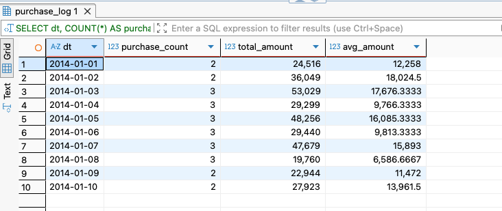


### 1-2 이동평균을 사용한 날짜별 추이 보기

1-1의 예시에서 7일 동안의 평균 매출을 사용한 8일 이동평균으로 표현하기 

```sql
SELECT
    dt,
    total_amount,
    AVG(total_amount) OVER (
        ORDER BY dt
        ROWS BETWEEN 6 PRECEDING AND CURRENT ROW
    ) AS seven_day_avg,
    CASE
        WHEN COUNT(*) OVER (
            ORDER BY dt
            ROWS BETWEEN 6 PRECEDING AND CURRENT ROW
        ) = 7
        THEN AVG(total_amount) OVER (
            ORDER BY dt
            ROWS BETWEEN 6 PRECEDING AND CURRENT ROW
        )
    END AS seven_day_avg_strict
FROM (
    SELECT
        dt,
        SUM(purchase_amount) AS total_amount
    FROM purchase_log
    GROUP BY dt
) AS daily_sales
ORDER BY dt;
```

**MySQL 풀이**

- mySQL에서는 집계함수 안에 **윈도우 함수** 구조를 표현 못함
  - 따라서 서브쿼리로 일별합계를 만들어 윈도우 함수가 이거를 매핑하듯이 사용

<!-- 1-2 이미지 -->
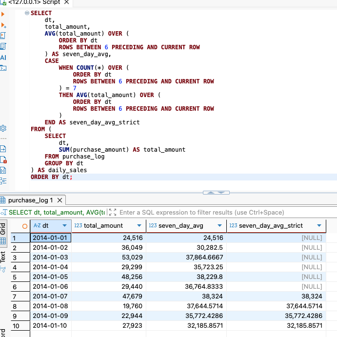


### 1-3 당월 매출 누계 구하기

- 날짜별로 매출, 당월 매출 누계도 확인하는 윈도우 함수를 사용하는 쿼리

```sql
SELECT
    dt,
    SUBSTRING(dt, 1, 7) AS year_month,
    total_amount,
    SUM(total_amount) OVER (
        PARTITION BY SUBSTRING(dt, 1, 7)
        ORDER BY dt
        ROWS BETWEEN UNBOUNDED PRECEDING AND CURRENT ROW
    ) AS agg_amount
FROM (
    SELECT
        dt,
        SUM(purchase_amount) AS total_amount
    FROM purchase_log
    GROUP BY dt
) AS daily_sales
ORDER BY dt;
```


- 위 쿼리는 GROUP BY dt로 날짜별로 집계한 합계 금액에 SUM 윈도 함수를 적용해서 파티션 생성
- 아래는 연,월,일을 3개로 추출하여 분할하여 결합하는 방법으로 편리하게 사용하는 쿼리

~~~sql
WITH daily_purchase AS (
	SELECT dt, 
		substring(dt, 1, 4) AS year,
		substring(dt, 6, 2) AS month,
substring(dt, 9, 2) AS date,
SUM(purchase_amount) AS purchase_amount,
COUNT(order_id) AS orders 
FROM purchase_log
GROUP BY dt)
SELECT *
FROM daily_purchase
ORDER BY dt;
~~~

<!-- 1-3 이미지 -->
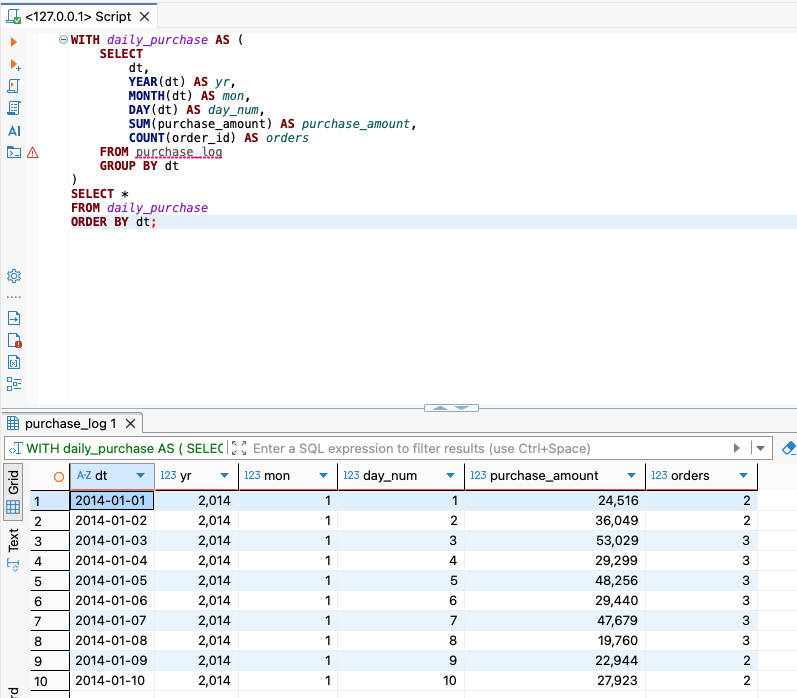


- daily_purchase 테이블에 대해 당월 누계 매출을 집계하는 쿼리

~~~sql
SELECT
    a.dt,
    DATE_FORMAT(a.dt, '%Y-%m') AS ym,
    a.purchase_amount,
    SUM(b.purchase_amount) AS agg_amount
FROM
    (
        SELECT
            dt,
            SUM(purchase_amount) AS purchase_amount
        FROM purchase_log
        GROUP BY dt
    ) a
JOIN
    (
        SELECT
            dt,
            SUM(purchase_amount) AS purchase_amount
        FROM purchase_log
        GROUP BY dt
    ) b
    ON DATE_FORMAT(a.dt, '%Y-%m') = DATE_FORMAT(b.dt, '%Y-%m')
   AND b.dt <= a.dt
GROUP BY
    a.dt,
    a.purchase_amount
ORDER BY
    a.dt;
~~~

<!-- 1-3-1 이미지 -->
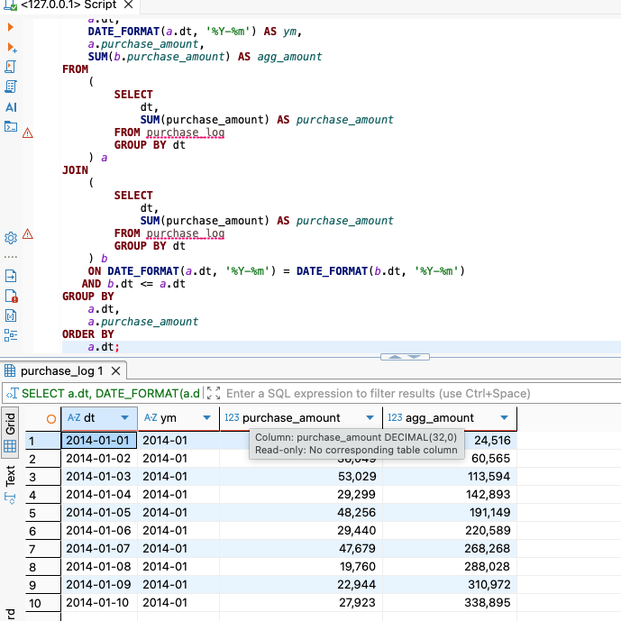


> **SQL 사용시**
>
> 서비스를 운용과 개발을 하기 위한 SQL과 비교할 때, 분석SQL은 성능이 조금 떨어지더라도 가독성과 재사용성을 증시해서 작성하는 경우가 다수 


### 1-4 월별 매출의 작대비 구하기

- 월별 매출 추이를 추출해서 작년의 해당 월의 매출과 비교하기 
  - 매출의 상승 or 하락 여부를 한 눈에 확인하는 리포트 만들기

```sql
WITH daily_purchase AS (
	SELECT dt, 
		substring(dt, 1, 4) AS year,
		substring(dt, 6, 2) AS month,
substring(dt, 9, 2) AS date,
SUM(purchase_amount) AS purchase_amount,
COUNT(order_id) AS orders 
FROM purchase_log
GROUP BY dt)
SELECT month, 
	SUM(CASE year WHEN '2014' THEN purchase_amount END) AS amount_2014,
	SUM(CASE year WHEN '2015' THEN purchase_amount END) AS amount_2015,
	100.0 * SUM(CASE year WHEN '2015' THEN purchase_amount END) / SUM(CASE year WHEN '2014' THEN purchase_amount END) AS rate
FROM daily_purchase
GROUP BY month
ORDER BY month;
```

<!-- 1-4 이미지 -->
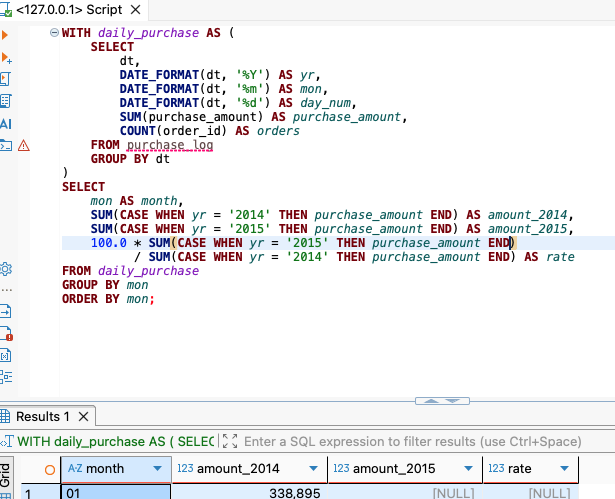


### 1-5 Z 차트로 업적의 추이 확인하기

**Z 차트** : 월차매출, 매출누계, 이동년계 3개의 지표로 구성되어 있는 차트

- 계절의 변동의 영향을 배제하고 트렌드를 분석하는 방법으로 알려져있다.

**월차매출**: 매출 합계를 월별로 집계

**매출누계** : 해당월의 매출에 이전월까지의 매출 누계를 합한 값

**이동년계** : 해당 월의 매출에 과거 11개월의 매출을 합한 값


**2015년 매출에 대한 Z 차트를 작성하는 쿼리**

```sql
WITH daily_purchase AS (
    SELECT
        dt,
        SUBSTRING(dt, 1, 4) AS year,
        SUBSTRING(dt, 6, 2) AS month,
        SUBSTRING(dt, 9, 2) AS date,
        SUM(purchase_amount) AS purchase_amount,
        COUNT(order_id) AS orders
    FROM purchase_log
    GROUP BY dt
),
monthly_amount AS (
    SELECT
        year,
        month,
        SUM(purchase_amount) AS amount
    FROM daily_purchase
    GROUP BY year, month
),
calc_index AS (
    SELECT
        year,
        month,
        amount,
        SUM(
            CASE
                WHEN year = '2015' THEN amount
            END
        ) OVER (
            ORDER BY year, month
            ROWS UNBOUNDED PRECEDING
        ) AS agg_amount,
        SUM(amount) OVER (
            ORDER BY year, month
            ROWS BETWEEN 11 PRECEDING AND CURRENT ROW
        ) AS year_avg_amount
    FROM monthly_amount
    ORDER BY year, month
)
SELECT
    CONCAT(year, '-', month) AS year_month,
    amount,
    agg_amount,
    year_avg_amount
FROM calc_index
WHERE year = '2015'
ORDER BY year_month;
```

<!-- 1-5 이미지 -->
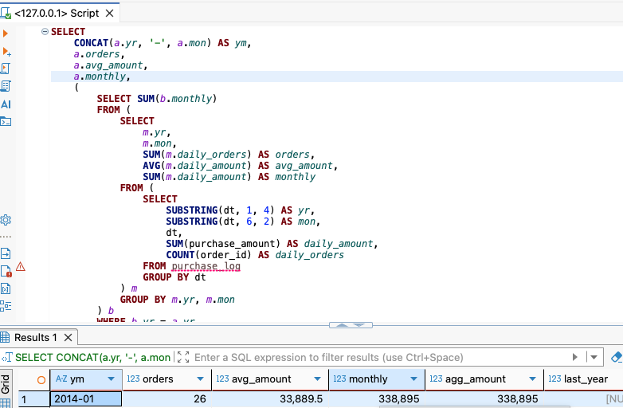


### 1-6 매출을 파악할 때 중요 포인트 

- 매출과 관련된 지표를 집계하는 쿼리

```sql
WITH daily_purchase AS (
    SELECT
        dt,
        SUBSTRING(dt, 1, 4) AS year,
        SUBSTRING(dt, 6, 2) AS month,
        SUBSTRING(dt, 9, 2) AS date,
        SUM(purchase_amount) AS purchase_amount,
        COUNT(order_id) AS orders
    FROM purchase_log
    GROUP BY dt
),
monthly_purchase AS (
    SELECT
        year,
        month,
        SUM(orders) AS orders,
        AVG(purchase_amount) AS avg_amount,
        SUM(purchase_amount) AS monthly
    FROM daily_purchase
    GROUP BY year, month
)
SELECT
    CONCAT(year, '-', month) AS year_month,
    orders,
    avg_amount,
    monthly,
    SUM(monthly) OVER (
        PARTITION BY year
        ORDER BY month
        ROWS UNBOUNDED PRECEDING
    ) AS agg_amount,
    LAG(monthly, 12) OVER (
        ORDER BY year, month
    ) AS last_year,
    100.0 * monthly /
    LAG(monthly, 12) OVER (
        ORDER BY year, month
    ) AS rate
FROM monthly_purchase
ORDER BY year_month;
```


## 2. 다면적인 축을 사용해 데이터 집계하기 

매출의 시계열, 상품의 카테고리 및 가격 등을 조합해서 데이터의 특징을 추출해 리포팅하는 방법

### 2-1 카테고리별 매출과 소계 계산하기

- 매출 합계를 먼저 제시 후, PC / SP 사이트의 구분 비교 
- 카테고리별 매출과 소계를 동시에 구하는 쿼리

```sql
WITH sub_category_amount AS (
    SELECT
        category,
        sub_category,
        SUM(price) AS amount
    FROM purchase_detail_log
    GROUP BY category, sub_category
),
category_amount AS (
    SELECT
        category,
        'all' AS sub_category,
        SUM(price) AS amount
    FROM purchase_detail_log
    GROUP BY category
),
total_amount AS (
    SELECT
        'all' AS category,
        'all' AS sub_category,
        SUM(price) AS amount
    FROM purchase_detail_log
)
SELECT
    category,
    sub_category,
    amount
FROM sub_category_amount
UNION ALL
SELECT
    category,
    sub_category,
    amount
FROM category_amount
UNION ALL
SELECT
    category,
    sub_category,
    amount
FROM total_amount;
```

<!-- 2-1 이미지 -->
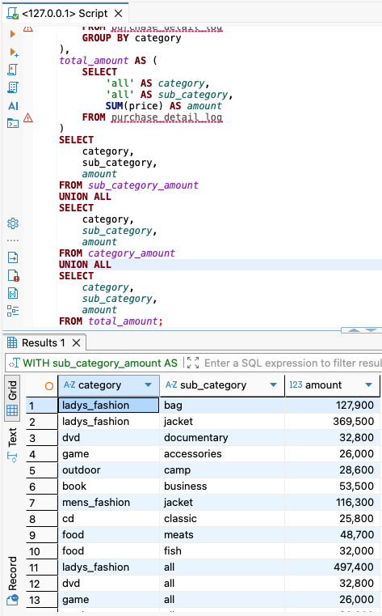


- `ROLLUP`을 사용해서 카테고리별 매출과 소계를 동시에 구하는 쿼리

~~~sql
SELECT
    COALESCE(category, 'all')      AS category,
    COALESCE(sub_category, 'all')  AS sub_category,
    SUM(price)                     AS amount
FROM purchase_detail_log
GROUP BY
    ROLLUP(category, sub_category);
~~~

<!-- 2-1-2 이미지 -->
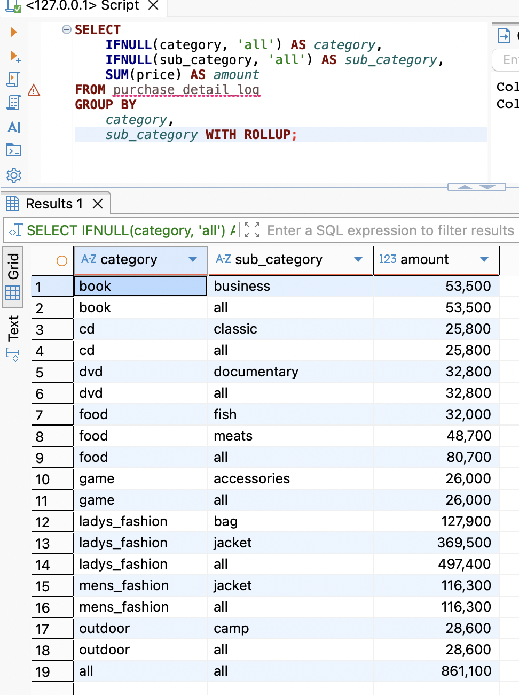


### 2-2 ABC 분석으로 잘 팔리는 상품 판별하기

**ABC 분석** : 재고 관리에서 사용하는 분석 방법

- 매출 중요도 (상위 몇프로)에 따라 상품을 나누고, 그에 맞는 전략을 만들 때 사용
- 데이터 작성 방법
  - 매출이 높은 순서로 데이터를 정렬
  - 매출 합계를 집계
  - 매출 합계 기반으로 각 데이터가 차지하는 비율을 계산하고, 구성비를 구함
  - 계산한 카테고리의 구성비를 기반으로 구성비누계를 구하기 
- **ABC 등급** 매출 구성비누계와 같이 계산하는 쿼리

```sql
WITH monthly_sales AS (
    SELECT
        category,
        SUM(price) AS amount
    FROM purchase_detail_log
    WHERE dt BETWEEN '2015-12-01' AND '2015-12-31'
    GROUP BY category
),
sales_composition_ratio AS (
    SELECT
        category,
        amount,
        100.0 * amount / SUM(amount) OVER () AS composition_ratio,
        100.0 * SUM(amount) OVER (
            ORDER BY amount DESC
            ROWS BETWEEN UNBOUNDED PRECEDING AND CURRENT ROW
        ) / SUM(amount) OVER () AS cumulative_ratio
    FROM monthly_sales
)
SELECT
    *,
    CASE
        WHEN cumulative_ratio <= 70 THEN 'A'
        WHEN cumulative_ratio <= 90 THEN 'B'
        ELSE 'C'
    END AS abc_rank
FROM sales_composition_ratio
ORDER BY amount DESC;
```

**MySQL 풀이** 

- 크게 차이없지만, 실제 git에 제공된 데이터는 2017년도
  - 따라서 BETWEEN 부분을 2017로 변경해서 풀이

<!-- 2-2 이미지 -->
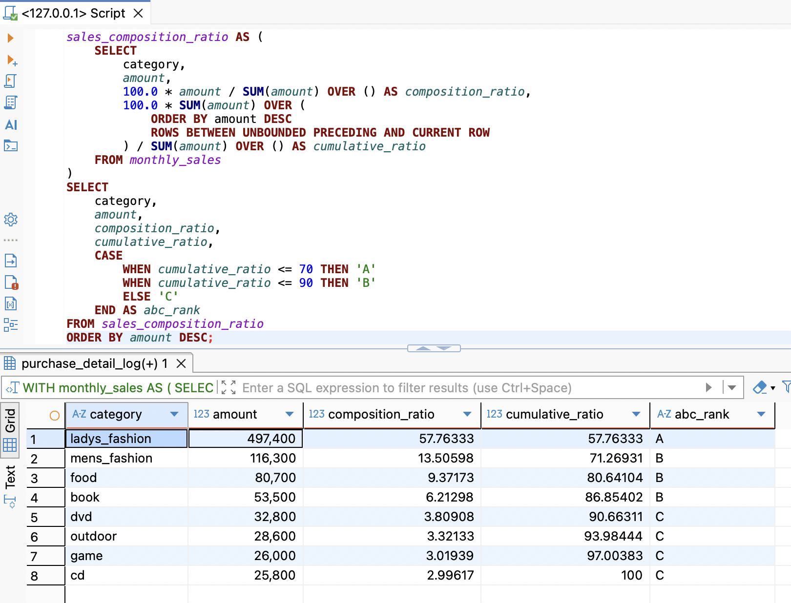


### 2-3 팬 차트로 상품의 매출 증가율 확인하기

**팬 차트** : 어떤 기준 시점을 100프로로 두고, 이후의 숫자 변동을 확인해주는 그래프

- 카테고리별 매출 금액의 추이를 판단할 수 있음 (변화가 백분율료 표시)

- 팬 차트 작성 때 필요한 데이터 구하는 쿼리
  - 날짜 데이터 기반 : 연과 월의 값 추출 후 연과 월 단위로 매출을 구함. 
  - 매출을 시계영ㄹ 순서로 정렬, 팬 차트 작성을 위한 기준이 되는 월 매출을 기준으로 비율을 구함. 

```sql
WITH daily_category_amount AS (
    SELECT
        dt,
        category,
        SUBSTRING(dt, 1, 4) AS year,
        SUBSTRING(dt, 6, 2) AS month,
        SUBSTRING(dt, 9, 2) AS date,
        SUM(price) AS amount
    FROM purchase_detail_log
    GROUP BY
        dt,
        category
),
monthly_category_amount AS (
    SELECT
        CONCAT(year, '-', month) AS year_month,
        category,
        SUM(amount) AS amount
    FROM daily_category_amount
    GROUP BY
        year,
        month,
        category
)
SELECT
    year_month,
    category,
    amount,
    FIRST_VALUE(amount) OVER (
        PARTITION BY category
        ORDER BY year_month, category
        ROWS BETWEEN UNBOUNDED PRECEDING AND CURRENT ROW
    ) AS base_amount,
    100.0 * amount / FIRST_VALUE(amount) OVER (
        PARTITION BY category
        ORDER BY year_month, category
        ROWS BETWEEN UNBOUNDED PRECEDING AND CURRENT ROW
    ) AS rate
FROM monthly_category_amount
ORDER BY
    year_month,
    category;
```

<!-- 2-3 이미지 -->
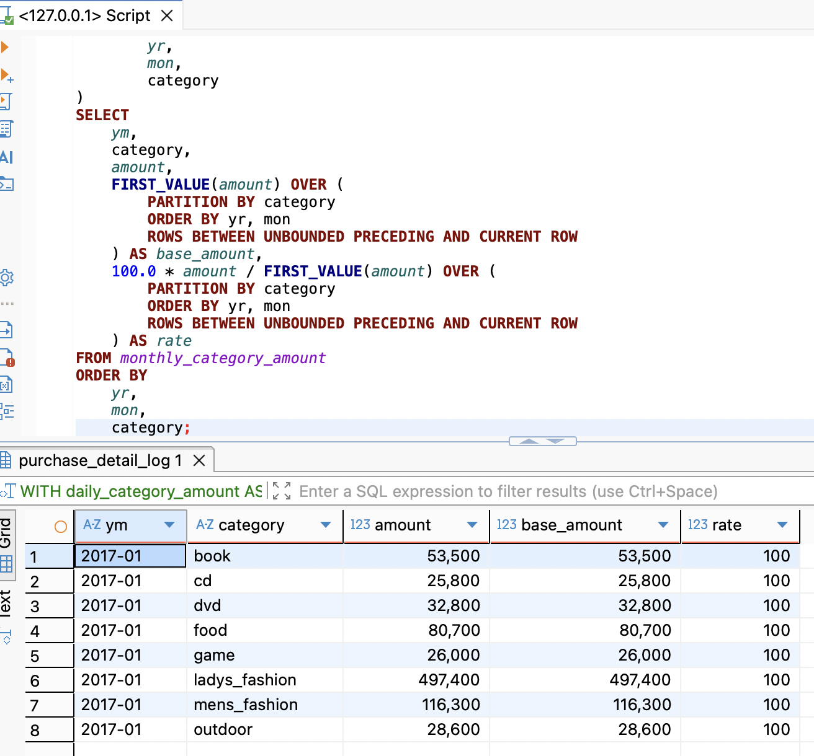


> 팬 차트 시 주의사항으로는 **어떤 시점**에서의 매출 금액을 기준으로 채택할 지를 잘 결정해야 한다. 

### 2-4 히스토그램으로 구매 가격대 집계하기 

**히스토그램** : 

- 가로축 : 단계 (데이터의 범위), 세로축 : 도수 (데이터의 개수)
- **최빈값 확인에 용이**
- 만드는 방법
  - 최대, 최소, 범위(최대 - 최소)를 구한다.
  - 범위를 기반으로 몇 개의 계급으로 나눌지 결정하고, 각 계급의 하한과 상한을 구한다.
  - 각 계급에 들어가는 데이터 개수(도수)를 구하고, 이를 표로 정리한다. 


**임의의 계층 수로 히스토그램 만들기**

- 최대, 최소, 범위를 구하는 쿼리

```sql
WITH stats AS (
    SELECT
        MAX(price) AS max_price,
        MIN(price) AS min_price,
        MAX(price) - MIN(price) AS range_price,
        10 AS bucket_num
    FROM purchase_detail_log
)

SELECT
    *
FROM stats;
```

<!-- 2-4 이미지 -->
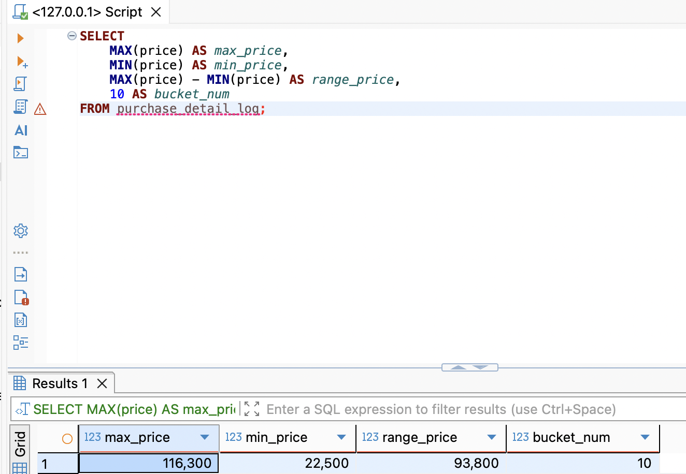


- 데이터의 계층을 구하는 쿼리

~~~sql
WITH stats AS (
    SELECT
        MAX(price) AS max_price,
        MIN(price) AS min_price,
        MAX(price) - MIN(price) AS range_price,
        10 AS bucket_num
    FROM purchase_detail_log
),
purchase_log_with_bucket AS (
    SELECT
        p.price,
        s.min_price,
        p.price - s.min_price AS diff,
        1.0 * s.range_price / s.bucket_num AS bucket_range,
        FLOOR(
            (p.price - s.min_price) /
            (1.0 * s.range_price / s.bucket_num)
        ) + 1 AS bucket
    FROM purchase_detail_log p
    CROSS JOIN stats s
)
SELECT *
FROM purchase_log_with_bucket
ORDER BY price;
~~~

<!-- 2-4-1 이미지 -->
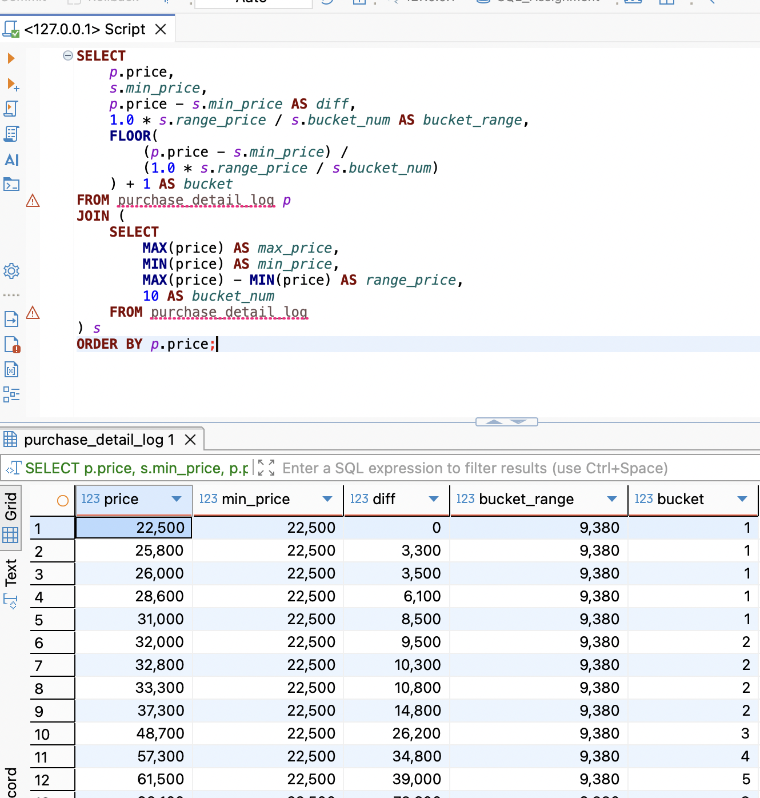


- 계급 상한 값을 조정한 쿼리

~~~sql
WITH stats AS (
    SELECT
        MAX(price) + 1 AS max_price,
        MIN(price) AS min_price,
        MAX(price) + 1 - MIN(price) AS range_price,
        10 AS bucket_num
    FROM purchase_detail_log
),
purchase_log_with_bucket AS (
    SELECT
        p.price,
        s.min_price,
        p.price - s.min_price AS diff,
        1.0 * s.range_price / s.bucket_num AS bucket_range,
        FLOOR(
            (p.price - s.min_price) /
            (1.0 * s.range_price / s.bucket_num)
        ) + 1 AS bucket
    FROM purchase_detail_log p
    CROSS JOIN stats s
)
SELECT *
FROM purchase_log_with_bucket
ORDER BY price;
~~~

<!-- 2-4-2 이미지 -->
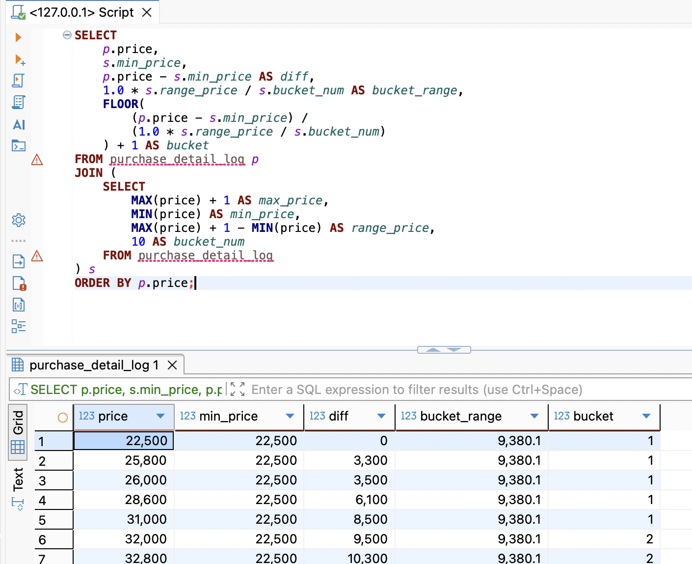


- 히스토그램을 구하는 쿼리

~~~sql
WITH stats AS (
    SELECT
        MAX(price) + 1 AS max_price,
        MIN(price) AS min_price,
        MAX(price) + 1 - MIN(price) AS range_price,
        10 AS bucket_num
    FROM purchase_detail_log
),
purchase_log_with_bucket AS (
    SELECT
        p.price,
        s.min_price,
        p.price - s.min_price AS diff,
        1.0 * s.range_price / s.bucket_num AS bucket_range,
        FLOOR(
            (p.price - s.min_price) /
            (1.0 * s.range_price / s.bucket_num)
        ) + 1 AS bucket
    FROM purchase_detail_log p
    CROSS JOIN stats s
)
SELECT
    bucket,
    min_price + bucket_range * (bucket - 1) AS lower_limit,
    min_price + bucket_range * bucket AS upper_limit,
    COUNT(price) AS num_purchase,
    SUM(price) AS total_amount
FROM purchase_log_with_bucket
GROUP BY
    bucket,
    min_price,
    bucket_range
ORDER BY bucket;
~~~

<!-- 2-4-3 이미지 -->
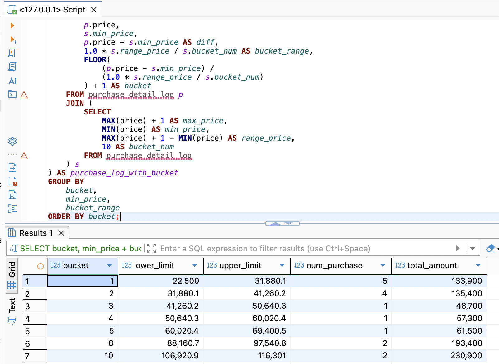


**임의의 계층 너비로 히스토그램 작성하기**

- 최대, 최소, 금액 범위 등의 고정값을 기반으로 너비 변경하는 기능

- 히스토그램의 상한과 하한을 수동으로 조정한 쿼리

~~~sql
WITH stats AS (
    SELECT
        50000 AS max_price,
        0 AS min_price,
        50000 AS range_price,
        10 AS bucket_num
    FROM purchase_detail_log
),
purchase_log_with_bucket AS (
    SELECT
        p.price,
        s.min_price,
        p.price - s.min_price AS diff,
        1.0 * s.range_price / s.bucket_num AS bucket_range,
        FLOOR(
            (p.price - s.min_price) /
            (1.0 * s.range_price / s.bucket_num)
        ) + 1 AS bucket
    FROM purchase_detail_log p
    CROSS JOIN stats s
)
SELECT
    bucket,
    min_price + bucket_range * (bucket - 1) AS lower_limit,
    min_price + bucket_range * bucket AS upper_limit,
    COUNT(price) AS num_purchase,
    SUM(price) AS total_amount
FROM purchase_log_with_bucket
GROUP BY
    bucket,
    min_price,
    bucket_range
ORDER BY bucket;
~~~

<!-- 2-4-4 이미지 -->
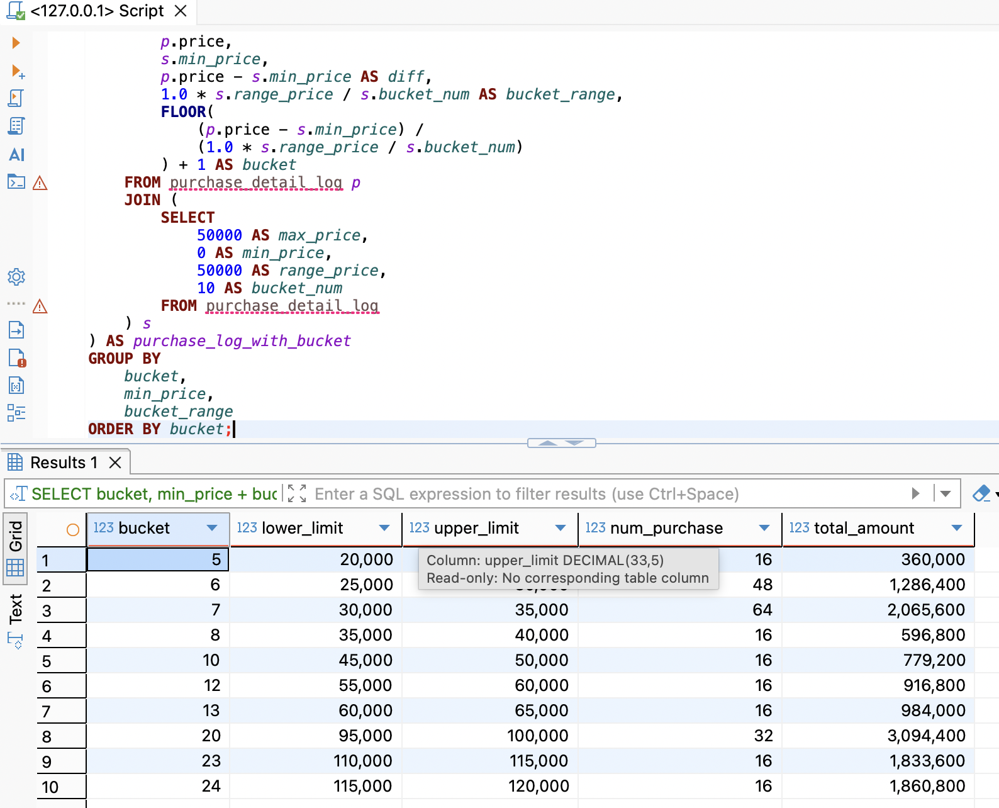


**히스토그램이 나눠진 경우**

- 데이터에 여러 조건을 걸어서 필터링을 해야 함.


### 🎉 수고하셨습니다.