# SQL_MASTER 4주차 정규과제

📌SQL MASTER 정규과제는 매주 정해진 분량의 『*데이터 분석을 위한 SQL 레시피*』 를 읽고 학습하는 것입니다. 이번 주는 아래의 **SQL_MASTER_4th_TIL**에 나열된 분량을 읽고 공부하시면 됩니다.

아래 실습을 수행하며 학습 내용을 직접 적용해보세요. 단순히 결과를 재현하는 것이 아니라, SQL을 직접 작성하는 과정에서 개념을 스스로 정리하는 것이 중요합니다.

필요한 경우 교재와 추가 자료를 참고하여 이해를 보완하시기 바랍니다.

## SQL_MASTER_4th_TIL

### 5장 사용자를 파악하기 위한 데이터 추출
#### 1. 사용자 전체의 특징과 경향 찾기


## Study Schedule

| 주차  | 공부 범위 | 완료 여부 |
| ----- | --------- | --------- |
| 1주차 | p.20~50   | ✅         |
| 2주차 | p.52~136  | ✅         |
| 3주차 | p.138~184 | ✅         |
| 4주차 | p.186~232 | ✅         |
| 5주차 | p.233~321 | 🍽️         |
| 6주차 | p.324~406 | 🍽️         |
| 7주차 | p.408~464 | 🍽️         |

<br>

<!-- 여기까진 그대로 둬 주세요-->


# 실습

## 0. 실습 규칙

1. 샘플 데이터 생성 코드는 **07_SQL_MASTER_Template/src** 경로에 장별로 정리되어 있습니다.
2. 아래 목차에 맞춰 해당 코드를 실행하여 샘플 데이터를 생성한 후, 각 장에서 요구하는 쿼리를 직접 작성해보시기 바랍니다.
3. 작성한 쿼리의 **실행 결과 화면도 함께 제출**해 주세요.
4. 단순히 교재의 예시 코드를 그대로 작성하는 것이 아니라, **제시된 로직을 충분히 이해한 뒤 교재를 보지 않고 스스로 쿼리를 구성**해보는 것을 권장합니다.
5. 교재 예시는 PostgreSQL, Hive, BigQuery 등 다양한 DBMS 기준으로 제시되어 있기 때문에, **MySQL이 아닌 다른 SQL 환경을 사용하여 실습을 진행해도 무방합니다.**
6. 다만, 사용 중인 DBMS에 맞는 문법으로 적절히 변환하여 작성하시기 바랍니다.

## 1. 사용자 전체의 특징과 경향 찾기

### 1-1 사용자의 액션 수 집계하기

사용자들이 특정 기간 동안 기능을 얼마나 사용하는지 집계하기 = **사용률**

- 평균적으로 액션을 몇 번이나 사용했는지 확인하는 비율 = **1명 당 액션 수**

- 액션 수를 집계한 테이블

```sql
WITH stats AS (
    SELECT
        COUNT(DISTINCT session) AS total_uu
    FROM action_log
)
SELECT
    l.action,
    COUNT(DISTINCT l.session) AS action_uu,
    COUNT(1) AS action_count,
    s.total_uu,
    100.0 * COUNT(DISTINCT l.session) / s.total_uu AS usage_rate,
    1.0 * COUNT(1) / COUNT(DISTINCT l.session) AS count_per_user
FROM action_log AS l
CROSS JOIN stats AS s
GROUP BY
    l.action,
    s.total_uu;
```

<!-- 이미지 1-1 -->
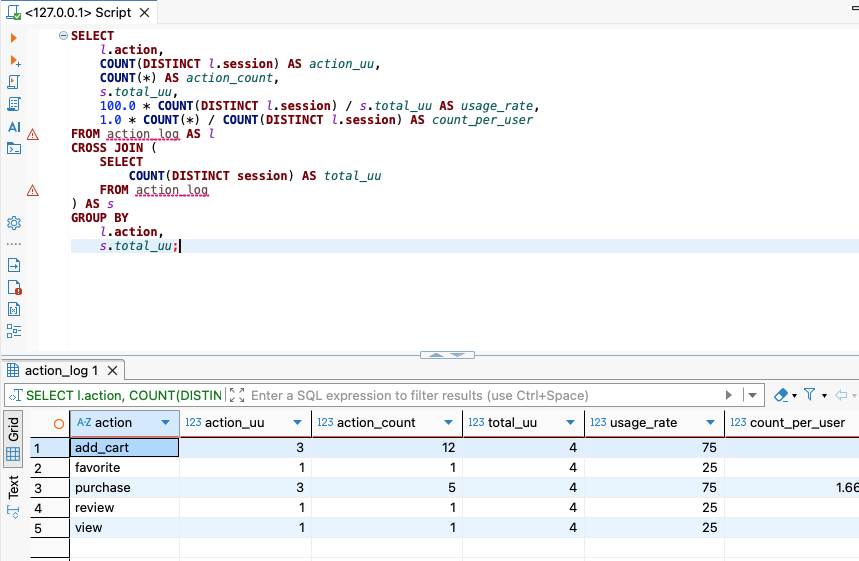


**로그인 사용자와 비로그인 사용자를 구분해서 집계하기**

- 로그인 상태를 판별하는 쿼리

~~~sql
WITH action_log_with_status AS (
    SELECT
        session,
        user_id,
        action,
        CASE
            WHEN COALESCE(user_id, '') <> '' THEN 'login'
            ELSE 'guest'
        END AS login_status
    FROM action_log
)
SELECT *
FROM action_log_with_status;
~~~

<!-- 이미지 1-2 -->
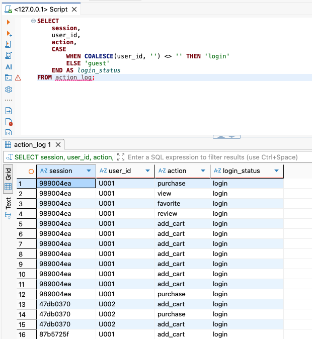


- 로그인 상태에 따라 액션 수 등을 따로 집계하는 쿼리

~~~sql
WITH action_log_with_status AS (
    SELECT
        session,
        user_id,
        action,
        CASE
            WHEN COALESCE(user_id, '') <> '' THEN 'login'
            ELSE 'guest'
        END AS login_status
    FROM action_log
)
SELECT
    COALESCE(action, 'all') AS action,
    COALESCE(login_status, 'all') AS login_status,
    COUNT(DISTINCT session) AS action_uu,
    COUNT(*) AS action_count
FROM action_log_with_status
GROUP BY
    ROLLUP(action, login_status);
~~~

<!-- 이미지 1-3 -->
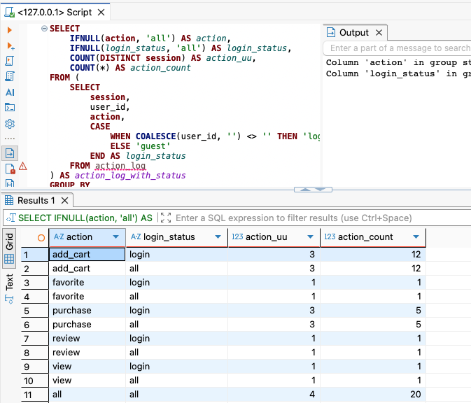


**회원과 비회원을 구분해서 집계하기**

- 회원 상태를 판별하는 쿼리
- 사용자 ID컬럼이 빈 상태 -> 문자열 or NULL 일 수도 있다고 판단 `COALESCE` 함수 사용

~~~sql
WITH action_log_with_status AS (
    SELECT
        session,
        user_id,
        action,
        stamp,
        CASE
            WHEN COALESCE(
                MAX(user_id) OVER (
                    PARTITION BY session
                    ORDER BY stamp
                    ROWS BETWEEN UNBOUNDED PRECEDING AND CURRENT ROW
                ),
                ''
            ) <> '' THEN 'member'
            ELSE 'none'
        END AS member_status
    FROM action_log
)
SELECT
    *
FROM action_log_with_status;
~~~

<!-- 이미지 1-4 -->
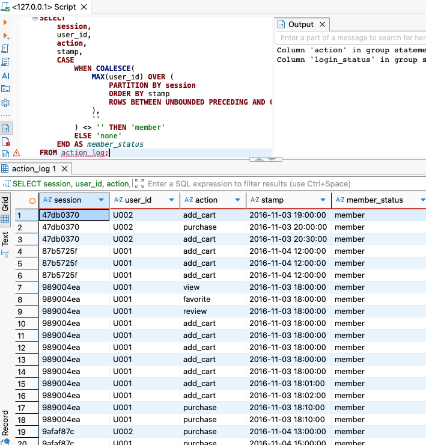


### 1-2 연령별 구분 집계하기

- 사용자의 생일을 계산하는 쿼리

```sql
WITH mst_users_with_int_birth_date AS (
    SELECT
        *,
        20170101 AS int_specific_date,
        CAST(REPLACE(SUBSTRING(birth_date, 1, 10), '-', '') AS INTEGER) AS int_birth_date
    FROM mst_users
),
mst_users_with_age AS (
    SELECT
        *,
        FLOOR((int_specific_date - int_birth_date) / 10000) AS age
    FROM mst_users_with_int_birth_date
)
SELECT
    user_id,
    sex,
    birth_date,
    age
FROM mst_users_with_age;
```

<!-- 이미지 2-1 -->
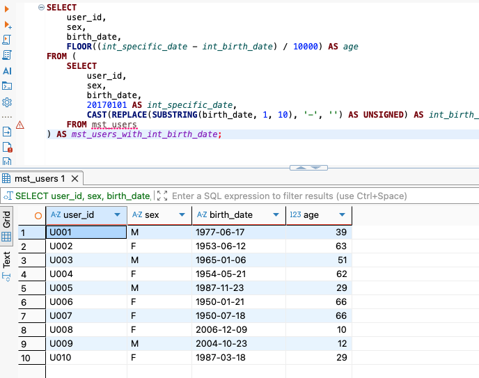


- 성별과 연령으로 연령별 구분을 계산하는 쿼리

~~~sql
WITH mst_users_with_int_birth_date AS (
    SELECT
        *,
        20170101 AS int_specific_date,
        CAST(REPLACE(SUBSTRING(birth_date, 1, 10), '-', '') AS INTEGER) AS int_birth_date
    FROM mst_users
),
mst_users_with_age AS (
    SELECT
        *,
        FLOOR((int_specific_date - int_birth_date) / 10000) AS age
    FROM mst_users_with_int_birth_date
),
mst_users_with_category AS (
    SELECT
        user_id,
        sex,
        age,
        CONCAT(
            CASE
                WHEN age >= 20 THEN sex
                ELSE ''
            END,
            CASE
                WHEN age BETWEEN 4 AND 12 THEN 'C'
                WHEN age BETWEEN 13 AND 19 THEN 'T'
                WHEN age BETWEEN 20 AND 34 THEN '1'
                WHEN age BETWEEN 35 AND 49 THEN '2'
                WHEN age >= 50 THEN '3'
            END
        ) AS category
    FROM mst_users_with_age
)
SELECT
    *
FROM mst_users_with_category;
~~~

<!-- 이미지 2-2 -->
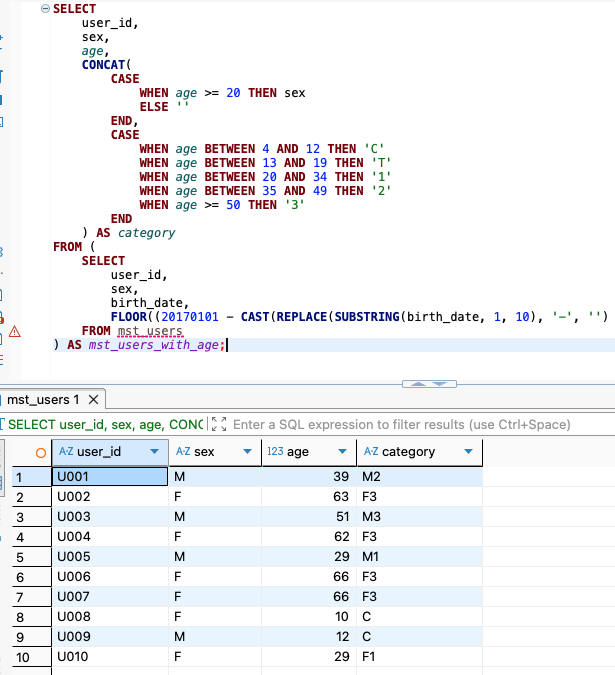


- 연령별 구분의 사람 수를 계산하는 쿼리

~~~sql
WITH mst_users_with_int_birth_date AS (
    SELECT
        *,
        20170101 AS int_specific_date,
        CAST(REPLACE(SUBSTRING(birth_date, 1, 10), '-', '') AS INTEGER) AS int_birth_date
    FROM mst_users
),

mst_users_with_age AS (
    SELECT
        *,
        FLOOR((int_specific_date - int_birth_date) / 10000) AS age
    FROM mst_users_with_int_birth_date
),
mst_users_with_category AS (
    SELECT
        user_id,
        sex,
        age,
        CONCAT(
            CASE
                WHEN age >= 20 THEN sex
                ELSE ''
            END,
            CASE
                WHEN age BETWEEN 4 AND 12 THEN 'C'
                WHEN age BETWEEN 13 AND 19 THEN 'T'
                WHEN age BETWEEN 20 AND 34 THEN '1'
                WHEN age BETWEEN 35 AND 49 THEN '2'
                WHEN age >= 50 THEN '3'
            END
        ) AS category
    FROM mst_users_with_age
)
SELECT
    category,
    COUNT(*) AS user_count
FROM mst_users_with_category
GROUP BY
    category;
~~~

<!-- 이미지 2-3 -->
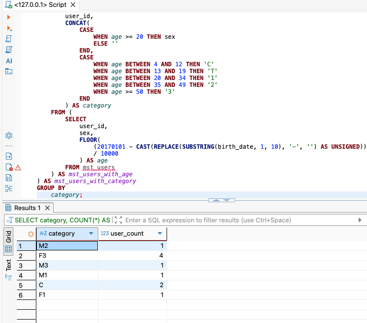


### 1-3 연령별 구분의 특징 추출하기

서비스의 사용 형태가 사용자 속성에 따라 다르다는 것을 확인하기

- 사용자 속성에 맞게 추천이 가능하다
- 연령별 구분과 카테고리를 집계하는 쿼리

```sql
WITH mst_users_with_int_birth_date AS (
    SELECT
        *,
        20170101 AS int_specific_date,
        CAST(REPLACE(SUBSTRING(birth_date, 1, 10), '-', '') AS INTEGER) AS int_birth_date
    FROM mst_users
),
mst_users_with_age AS (
    SELECT
        *,
        FLOOR((int_specific_date - int_birth_date) / 10000) AS age
    FROM mst_users_with_int_birth_date
),
mst_users_with_category AS (
    SELECT
        user_id,
        sex,
        age,
        CONCAT(
            CASE
                WHEN age >= 20 THEN sex
                ELSE ''
            END,
            CASE
                WHEN age BETWEEN 4 AND 12 THEN 'C'
                WHEN age BETWEEN 13 AND 19 THEN 'T'
                WHEN age BETWEEN 20 AND 34 THEN '1'
                WHEN age BETWEEN 35 AND 49 THEN '2'
                WHEN age >= 50 THEN '3'
            END
        ) AS category
    FROM mst_users_with_age
)
SELECT
    p.category AS product_category,
    u.category AS user_category,
    COUNT(*) AS purchase_count
FROM action_log AS p
JOIN mst_users_with_category AS u
    ON p.user_id = u.user_id
WHERE p.action = 'purchase'
GROUP BY
    p.category,
    u.category
ORDER BY
    p.category,
    u.category;
```

<!-- 이미지 3-1 -->
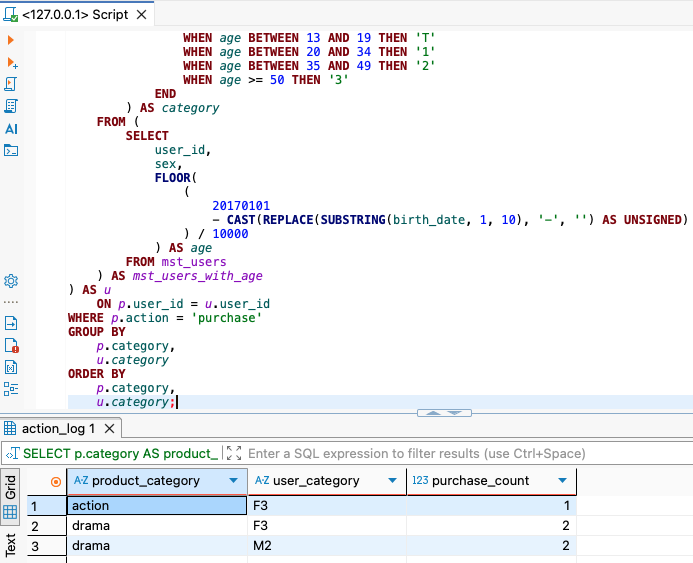


> ABC 분석과 구성비누계를 리포트에 추가 
>
> - 리포트의 내용 전달성 향상이 가능


### 1-4 사용자의 방문 빈도 집계하기

- 한 주에 며칠 사용되었는지를 집계하는 쿼리

```sql
WITH action_log_with_dt AS (
    SELECT
        *,
        SUBSTRING(stamp, 1, 10) AS dt
    FROM action_log
),

action_day_count_per_user AS (
    SELECT
        user_id,
        COUNT(DISTINCT dt) AS action_day_count
    FROM action_log_with_dt
    WHERE dt BETWEEN '2016-11-01' AND '2016-11-07'
    GROUP BY user_id
)

SELECT
    action_day_count,
    COUNT(DISTINCT user_id) AS user_count
FROM action_day_count_per_user
GROUP BY action_day_count
ORDER BY action_day_count;
```

<!-- 이미지 4-1 -->
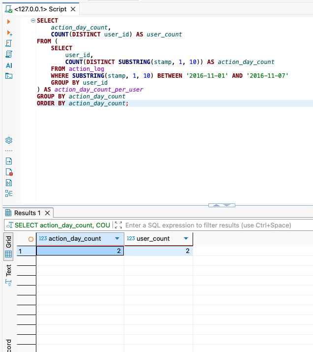


- 구성비와 구성비누계를 계산하는 쿼리

~~~sql
WITH action_day_count_per_user AS (
    SELECT
        user_id,
        COUNT(DISTINCT dt) AS action_day_count
    FROM action_log_with_dt
    WHERE dt BETWEEN '2016-11-01' AND '2016-11-07'
    GROUP BY user_id
)

SELECT
    action_day_count,
    COUNT(DISTINCT user_id) AS user_count,

    100.0 * COUNT(DISTINCT user_id)
        / SUM(COUNT(DISTINCT user_id)) OVER () AS composition_ratio,

    100.0 * SUM(COUNT(DISTINCT user_id)) OVER (
        ORDER BY action_day_count
        ROWS BETWEEN UNBOUNDED PRECEDING AND CURRENT ROW
    )
        / SUM(COUNT(DISTINCT user_id)) OVER () AS cumulative_ratio

FROM action_day_count_per_user
GROUP BY action_day_count
ORDER BY action_day_count;
~~~

<!-- 이미지 4-2 -->
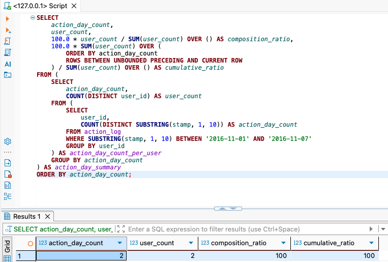


### 1-5 벤 다이어그램으로 사용자 액션 집계하기

벤 다이어그램을 만드는 SQL

- 사용자들의 액션 플래그를 집계하는 쿼리
  - 사용자 단위로 로그를 집약후, purchase, review, favorite 이라는 3개의 액션을 행한 로그가 존재하는지를 0과 1플래그를 부여하는 쿼리

```sql
WITH user_action_flag AS (
    SELECT
        user_id,
        SIGN(SUM(CASE WHEN action = 'purchase' THEN 1 ELSE 0 END)) AS has_purchase,
        SIGN(SUM(CASE WHEN action = 'review' THEN 1 ELSE 0 END)) AS has_review,
        SIGN(SUM(CASE WHEN action = 'favorite' THEN 1 ELSE 0 END)) AS has_favorite
    FROM action_log
    GROUP BY user_id
)

SELECT
    *
FROM user_action_flag;
```

<!-- 이미지 5-1 -->
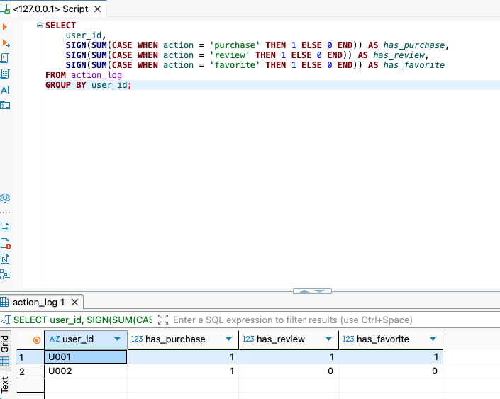


- 표준 `CUBE` 구문을 활용하면 이러한 수를 쉽게 계산하기 가능
- 모든 액션 조합에 대한 사용자 수 계산하는 쿼리

~~~sql
WITH user_action_flag AS (
    SELECT
        user_id,
        SIGN(SUM(CASE WHEN action = 'purchase' THEN 1 ELSE 0 END)) AS has_purchase,
        SIGN(SUM(CASE WHEN action = 'review' THEN 1 ELSE 0 END)) AS has_review,
        SIGN(SUM(CASE WHEN action = 'favorite' THEN 1 ELSE 0 END)) AS has_favorite
    FROM action_log
    GROUP BY user_id
),

action_venn_diagram AS (
    SELECT
        has_purchase,
        has_review,
        has_favorite,
        COUNT(*) AS users
    FROM user_action_flag
    GROUP BY
        CUBE(has_purchase, has_review, has_favorite)
)

SELECT
    *
FROM action_venn_diagram
ORDER BY
    has_purchase,
    has_review,
    has_favorite;
~~~

<!-- 이미지 5-2 -->
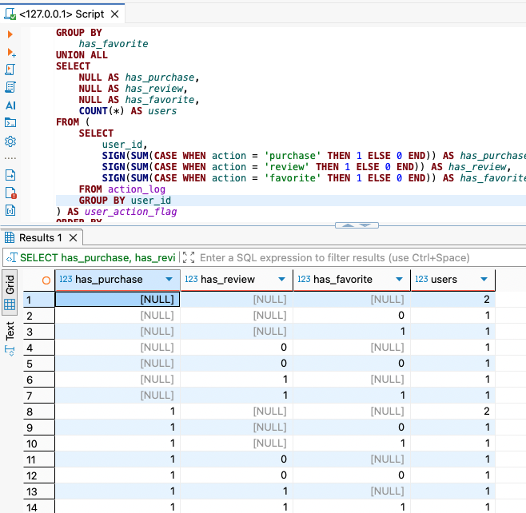


- `CUBE` 를 사용하지 않은 표준 SQL만으로 작성한 쿼리
  - 모든 미들웨어에서 동작하지만, `UNION ALL` 을 많이 사용하기에 성능이 좋지 않음. 

~~~sql
SELECT
    has_purchase,
    has_review,
    has_favorite,
    COUNT(*) AS users
FROM (
    SELECT
        user_id,
        SIGN(SUM(CASE WHEN action = 'purchase' THEN 1 ELSE 0 END)) AS has_purchase,
        SIGN(SUM(CASE WHEN action = 'review' THEN 1 ELSE 0 END)) AS has_review,
        SIGN(SUM(CASE WHEN action = 'favorite' THEN 1 ELSE 0 END)) AS has_favorite
    FROM action_log
    GROUP BY user_id
) AS user_action_flag
GROUP BY
    has_purchase,
    has_review,
    has_favorite

UNION ALL

SELECT
    has_purchase,
    has_review,
    NULL AS has_favorite,
    COUNT(*) AS users
FROM (
    SELECT
        user_id,
        SIGN(SUM(CASE WHEN action = 'purchase' THEN 1 ELSE 0 END)) AS has_purchase,
        SIGN(SUM(CASE WHEN action = 'review' THEN 1 ELSE 0 END)) AS has_review,
        SIGN(SUM(CASE WHEN action = 'favorite' THEN 1 ELSE 0 END)) AS has_favorite
    FROM action_log
    GROUP BY user_id
) AS user_action_flag
GROUP BY
    has_purchase,
    has_review

UNION ALL

SELECT
    has_purchase,
    NULL AS has_review,
    has_favorite,
    COUNT(*) AS users
FROM (
    SELECT
        user_id,
        SIGN(SUM(CASE WHEN action = 'purchase' THEN 1 ELSE 0 END)) AS has_purchase,
        SIGN(SUM(CASE WHEN action = 'review' THEN 1 ELSE 0 END)) AS has_review,
        SIGN(SUM(CASE WHEN action = 'favorite' THEN 1 ELSE 0 END)) AS has_favorite
    FROM action_log
    GROUP BY user_id
) AS user_action_flag
GROUP BY
    has_purchase,
    has_favorite

UNION ALL

SELECT
    NULL AS has_purchase,
    has_review,
    has_favorite,
    COUNT(*) AS users
FROM (
    SELECT
        user_id,
        SIGN(SUM(CASE WHEN action = 'purchase' THEN 1 ELSE 0 END)) AS has_purchase,
        SIGN(SUM(CASE WHEN action = 'review' THEN 1 ELSE 0 END)) AS has_review,
        SIGN(SUM(CASE WHEN action = 'favorite' THEN 1 ELSE 0 END)) AS has_favorite
    FROM action_log
    GROUP BY user_id
) AS user_action_flag
GROUP BY
    has_review,
    has_favorite

UNION ALL

SELECT
    has_purchase,
    NULL AS has_review,
    NULL AS has_favorite,
    COUNT(*) AS users
FROM (
    SELECT
        user_id,
        SIGN(SUM(CASE WHEN action = 'purchase' THEN 1 ELSE 0 END)) AS has_purchase,
        SIGN(SUM(CASE WHEN action = 'review' THEN 1 ELSE 0 END)) AS has_review,
        SIGN(SUM(CASE WHEN action = 'favorite' THEN 1 ELSE 0 END)) AS has_favorite
    FROM action_log
    GROUP BY user_id
) AS user_action_flag
GROUP BY
    has_purchase

UNION ALL

SELECT
    NULL AS has_purchase,
    has_review,
    NULL AS has_favorite,
    COUNT(*) AS users
FROM (
    SELECT
        user_id,
        SIGN(SUM(CASE WHEN action = 'purchase' THEN 1 ELSE 0 END)) AS has_purchase,
        SIGN(SUM(CASE WHEN action = 'review' THEN 1 ELSE 0 END)) AS has_review,
        SIGN(SUM(CASE WHEN action = 'favorite' THEN 1 ELSE 0 END)) AS has_favorite
    FROM action_log
    GROUP BY user_id
) AS user_action_flag
GROUP BY
    has_review

UNION ALL

SELECT
    NULL AS has_purchase,
    NULL AS has_review,
    has_favorite,
    COUNT(*) AS users
FROM (
    SELECT
        user_id,
        SIGN(SUM(CASE WHEN action = 'purchase' THEN 1 ELSE 0 END)) AS has_purchase,
        SIGN(SUM(CASE WHEN action = 'review' THEN 1 ELSE 0 END)) AS has_review,
        SIGN(SUM(CASE WHEN action = 'favorite' THEN 1 ELSE 0 END)) AS has_favorite
    FROM action_log
    GROUP BY user_id
) AS user_action_flag
GROUP BY
    has_favorite

UNION ALL

SELECT
    NULL AS has_purchase,
    NULL AS has_review,
    NULL AS has_favorite,
    COUNT(*) AS users
FROM (
    SELECT
        user_id,
        SIGN(SUM(CASE WHEN action = 'purchase' THEN 1 ELSE 0 END)) AS has_purchase,
        SIGN(SUM(CASE WHEN action = 'review' THEN 1 ELSE 0 END)) AS has_review,
        SIGN(SUM(CASE WHEN action = 'favorite' THEN 1 ELSE 0 END)) AS has_favorite
    FROM action_log
    GROUP BY user_id
) AS user_action_flag

ORDER BY
    has_purchase,
    has_review,
    has_favorite;
~~~


- 벤 다이어그램을 만들기 위해 데이터를 가공하는 쿼리

~~~sql
WITH user_action_flag AS (
    SELECT
        user_id,
        SIGN(SUM(CASE WHEN action = 'purchase' THEN 1 ELSE 0 END)) AS has_purchase,
        SIGN(SUM(CASE WHEN action = 'review' THEN 1 ELSE 0 END)) AS has_review,
        SIGN(SUM(CASE WHEN action = 'favorite' THEN 1 ELSE 0 END)) AS has_favorite
    FROM action_log
    GROUP BY user_id
),

action_venn_diagram AS (
    SELECT
        has_purchase,
        has_review,
        has_favorite,
        COUNT(*) AS users
    FROM user_action_flag
    GROUP BY
        CUBE(has_purchase, has_review, has_favorite)
)

SELECT
    CASE
        WHEN has_purchase = 1 THEN 'purchase'
        WHEN has_purchase = 0 THEN 'not purchase'
        ELSE 'any'
    END AS has_purchase,

    CASE
        WHEN has_review = 1 THEN 'review'
        WHEN has_review = 0 THEN 'not review'
        ELSE 'any'
    END AS has_review,

    CASE
        WHEN has_favorite = 1 THEN 'favorite'
        WHEN has_favorite = 0 THEN 'not favorite'
        ELSE 'any'
    END AS has_favorite,

    users,

    100.0 * users
        / NULLIF(
            SUM(
                CASE
                    WHEN has_purchase IS NULL
                     AND has_review IS NULL
                     AND has_favorite IS NULL
                    THEN users
                    ELSE 0
                END
            ) OVER (),
            0
        ) AS ratio

FROM action_venn_diagram
ORDER BY
    has_purchase,
    has_review,
    has_favorite;
~~~

<!-- 이미지 5-3 -->
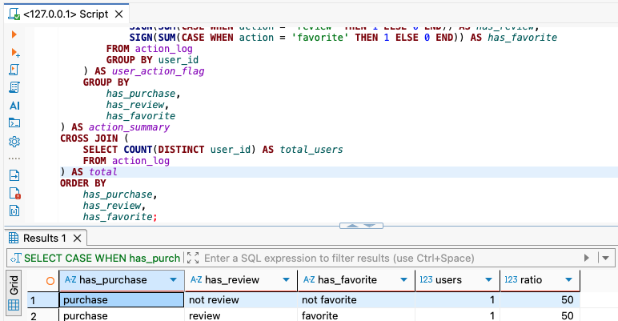


> 벤다이어그램은 아래와 같은 범위에 적용이 가능
>
> - 글을 작성하지 않고 다른 사람의 글만 확인하는 사용자
> - 글을 많이 작성하는 사용자
> - 글을 거의 작성하지 않지만 댓글은 많이 작성하는 사용자
> - 글과 댓글 모두 적극적으로 작성하는 사용자


### 1-6 Decile 분석을 사용해 사용자를 10단계 그룹으로 나누기

데모그래픽한 데이터가 존재하지 않는 경우, 사용자 액션으로 속성을 정의해보는 것도 매우 좋음. 

- 데이터를 10단계로 분할해서 중요도를 파악하는 분석 = **Decile 분석**
  - 사용자를 구매 금액이 많은 순서로 정렬 후
  - 정렬된 사용자의 상위에서 10%씩 Decile1부터 10까지 그룹을 할당
  - 같은 수로 데이터 그룹을 만들 때는 `NTILE` 윈도우 함수 사용
- 구매액이 많은 순서로 사용자 그룹을 10등분하는 쿼리

```sql
WITH user_purchase_amount AS (
    SELECT
        user_id,
        SUM(amount) AS purchase_amount
    FROM action_log
    WHERE action = 'purchase'
    GROUP BY user_id
),

users_with_decile AS (
    SELECT
        user_id,
        purchase_amount,
        NTILE(10) OVER (ORDER BY purchase_amount DESC) AS decile
    FROM user_purchase_amount
)

SELECT
    *
FROM users_with_decile;
```

<!-- 이미지 6-1 -->
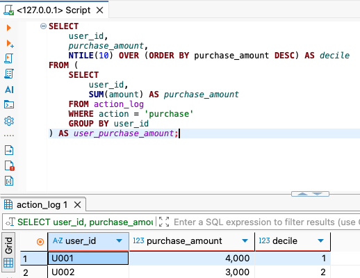


- 10분할한 Decile 들을 집계하는 쿼리

~~~sql
WITH user_purchase_amount AS (
    SELECT
        user_id,
        SUM(amount) AS purchase_amount
    FROM action_log
    WHERE action = 'purchase'
    GROUP BY user_id
),

users_with_decile AS (
    SELECT
        user_id,
        purchase_amount,
        NTILE(10) OVER (ORDER BY purchase_amount DESC) AS decile
    FROM user_purchase_amount
),

decile_with_purchase_amount AS (
    SELECT
        decile,
        SUM(purchase_amount) AS amount,
        AVG(purchase_amount) AS avg_amount,

        SUM(SUM(purchase_amount)) OVER (ORDER BY decile)
            AS cumulative_amount,

        SUM(SUM(purchase_amount)) OVER ()
            AS total_amount

    FROM users_with_decile
    GROUP BY decile
)

SELECT
    *
FROM decile_with_purchase_amount;
~~~

<!-- 이미지 6-2 -->
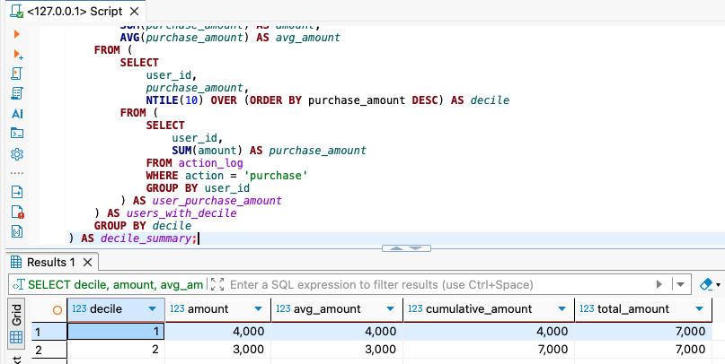


- 구매액이 많은 Decile 순서로 구성비와 구성비누계를 계산하는 쿼리

~~~sql
WITH user_purchase_amount AS (
    SELECT
        user_id,
        SUM(amount) AS purchase_amount
    FROM action_log
    WHERE action = 'purchase'
    GROUP BY user_id
),

users_with_decile AS (
    SELECT
        user_id,
        purchase_amount,
        NTILE(10) OVER (ORDER BY purchase_amount DESC) AS decile
    FROM user_purchase_amount
),

decile_with_purchase_amount AS (
    SELECT
        decile,
        SUM(purchase_amount) AS amount,
        AVG(purchase_amount) AS avg_amount,
        SUM(SUM(purchase_amount)) OVER (
            ORDER BY decile
        ) AS cumulative_amount,
        SUM(SUM(purchase_amount)) OVER () AS total_amount
    FROM users_with_decile
    GROUP BY decile
)

SELECT
    decile,
    amount,
    avg_amount,
    100.0 * amount / total_amount AS total_ratio,
    100.0 * cumulative_amount / total_amount AS cumulative_ratio
FROM decile_with_purchase_amount;
~~~

<!-- 이미지 6-3 -->
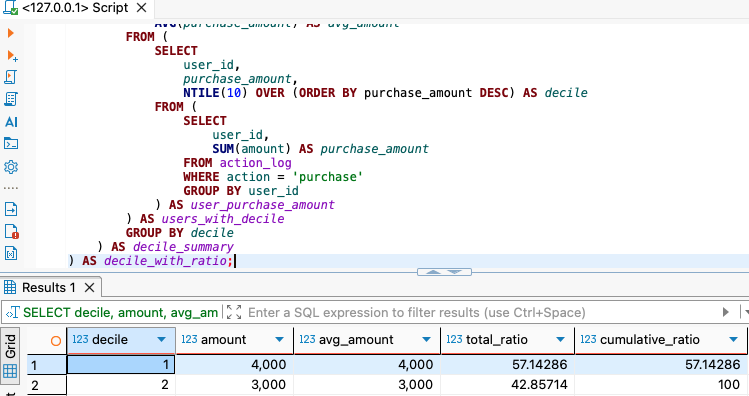


### 1-7 RFM 분석으로 사용자를 3가지 관점의 그룹으로 나누기

**RFM 분석** : 3가지 지표

- **Recency : 최근 구매일**
  - 최근 무언가를 구매한 사용자를 우량 고객으로 취급
- **Frequency : 구매 횟수**
  - 사용자가 구매한 횟수를 세고, 많을수록 우량 고객으로 취급
- **Monetary : 구매 금액 합계**
  - 사용자의 구매 금액 합계를 집계하고, 금액이 높을수록 우량 고객으로 취급


- 사용자별로 RFM 을 집계하는 쿼리

```sql
WITH purchase_log AS (
    SELECT
        user_id,
        amount,
        SUBSTRING(stamp, 1, 10) AS dt
    FROM action_log
    WHERE action = 'purchase'
),

user_rfm AS (
    SELECT
        user_id,
        MAX(dt) AS recent_date,
        CURRENT_DATE - MAX(CAST(dt AS DATE)) AS recency,
        COUNT(dt) AS frequency,
        SUM(amount) AS monetary
    FROM purchase_log
    GROUP BY user_id
)

SELECT
    *
FROM user_rfm;
```

<!-- 이미지 7-1 -->
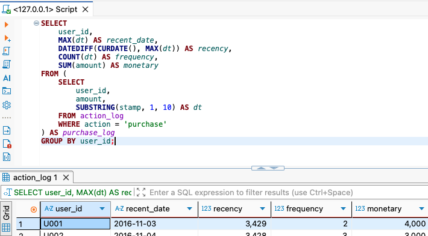


**RFM 랭크 정의하기**

- 3개의 지표를 각각 5개의 그룹으로 나누는 것이 일반적
  - 총 125개의 그룹으로 사용자를 나눠서 파악이 가능
- 사용자들의 RFM 랭크를 계산하는 쿼리

~~~sql
WITH purchase_log AS (
    SELECT
        user_id,
        amount,
        SUBSTRING(stamp, 1, 10) AS dt
    FROM action_log
    WHERE action = 'purchase'
),

user_rfm AS (
    SELECT
        user_id,
        MAX(dt) AS recent_date,
        CURRENT_DATE - MAX(CAST(dt AS DATE)) AS recency,
        COUNT(dt) AS frequency,
        SUM(amount) AS monetary
    FROM purchase_log
    GROUP BY user_id
),

user_rfm_rank AS (
    SELECT
        user_id,
        recent_date,
        recency,
        frequency,
        monetary,

        -- Recency 점수
        CASE
            WHEN recency < 14 THEN 5
            WHEN recency < 28 THEN 4
            WHEN recency < 60 THEN 3
            WHEN recency < 90 THEN 2
            ELSE 1
        END AS r,

        -- Frequency 점수
        CASE
            WHEN frequency >= 20 THEN 5
            WHEN frequency >= 10 THEN 4
            WHEN frequency >= 5 THEN 3
            WHEN frequency >= 2 THEN 2
            ELSE 1
        END AS f,

        -- Monetary 점수
        CASE
            WHEN monetary >= 300000 THEN 5
            WHEN monetary >= 100000 THEN 4
            WHEN monetary >= 30000 THEN 3
            WHEN monetary >= 5000 THEN 2
            ELSE 1
        END AS m

    FROM user_rfm
)

SELECT
    *
FROM user_rfm_rank;
~~~

<!-- 이미지 7-2 -->
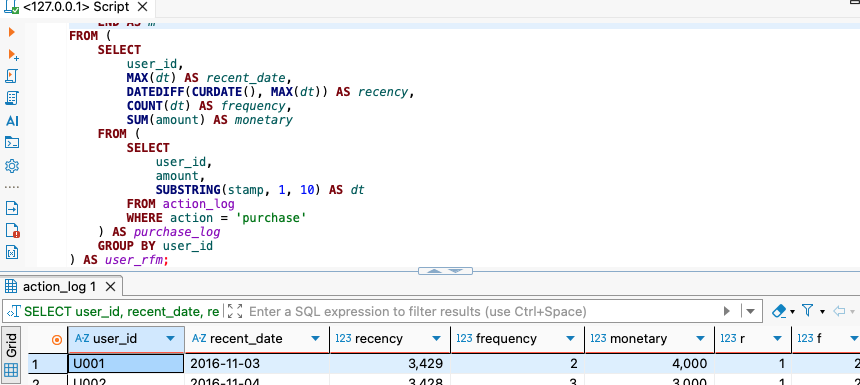


**사용자를 1차원으로 구분하기**

- 125개의 그룹을 관리하기가 어렵기에 각 랭크 합계를 기반으로 13개 그룹으로 나누어 관리하는 방법
  - `R + F + M` 의 방법을 사용함

- 통합 랭크를 계산하는 쿼리

~~~sql
WITH user_rfm AS (
    SELECT
        user_id,
        MAX(dt) AS recent_date,
        CURRENT_DATE - MAX(CAST(dt AS DATE)) AS recency,
        COUNT(dt) AS frequency,
        SUM(amount) AS monetary
    FROM purchase_log
    GROUP BY user_id
),

user_rfm_rank AS (
    SELECT
        user_id,
        recent_date,
        recency,
        frequency,
        monetary,

        CASE
            WHEN recency < 14 THEN 5
            WHEN recency < 28 THEN 4
            WHEN recency < 60 THEN 3
            WHEN recency < 90 THEN 2
            ELSE 1
        END AS r,

        CASE
            WHEN frequency >= 20 THEN 5
            WHEN frequency >= 10 THEN 4
            WHEN frequency >= 5 THEN 3
            WHEN frequency >= 2 THEN 2
            ELSE 1
        END AS f,

        CASE
            WHEN monetary >= 300000 THEN 5
            WHEN monetary >= 100000 THEN 4
            WHEN monetary >= 30000 THEN 3
            WHEN monetary >= 5000 THEN 2
            ELSE 1
        END AS m

    FROM user_rfm
)

SELECT
    r + f + m AS total_rank,
    r,
    f,
    m,
    COUNT(user_id) AS user_count
FROM user_rfm_rank
GROUP BY
    r,
    f,
    m
ORDER BY
    total_rank DESC,
    r DESC,
    f DESC,
    m DESC;
~~~

<!-- 이미지 7-3 -->
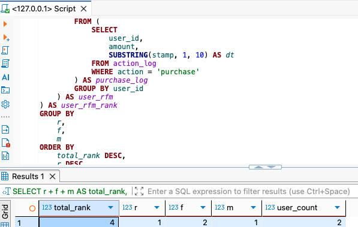


**2차원으로 사용자 인식하기**

- 각 사용자 계층에 대해 어떤 마케팅을 실시할지, 상위 사용자 층으로 옮긼수 있을지에 대한 집계가 가능
- R과 F를 사용해 2차원 사용자 층의 사용자 수를 집계하는 쿼리

~~~sql
WITH user_rfm AS (
    SELECT
        user_id,
        MAX(dt) AS recent_date,
        CURRENT_DATE - MAX(CAST(dt AS DATE)) AS recency,
        COUNT(dt) AS frequency,
        SUM(amount) AS monetary
    FROM purchase_log
    GROUP BY user_id
),

user_rfm_rank AS (
    SELECT
        user_id,
        recent_date,
        recency,
        frequency,
        monetary,

        CASE
            WHEN recency < 14 THEN 5
            WHEN recency < 28 THEN 4
            WHEN recency < 60 THEN 3
            WHEN recency < 90 THEN 2
            ELSE 1
        END AS r,

        CASE
            WHEN frequency >= 20 THEN 5
            WHEN frequency >= 10 THEN 4
            WHEN frequency >= 5 THEN 3
            WHEN frequency >= 2 THEN 2
            ELSE 1
        END AS f,

        CASE
            WHEN monetary >= 300000 THEN 5
            WHEN monetary >= 100000 THEN 4
            WHEN monetary >= 30000 THEN 3
            WHEN monetary >= 5000 THEN 2
            ELSE 1
        END AS m

    FROM user_rfm
)

SELECT
    CONCAT('r_', r) AS r_rank,
    COUNT(CASE WHEN f = 5 THEN 1 END) AS f_5,
    COUNT(CASE WHEN f = 4 THEN 1 END) AS f_4,
    COUNT(CASE WHEN f = 3 THEN 1 END) AS f_3,
    COUNT(CASE WHEN f = 2 THEN 1 END) AS f_2,
    COUNT(CASE WHEN f = 1 THEN 1 END) AS f_1
FROM user_rfm_rank
GROUP BY r
ORDER BY r_rank DESC;
~~~

<!-- 이미지 7-4 -->
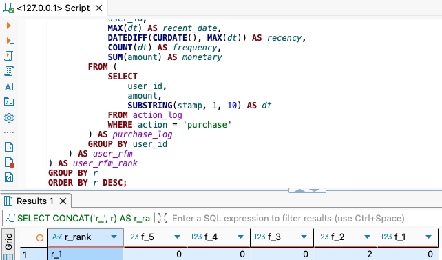


> 서비스 개선 검토, 사용자에 따른 메일 최적화 등 다양한 용도로 활용이 가능


### 🎉 수고하셨습니다.