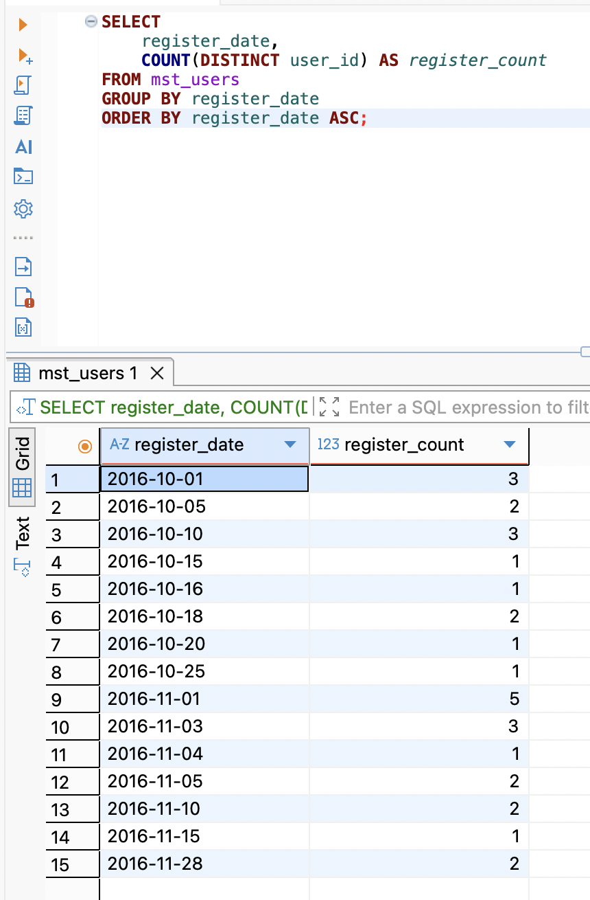
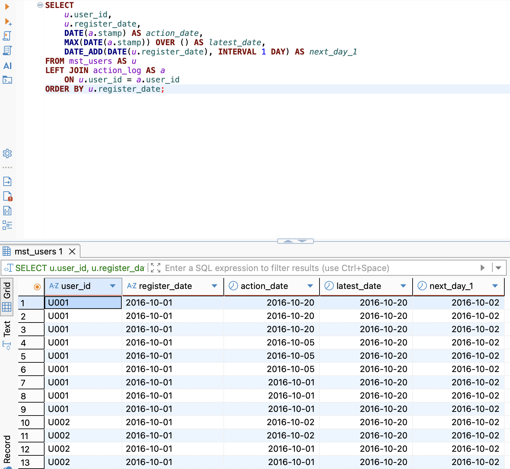
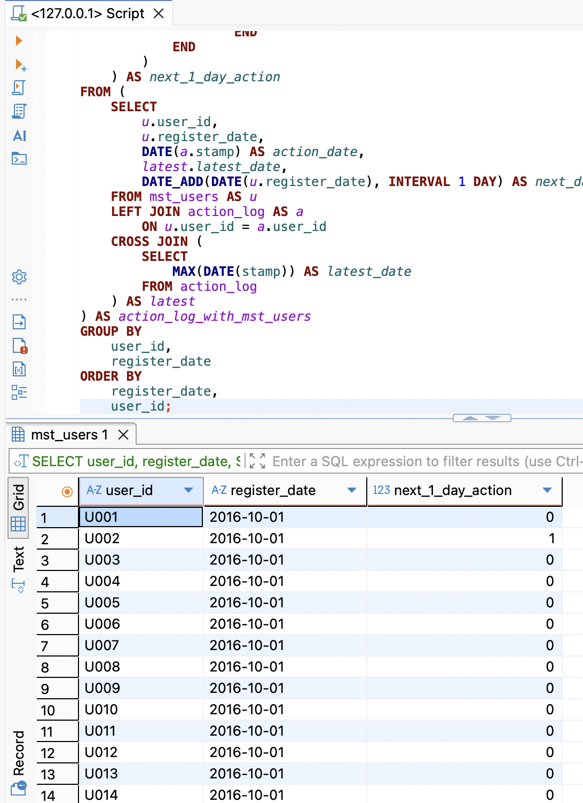
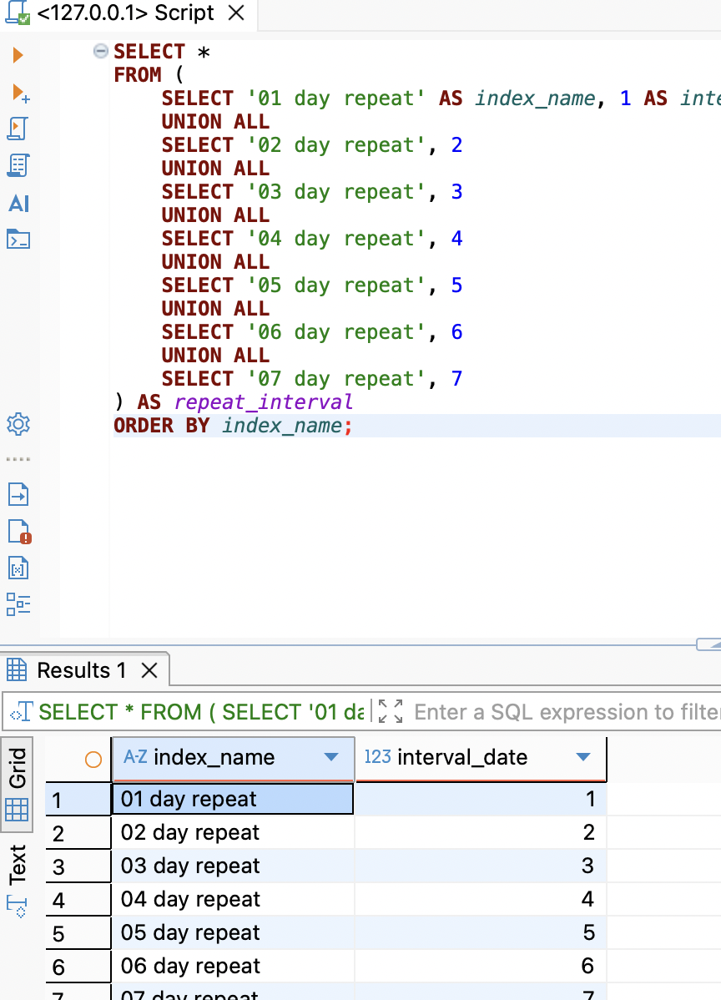
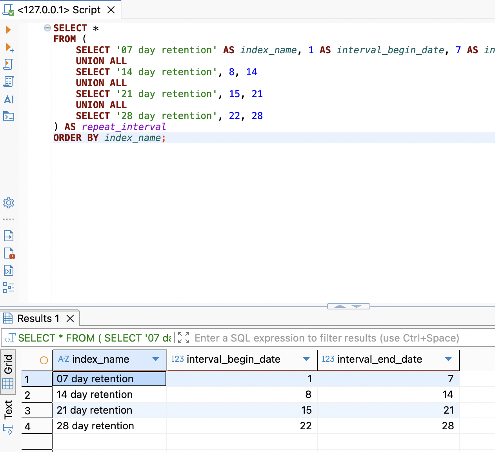

# SQL_MASTER 5주차 정규과제

📌SQL MASTER 정규과제는 매주 정해진 분량의 『*데이터 분석을 위한 SQL 레시피*』 를 읽고 학습하는 것입니다. 이번 주는 아래의 **SQL_MASTER_5th_TIL**에 나열된 분량을 읽고 공부하시면 됩니다.

아래 실습을 수행하며 학습 내용을 직접 적용해보세요. 단순히 결과를 재현하는 것이 아니라, SQL을 직접 작성하는 과정에서 개념을 스스로 정리하는 것이 중요합니다.

필요한 경우 교재와 추가 자료를 참고하여 이해를 보완하시기 바랍니다.

## SQL_MASTER_5th_TIL

### 5장 사용자를 파악하기 위한 데이터 추출
#### 2. 시계열에 따른 사용자 전체의 상태 변화 찾기
#### 3. 시계열에 따른 사용자의 개별적인 행동 분석하기 


## Study Schedule

| 주차  | 공부 범위 | 완료 여부 |
| ----- | --------- | --------- |
| 1주차 | p.20~50   | ✅         |
| 2주차 | p.52~136  | ✅         |
| 3주차 | p.138~184 | ✅         |
| 4주차 | p.186~232 | ✅         |
| 5주차 | p.233~321 | ✅         |
| 6주차 | p.324~406 | 🍽️         |
| 7주차 | p.408~464 | 🍽️         |

<br>

<!-- 여기까진 그대로 둬 주세요-->


# 실습 

## 0. 실습 규칙

1. 샘플 데이터 생성 코드는 **07_SQL_MASTER_Template/src** 경로에 장별로 정리되어 있습니다.
2. 아래 목차에 맞춰 해당 코드를 실행하여 샘플 데이터를 생성한 후, 각 장에서 요구하는 쿼리를 직접 작성해보시기 바랍니다.
3. 작성한 쿼리의 **실행 결과 화면도 함께 제출**해 주세요.
4. 단순히 교재의 예시 코드를 그대로 작성하는 것이 아니라, **제시된 로직을 충분히 이해한 뒤 교재를 보지 않고 스스로 쿼리를 구성**해보는 것을 권장합니다.
5. 교재 예시는 PostgreSQL, Hive, BigQuery 등 다양한 DBMS 기준으로 제시되어 있기 때문에, **MySQL이 아닌 다른 SQL 환경을 사용하여 실습을 진행해도 무방합니다.**
6. 다만, 사용 중인 DBMS에 맞는 문법으로 적절히 변환하여 작성하시기 바랍니다.

## 2. 시계열에 따른 사용자 전체의 상태 변화 찾기

서비스를 운영하는 입장에서는 사용자가 계속해서 사용하기를 원함.

- 사용자가 어느 정도 계속해서 사용하는지,
- 목표와의 괴리를 어떻게 해결할지 검토할 필요성이 존재
- 사용자의 서비스 사용을 시계열로 수치화하고 변화를 시각화 하는 방법

### 2-1 등록 수의 추이와 경향 보기

- 등록자가 감소 경향을 보인다는 뜻 : 서비스를 활성화하기 어렵다.
- 반대는 증가현황을  보인다고 할 수 있음.


**날짜별 등록의 추이**

- 날짜별 등록 수의 추이를 집계하는 쿼리 

```sql
SELECT
    register_date,
    COUNT(DISTINCT user_id) AS register_count
FROM mst_users
GROUP BY register_date
ORDER BY register_date;
```

<!-- 이미지 2-1 -->



**월별 등록 수 추이**

- 월별 집계 : 날짜 자료형의 데이터에서 연과 월 데이터만을 추출
- LAG 윈도 함수를 사용
- 매달 등록 수와 전월비를 계산하는 쿼리

~~~sql
WITH mst_users_with_year_month AS (
    SELECT
        *,
        SUBSTRING(register_date, 1, 7) AS year_month
    FROM mst_users
),

monthly_register_count AS (
    SELECT
        year_month,
        COUNT(DISTINCT user_id) AS register_count
    FROM mst_users_with_year_month
    GROUP BY year_month
)

SELECT
    year_month,
    register_count,
    LAG(register_count) OVER (
        ORDER BY year_month
    ) AS last_month_count,
    1.0 * register_count
        / LAG(register_count) OVER (
            ORDER BY year_month
        ) AS month_over_month_ratio
FROM monthly_register_count
ORDER BY year_month;
~~~


**등록 디바이스별 추이**

- 디바이스들의 등록 수를 집계하는 쿼리

~~~sql
WITH mst_users_with_year_month AS (
    SELECT
        *,
        SUBSTRING(register_date, 1, 7) AS year_month
    FROM mst_users
)

SELECT
    year_month,
    COUNT(DISTINCT user_id) AS register_count,
    COUNT(DISTINCT CASE WHEN register_device = 'pc' THEN user_id END) AS register_pc,
    COUNT(DISTINCT CASE WHEN register_device = 'sp' THEN user_id END) AS register_sp,
    COUNT(DISTINCT CASE WHEN register_device = 'app' THEN user_id END) AS register_app
FROM mst_users_with_year_month
GROUP BY year_month
ORDER BY year_month;
~~~


> 등록한 디바이스에 따라 사용자의 행동을 분석 
>
> - 추가로 여러 장치를 사용하는 멀티 디바이스 사용자


### 2-2 지속률과 정착률 산출하기

등록시점을기준으로 일정 기간동안 사용자가 지속해서 사용하고 있는지 조사할 때,

- 지속률과 정착률을 사용하면 경향을 쉽게 파악이 가능

**지속률과 정착률의 정의**

- **지속률 : 등록을 기준으로 이후 지정일 동안 사용자가 서비스를 얼마나 이용했는지 나타내는 지표**
- **정착률 : 등록을 기준으로 이후 지정한 7일 동안 사용자가 서비스를 사용했는지를 나타내는 지표**


**지속률과 정착률 사용 구분하기**

- 서비스의 목적과 용도에 따라 어떤 것이 더 중요한지 검토 후, 정기적으로 해당 값 사용해야 함. 

**지속률과 관계있는 리포트**

- 날짜별 n일 지속률 추이
  - 지정한 날짜에 등록한 사용자 중에서 다음날에도 서비스를 사용한 사람의 비율 
- 로그 최근 일자와 사용자별 등록일의 다음날을 계산하는 쿼리

```sql
WITH action_log_with_mst_users AS (
    SELECT
        u.user_id,
        u.register_date,
        CAST(a.stamp AS DATE) AS action_date,
        MAX(CAST(a.stamp AS DATE)) OVER () AS latest_date,
        CAST(CAST(u.register_date AS DATE) + INTERVAL '1 day' AS DATE) AS next_day_1
    FROM mst_users AS u
    LEFT OUTER JOIN action_log AS a
        ON u.user_id = a.user_id
)

SELECT
    *
FROM action_log_with_mst_users
ORDER BY register_date;
```

<!-- 이미지 2-2 -->



- 지정한 날의 다음날에 액션을 했는지 0과 1 플래그로 표현
- 사용자의 액션 플래그를 계산하는 쿼리

~~~sql
WITH action_log_with_mst_users AS (
    SELECT
        u.user_id,
        u.register_date,
        CAST(a.stamp AS DATE) AS action_date,
        MAX(CAST(a.stamp AS DATE)) OVER () AS latest_date,
        CAST(CAST(u.register_date AS DATE) + INTERVAL '1 day' AS DATE) AS next_day_1
    FROM mst_users AS u
    LEFT OUTER JOIN action_log AS a
        ON u.user_id = a.user_id
),

user_action_flag AS (
    SELECT
        user_id,
        register_date,
        SIGN(
            SUM(
                CASE
                    WHEN next_day_1 <= latest_date THEN
                        CASE
                            WHEN next_day_1 = action_date THEN 1
                            ELSE 0
                        END
                END
            )
        ) AS next_1_day_action
    FROM action_log_with_mst_users
    GROUP BY
        user_id,
        register_date
)

SELECT
    *
FROM user_action_flag
ORDER BY
    register_date,
    user_id;
~~~

<!-- 이미지 2-2-1 -->



- 다음 날 지속률을 계산하는 쿼리
  - 사용자의 액션 플래그를 0과 1로 표현하면, 그래프 값에 100을 곱해 AVG함수를 사용해 퍼센트로 계산하기

~~~sql
WITH action_log_with_mst_users AS (
    SELECT
        u.user_id,
        u.register_date,
        CAST(a.stamp AS DATE) AS action_date,
        MAX(CAST(a.stamp AS DATE)) OVER () AS latest_date,
        CAST(CAST(u.register_date AS DATE) + INTERVAL '1 day' AS DATE) AS next_day_1
    FROM mst_users AS u
    LEFT OUTER JOIN action_log AS a
        ON u.user_id = a.user_id
),

user_action_flag AS (
    SELECT
        user_id,
        register_date,
        SIGN(
            SUM(
                CASE
                    WHEN next_day_1 <= latest_date THEN
                        CASE
                            WHEN next_day_1 = action_date THEN 1
                            ELSE 0
                        END
                END
            )
        ) AS next_1_day_action
    FROM action_log_with_mst_users
    GROUP BY
        user_id,
        register_date
)
SELECT register_date, AVG(100.0*next_1_day_action) AS repeat_rate_1_day
FROM user_action_flag
GROUP BY register_date
ORDER BY register_date;
~~~


- 지속률 지표를 관리하는 마스터 테이블을 작성하는 쿼리

~~~sql
WITH repeat_interval(index_name, interval_date) AS (
    VALUES
        ('01 day repeat', 1),
        ('02 day repeat', 2),
        ('03 day repeat', 3),
        ('04 day repeat', 4),
        ('05 day repeat', 5),
        ('06 day repeat', 6),
        ('07 day repeat', 7)
)

SELECT
    *
FROM repeat_interval
ORDER BY index_name;
~~~

<!-- 이미지 2-2-2 -->



**정착률 관련 리포트**

- 대상이 여러 일자에 걸쳐 있기 때문에 확장해야 한다.
- 정착률 지표를 관리하는 마스터 테이블을 작성하는 쿼리

~~~sql
WITH repeat_interval(index_name, interval_begin_date, interval_end_date) AS (
    VALUES
        ('07 day retention', 1, 7),
        ('14 day retention', 8, 14),
        ('21 day retention', 15, 21),
        ('28 day retention', 22, 28)
)

SELECT
    *
FROM repeat_interval
ORDER BY index_name;
~~~

<!-- 이미지 2-2-3 -->



**n일 지속률과 n일 정착률의 추이**

- 등록 후 며칠간 사용자가 안정적으로 서비스 사용, 며칠 후에 그만두는 사용자가 많은지를 알 수 있는 시점으로 대책 수립이 가능


> 지속률과 정착률 모두 **n일 후의 행동을 집계하는 것**
>
> - 30 ,60 일 지속률처럼 오래 걸리는 지표보다 1,7일 다닉 지표를 활용하는 것이 더욱 좋음.


### 2-3 지속과 정착에 영향을 주는 액션 집계하기 

<!-- 이 부분을 지우고 새롭게 배운 내용을 자유롭게 정리해주세요. -->

```sql
여기에 코드를 적어주세요.
```

<!-- 이 부분을 지우고 실행 결과 화면을 제출해주세요. -->

### 2-4 액션 수에 따른 정착률 집계하기 

<!-- 이 부분을 지우고 새롭게 배운 내용을 자유롭게 정리해주세요. -->

```sql
여기에 코드를 적어주세요.
```

<!-- 이 부분을 지우고 실행 결과 화면을 제출해주세요. -->

### 2-5 사용 일수에 따른 정착률 집계하기 

<!-- 이 부분을 지우고 새롭게 배운 내용을 자유롭게 정리해주세요. -->

```sql
여기에 코드를 적어주세요.
```

<!-- 이 부분을 지우고 실행 결과 화면을 제출해주세요. -->

### 2-6 사용자의 잔존율 집계하기 

<!-- 이 부분을 지우고 새롭게 배운 내용을 자유롭게 정리해주세요. -->

```sql
여기에 코드를 적어주세요.
```

<!-- 이 부분을 지우고 실행 결과 화면을 제출해주세요. -->

### 2-7 방문 빈도를 기반으로 사용자 속성을 정의하고 집계하기

<!-- 이 부분을 지우고 새롭게 배운 내용을 자유롭게 정리해주세요. -->

```sql
여기에 코드를 적어주세요.
```

<!-- 이 부분을 지우고 실행 결과 화면을 제출해주세요. -->

### 2-8 방문 종류를 기반으로 성장지수 집계하기 

<!-- 이 부분을 지우고 새롭게 배운 내용을 자유롭게 정리해주세요. -->

```sql
여기에 코드를 적어주세요.
```

<!-- 이 부분을 지우고 실행 결과 화면을 제출해주세요. -->

### 2-9 지표 개선 방법 익히기 

<!-- 이 부분을 지우고 새롭게 배운 내용을 자유롭게 정리해주세요. -->

```sql
여기에 코드를 적어주세요.
```

<!-- 이 부분을 지우고 실행 결과 화면을 제출해주세요. -->


## 3. 시계열에 따른 사용자의 개별적인 행동 분석하기 

### 3-1 사용자의 액션 간격 집계하기

<!-- 이 부분을 지우고 새롭게 배운 내용을 자유롭게 정리해주세요. -->

```sql
여기에 코드를 적어주세요.
```

<!-- 이 부분을 지우고 실행 결과 화면을 제출해주세요. -->

### 3-2 카트 추가 후에 구매했는지 파악하기 

<!-- 이 부분을 지우고 새롭게 배운 내용을 자유롭게 정리해주세요. -->

```sql
여기에 코드를 적어주세요.
```

<!-- 이 부분을 지우고 실행 결과 화면을 제출해주세요. -->

### 3-3 등록으로부터의 매출을 날짜별로 집계하기 

<!-- 이 부분을 지우고 새롭게 배운 내용을 자유롭게 정리해주세요. -->

```sql
여기에 코드를 적어주세요.
```

<!-- 이 부분을 지우고 실행 결과 화면을 제출해주세요. -->


### 🎉 수고하셨습니다.